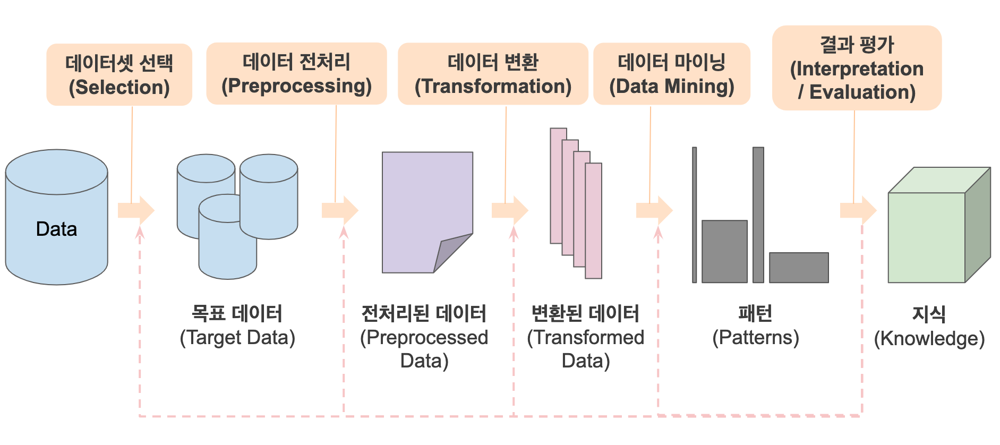
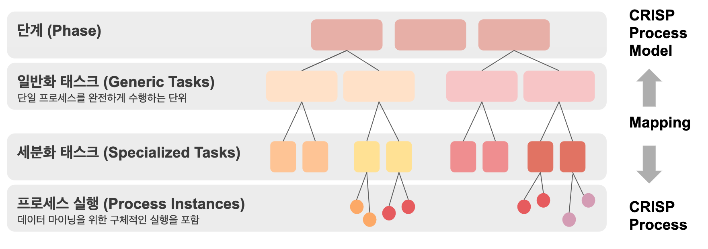
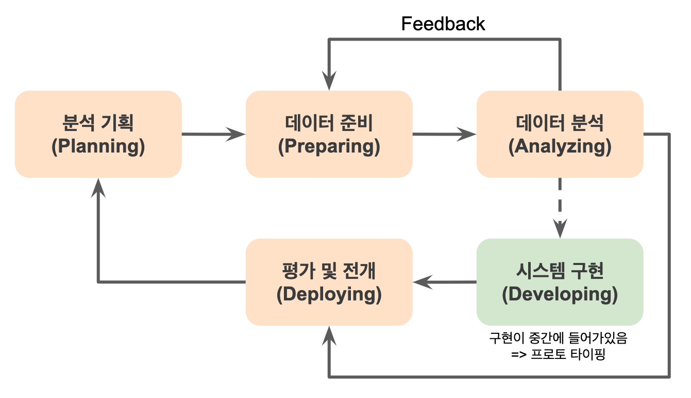

# 2과목. 데이터 분석 기획

* 데이터 분석 기획
  * 데이터 분석 기획 방향성 도출
  * 분석 및 분석과제발굴 방법론
  * 분석 프로젝트 관리 방안

* 분석 마스터 플랜
  * 마스터 플랜 수립 프레임워크
  * 분석 거버넌스 체계

> **예상 출제 문항수 : 7~10문제 정도?**
> 2과목 : 과락이 많음.... 용어들이 너무 낯설어서 그러하다
> 전부다 외우기보다는 과락을 하지 않을 정도로만 암기하는것이 효율적이다
> 
> - 1장 - 데이터 분석 기획 : 새로 추가된 내용들. 암기 위주로 공부하기
> - 2장 - 분석 마스터 플랜 : 기출문제 중심으로 공부하기

# 1. 데이터 분석 기획

* 분석 프로세스
  * 정량적 데이터 분석 프로세스
  * 빅데이터 분석 프로세스
* 분석 과제 발굴

> **4문제 정도?** 적어도 3문제는 맞추자!

## 분석 기획

> 출제포인트 : 단답형으로 출제될 수 있음

실제 분석을 수행하기 앞서, 분석을 수행할 **과제의 정의에서부터 의도했던 결과를 도출하기 까지의 과정을 적절하게 관리할 수 있도록 방안을 사전에 계획**하는 일련의 작업

* 어떠한 목표(what)를 위해(why) 어떤방식으로(how) 수행할지에 대한 일련의 계획

### 분석의 유형

> 출제포인트 : 분석 유형 맞추기 문제

**분석 대상(What)**과 **분석 방식(How)**에 따라 4가지로 나뉜다

* **최적화 (Optimization)** : Known, Known
  * 분석 대상, 분석 방법을 모두 알고 있는 경우
* **통찰 (Insight)** : Unknown, Known
  * 분석 방법은 알지만 분석 대상이 무엇인지 인지하지 못하는 경우
* **솔루션 (Solution)** : Known, Unknown
  * 분석 대상은 알지만 분석 방법을 모르는 경우
* **발견 (Discovery)** : Unknown, Unknown
  * 분석 대상과 분석 방법을 모두 모르는 경우

### 목표 시점별 분석 기획

> 출제포인트 : 목표 시점 별 방향, 목표, 유형, 접근 방식에 대한 특징

* **과제 중심적인 접근 방식** : 당면한 과제를 빠르게 해결 & 단기적인 접근 방식
  * 1차 목표 : Speed & Test
  * 과제의 유형 : Quick-Win
  * 접근 방식 : Problem Solving
* **장기적인 마스터 플랜 방식** : 지속적인 분석 내재화 & 중장기적인 접근 방식
  * 1차 목표 : Accuracy & Deploy
  * 과제의 유형 : Long Term View
  * 접근 방식 : Problem Definition

### 분석 기획시 주의 사항

* 가용데이터에 대한 고려 (Available Data) : 적절한 데이터를 사용하고 있는가?
  * 데이터 유형에 따라 솔루션, 분석 방법이 달라질 수 있음
  * 정형 데이터, 반정형 데이터, 비정형 데이터 (관련 내용은 1과목에 정리해둔 내용이 있다. 그것을 참고하기!)
* 적절한 활용 방안과 유즈케이스 탐색 (Proper Business Use Case)
  * 벤치마킹을 빠르게 하는 것이 좋다 => 실패할 확률을 줄인다
* 장애요소들에 대한 사전 계획 수립 (Low Barrier of Execution)
  * 조직 문화 내재화, 계속적인 교육, 변화 관리 (change management)

## 분석 방법론 (분석 프로세스)

데이터 분석이 효과적, 문화적으로 정착하기 위해서는 **체계화된 절차와 방법이 정리된 분석 방법론 수립**이 필수적이다

* 절차 (Procedures), 방법 (Methods), 도구와 기법 (Tools&Techniques), 템플릿과 산출물 (Templates&Outputs)

### 데이터 기반 의사결정
  * 경험과 감에 의한 결정보다는 데이터 기반의 의사결정을 하는 것이 합리적
  * **장애요소 : 고정관념 (Sterotype), 편향된 생각 (Bias), 프레이밍효과 (Framing Effect)**
    * 프레이밍 효과 : 동일 사건/상황에 대해 표현하는 방식에 따라 판단이 달라질 수 있는 현상

### 방법론 모델

* 폭포수 모델 (Waterfall Model) : 순차적으로 진행
* **프로토타입 모델 (Prototype Model) : 점진적 개발 모델 - 일부분 먼저 개발 -> 개선**
* 나선형 모델 (Spiral Model) : 반복을 통해 점증적으로 개발
  * 초기 프로젝트에 적용이 용이 / But, 관리체계를 체계적으로 갖추지 못한 경우에는 오히려 복잡도가 상승하여 프로젝트 진행이 어려울 수 있음

### 방법론 구성

계층적으로 구성된다

> 출제포인트 : 각 단계 명칭 & 특징 & 아웃풋 

**단계 -> 태스크 -> 스탭**

* 단계 : 단계별 산출물이 생성
  * output : 단계별 완료보고서
* 태스크 : 단계를 구성하는 단위 활동
  * output : 보고서
* 스텝 : WBS의 워크 패키지
  * output : 보고서 구성요소

## 분석 방법론 개요

전반적인 방법론 플로우가 각 방법론에서는 어디에 매칭되는지 비교하면서 학습해보자

> 출제 포인트 : KDD 분석 방법론 vs CRISP-DM 분석 방법론

## 분석 방법론 1. KDD 분석 방법론

1. 데이터셋 선택 (Selection)
   * 개요 : 비즈니스 이해, 데이터 이해
2. 데이터 전처리 (Preprocessing)
   * 개요 : 데이터 전처리
3. 데이터 변환 (Transformation)
   * 개요 : 데이터 변수 생성, 데이터 분할, 데이터 변수 선택
4. 데이터 마이닝 (Data Mining)
   * 개요 : 모형 개발 (모델링)
5. 결과 평가 (Interpretation / Evaluation)
   * 개요 : 모형 평가, 모형 검증
   * 평가 후 앞단계로 다시 되돌아가서 성능을 올리기 위해 흐름을 반복한다

## 분석 방법론 2. CRISP-DM 분석 방법론

주요 5개 업체들이 주도하여 만든 계층적 프로세스 모델

> 출제 포인트 : 4가지 레벨, 6단계 프로세스, 각 단계별 업무내용, KDD와의 비교

### 4레벨 구조

* 기존 방법론들 : Phase -> Task -> Step/Instance (3단계)
* CRISP-DM : Phase -> Generic Tasks -> Specialized Tasks -> Process Instances (4단계)

### 프로세스

6단계로 구성, 단방향X, 단계간 피드백을 통해 완성도를 향상시킨다

* 업무 이해 (Business Understanding)
  * 개요 : 비즈니스 이해
  * 업무 목적 파악, 목표 설정, 계획 수립
* **데이터 이해 (Data Understanding)**
  * 개요 : 데이터 이해,  데이터 전처리 중 이상치 식별작업
  * 데이터 수집, 데이터 기술 분석, 데이터 탐색, 데이터 품질 확인
* **데이터 준비 (Data Preparing)**
  * 개요 : 데이터 전처리, 데이터 변수 생성, 데이터 분할, 데이터 변수 선택
  * 데이터 셋 선택, 데이터 정제, 데이터 셋 편성, 데이터 통합, 데이터 포맷팅
* **모델링 (Modeling)**
  * 개요 : 모델 개발, **모델 평가**
  * 모델링 기법 선택, 모델 테스트 계획 설계, 모델 작성, 모델 평가
* **평가 (Evaluation)**
  * 개요 : 모형 검증
  * 분석 결과 평가, 모델링 과정 평가, 모델 적용성 평가
* 전개 (Deployment)
  * 전개 계획 수립, 프로젝트 종료 보고서 작성, 프로젝트 리뷰

## 분석 방법론 3. 빅데이터 분석 방법론

> 출제포인트 : 3단계 계층, 5단계 프로세스 & 각 단계별 주요 업무 
> 시험에 자주 출제됨. 근데 너무 외울게 많아서 중요한 것들만 확인하고 패스하는게 이득일수도 있겠다. 

### 3단계 계층

### 5단계 프로세스

> 출제포인트 : 가끔 세세한 스텝까지 물어보기도 함.
> 내 생각에는 이런 스텝까지 다 외우기는 힘들 듯... 어차피 실무와 큰 관련은 없으니 패스하는게 나을 듯

* 분석 기획

  * 비즈니스 이해 및 범위 설정
  * 프로젝트 정의 및 계획 수립
  * 프로젝트 위험계획 수립

* 데이터 준비

  * 필요 데이터 정의
  * 데이터 스토어 설계
  * 데이터 수집 및 정합성 점검

* 데이터 분석

  * 분석용 데이터 준비
  * 텍스트 분석
  * 탐색적 분석
  * 모델링
  * 모델 평가 및 검증
  * 모델 적용 및 운영 방안 수립

* 시스템 구현

  * 설계 및 구현
  * 시스템 테스트 및 운영

* 평가 및 전개

  * 모델 발전 계획 수립
  * 프로젝트 평가 및 보고

  

## 분석 과제 발굴 방법론

> 출제 포인트 : 분석 대상(What)과 방법(How)을 활용한 방법론

* 분석 과제 도출 방법 : 상향식 (Bottm-Up), 하향식 (Top-Down)
  * 최적의 의사결정 : 두 접근 방식이 상호보완관계에 있을 때

* **하향식 접근 방식 (Top-Down Approach)** : 문제의 해법을 찾기 위해 **각 과정이 체계적으로 단계화 되어 수행**되는 방식
  * 분석 대상을 알고있는 경우
  * 전통적으로 수행되었던 분석 과제 발굴 방식

* **상향식 접근 방식 (Bottom-Up Approach)** : 문제의 정의 자체가 어려워 **데이터를 기반으로 문제의 재정의 및 해결방안을 탐색하고 이를 지속적으로 개선**하는 방식
  * 분석 대상을 모르는 경우

## 분석 과제 발굴 방법론 1. 하향식 접근법 (Top Down Approach)

> 출제포인트 : 하향식 접근 방식의 정의, 프로세스

분석 대상이 무엇인지 알고있는 경우 이에 대한 해법(How)을 찾기 위해서 각 과정을 단계적으로 수행하는 방식

* 분석적으로 사물을 인식하려는 **Why 관점**에서 접근

### 1단계. 문제 탐색 (Problem Discovery)

> 가장 중요한 단계
> 출제 포인트 : 비즈니스 모델 캔버스를 활용한 과제 발굴 방법 5가지, 분석 기회 발굴 범위 확장의 4가지 관점

* 문제를 해결함으로써 발생하는 가치에 중점을 두는 것이 중요

* **비즈니스 모델 캔버스**를 활용

  * 문제 발굴 : 업무, 제품, 고객

  * 관리 : 규제와 감사, 지원 인프라

* **분석 기회 발굴의 범위 확장**

  * 거시적 관점 : 사회, 기술, 경제, 환경, 정치
  * 경쟁자 확대 : 대체제, 경쟁자, 신규 진입자
  * 시장 니즈 탐색 : 고객, 채널, 영향자들
  * 역량의 재해석 : 내부역량, 파트너 네트워크

* 외부 참조 모델 기반 문제 탐색 (벤치마킹) : Quick & Easy

* 분석 유즈 케이스 (Analytics Use Case) 표기

### 2단계. 문제 정의 (Problem Definition)

> 출제 포인트 : 문제 정의 단계의 목적, 표현방식

비즈니스적인 표현을 되어있는 문제를 데이터 분석의 문제로 변환하여 정의하는 단계

* 목적 : 필요한 데이터 및 기법(How)을 정의하기 위함
* 예시 (비즈니스 문제 -> 분석 문제)
  * "고객 이탈의 증대" -> "고객 이탈에 영향을 미치는 요인을 식별하고 이탈가능성 예측"
  * "예상치 않은 설비 장애로 인한 판매량 감소" -> "설비의 장애를 이끄는 신호를 감지하여 설비 장애 용인으로 식별하고 장애 발생 시점 및 가능성을 예측"

### 3단계. 해결방안 탐색 (Solution Search)

정의된 **데이터 분석 문제 해결을 위한 다양한 방안**을 모색

### 4단계. 타당성 검토 (Feasibility Study)

실제로 비즈니스에 유용한지 아닌지 타당성을 검토

* 경제적 타당성 : 비용 대비 편익
* 데이터 타당성 : 데이터 존재 여부
* 기술적 타당성 : 분석 시스템 환경, 분석 역량

## 분석 과제 발굴 방법론 2. 상향식 접근법 (Bottom Up Approach)

> 출제포인트 : 상향식 접근법의 특징을 하향식 접근법에 비교하는 문제 
> 자주 출제되지는 않음

보유하고 있는 다양한 원천데이터로부터의 분석을 통해 통찰력과 지식을 얻는 방법

문제 정의 자체가 어려운 경우 데이터를 기반으로 문제를 지속적으로 관찰하고 개선하는 방식

주로 비지도 학습방법으로 수행된다

* 사물을 있는 그대로 인식하는 **What 관점**에서 접근

### 디자인 사고 (Design Thinking)

상향식 접근 방식의 발산 단계와 하향식 접근 방식의 수행 단계를 반복적으로 수행하는 상호보완적인 방법

=> 분석의 가치를 올리는 최적의 의사결정 방식

* 프로세스 : **감정이입** -> 정의 -> 아이디어도출 -> 시제품 -> 테스트
  * "감정이입" 단계가 가장 중요하다

### 프로토타이핑 접근법

일단 분석을 시도해 보고 그 결과를 확인해 가면서 반복적으로 개선해 나가는 방법 => 시행 착오를 통한 문제 해결

* 빅데이터 분석 환경에서 프로토타이핑의 필요성

  > 가끔 출제됨

  * 문제에 대한 인식 수준 향상시키기 위해
  * 필요 데이터 존재 여부의 불확실성을 해결하기 위해
  * 데이터 사용 목적의 가변성 : 데이터를 재검토하여 사용목적과 범위를 확대할 수 있음

### 분석 과제 정의

분석 과제 정의서로 내용을 정리한다

* 분석 과제 정의서 : 소스데이터, 분석방법, 데이터 입수/분석의 난이도, 수행주기, 분석과정 등을 정의
  * 프로젝트 방향 설정, 성공여부 판별의 주요자료

## 분석 프로젝트 관리 방안

> 출제포인트 : 2~3문제 정도 출제될 수 있음

### 5가지 주요 영역

* 데이터 양 (Data Size)
* 데이터 복잡성 (Data Complexity)
* 속도 (Speed)
* 분석복잡성(Analytic Complexity)
* 정확성&밀집도(일관성) (Accuracy&Precision)
  * 

### 분석 프로젝트의 특성

* 분석가의 목표 : 개별적인 분석업무 수행 뿐만 아니라 **전반적인 프로젝트 관리** 또한 중요

* 분석가의 입장

  * 데이터 영역, 비즈니스 영역의 현황을 이해
  * 분석의 정확도 달성
  * 결과에 대한 가치 이해를 팀에 전달하는 조정자로서의 역할 중요

  

# 2. 분석 마스터 플랜

* 분석 마스터 플랜 : 발굴한 분석 과제들을 우선순위별로 나열한 계획
* **마스터 플랜 수립 프레임워크**
* **분석 거버넌스 체계** : 마스터 플랜을 실행하기 위해 내부적으로 거버넌스 체계를 잡는다

> 출제포인트 : 분석과제들의 우선순위 기준, 우선순위 평가기준, 우선순위 설정 방법, 이행계획 수립 방법
> 자격증 1회 시험부터 존재했던 내용이라 기출문제를 많이 풀어보는 것이 좋다

## 마스터 플랜 수립 프레임워크

데이터 기반 구축을 위하여 분석 과제를 대상으로 다양한 기준을 고려해 적용 우선순위를 설정 & 로드맵 수립

* **적용 우선순위 설정 시 - 고려요소 3가지**
  * 전략적 중요도 : 전략적 필요성, 시급성
  * 비즈니스 성과/ROI
  * 실행 용이성 : 투자 용이성, 기술 용이성
* **적용 범위 / 방식 (로드맵) 수립 시 - 고려요소 3가지**
  * 업무 내재화 적용 수준
  * 분석 데이터 적용 수준
  * 기술 적용 수준
* 참고 내용
  * ISP (Information Strategy Planning, 정보 전략 계획) : 조직의 내외부 환경을 분석하여 시스템 구축 우선순위를 결정하는 등 중장기 마스터 플랜을 수립하는 절차
  * 분석 마스터 플랜 : ISP 방법론을 활용하며 데이터 분석의 특성을 고려하여 분석과제를 빠짐없이 도출
    * 과제의 우선순위 => 단/중/장기 계획 수립

### ROI 관점에서의 빅데이터 핵심 특징

> 출제포인트 : ROI 요소, 3V, 4V 내용, 평가기준과의 매칭

* 투자비용 요소 (3V) - **난이도**
  * 크기 (Volume)
  * 다양성 (Variety)
  * 속도 (Velocity)
* 비즈니스 효과 (4V) - **시급성**
  * 가치 (Value) : 데이터 분석을 통해 얻은 목표 가치

### 과제 우선순위 선정

* 시급성 : 전략적 중요도, 목표가치 (KPI)

* 난이도 : 데이터 획득 / 저장 / 가공비용, 분석 적용 비용, 분석 수준

* 포트폴리오 사분면 분석

  

  * 난이도가 낮고 시급성이 높은 것 부터 먼저 처리

    

    * 난이도 관점 : 3 -> 1 -> 2
    * 시급성 관점 : 3 -> 4 -> 2

  * 2사분면 : 가장 나중에 한다

### 로드맵 수립

데이터 분석체계 도입 -> 데이터 분석 유효성 검증 -> 데이터 분석 확산 및 고도화

* 폭포수 모델 : 모든 단계를 순차적으로 수행
* **혼합형 : 데이터 수집/확보/준비 단계는 순차적으로, 모델링 단계는 반복적으로 수행**

# 3. 분석 거버넌스 체계

* 목표 : 데이터 분석을 기업의 문화로 정착, 데이터 분석 업무를 지속적으로 고도화

### 구성요소

1. 분석 시스템 (System)
2. 데이터 (Data)
3. 분석 조직 (Organization)
4. 운영 프로세스 (Process)
5. 분석 교육 및 마인드 육성체계 (Human Resource)

### 분석 수준 진단 목표 2가지

분석 거버넌스 체계를 수립하기 위해 가장 먼저 수행되어야 한다

> 출제포인트 : 주관식 출제 가능

* **분석 준비도 (Readiness)**
  * 분석 업무
  * 분석 인력, 조직
  * 분석 기법
  * 분석 데이터
  * 분석 문화
  * 분석 인프라
* **분석 성숙도 (Maturity)**
  * 평가도구 : CMMI 모델 (소프트웨어 품질보증 + 시스템 엔지니어링 품질보증)
  * 성숙도 수준 분류 : 도입 > 활용 > 확산 > 최적화
  * 성숙도 진단 분류 : 비즈니스, 조직/역량, IT

> **주관식 문제 예시**
>
> Q. 분석업무를 파악하고 인력-조직에 대해 평가하고 분석기법, 분석데이터, 분석문화, IT 인프라를 평가함으로써 기업의 분석수준이 어느 정도이고 목표를 어덯게 세울 것인지에 대한 분석 거버넌스 체계를 수립하는데 활용되는 방법론은 무엇일까?
> A. 분석 준비도

### 사분면 분석

준비도, 성숙도에 따라 **정착형, 확산형, 준비형, 도입형**으로 분류

## 구성요소 1. 분석 시스템 (System)

개별 시스템에서 확장성을 고려한 **플랫폼 구조의 시스템**으로 발전

* 개별 시스템
  * 시스템 간 독립적인 데이터 관리, 자체적인 데이터 교환
  * 관리 복잡도 & 비용 증가
* 플랫폼 구조
  * 플랫폼을 활용하여 공동 기능 활용
  * 중앙 집중적 데이터 관리
  * 시스템간 인터페이스 최소화

## 구성요소 2. 데이터 거버넌스 (Data)

전사 차원의 모든 데이터에 대해 정책 및 지침, 표준화, 운영 조직 및 책임 등의 **표준화된 관리체계를 수립하고 운영을 위한 프레임워크 및 저장소를 구축**하는 것

* 중요 관리 대상 : 마스터 데이터, 메타데이터, 데이터 사전
* 특징
  * 독자적으로 수행될 수 있지만 **전사차원의 IT 거버넌스나 EA(Enterprise Architecture)의 구성요소로서 구축되는 경우도 있음**
* **구성요소 3가지 (POP)**
  * **원칙 (Principle)** : 데이터를 유지, 관리하기 위한 지침 / 가이드
    * 보안, 품질 기준, 변경 관리
  * **조직 (Organization)** : 데이터를 관리할 조직의 역할 / 책임
    * 데이터 관리자, 데이터베이스 관리자, 데이터 아키텍트
  * **프로세스 (Process)** : 데이터 관리를 위한 활동과 체계
    * 작업 절차, 모니터링 활동, 측정 활동
* 데이터 거버넌스 체계
  * 데이터 표준화
  * 데이터 관리체계
  * 데이터 저장소 관리
  * 표준화 활동

## 구성요소 3. 데이터 조직 (분석 조직, Organization)

* 집중 구조
  * 분석 전담 조직에서 집중하여 담당
  * 전략적 중요도에 따라 분석조직이 우선순위를 정해서 진행 가능
  * 현업 업무부서의 분석업무와 이중화/이원화 될 가능성이 높음
* 기능 구조
  * 일반적인 분석 수행구조
  * 별도의 분석 조직이 없음. 실무 부서에서 분석 수행
  * 숲을 보기 어려움 (전사적 핵심 분석이 어려움)
  * 각 부서에 국한된 북석 수행 가능성이 높음
* 분산 구조
  * 분석 조직에서 각 부서에 분석 전문가를 파견함
  * 집중구조 + 기능구조
  * 부서 분석 업무와 역할 분담이 명확해야 함

## 구성요소 4. 분석 과제 관리 프로세스 (Process)

> 출제 포인트 : 분석 과제 관리 프로세스(과제 발굴, 과제 수행)에 대한 잘못된 것을 선택하는 문제

* **과제 발굴** : 분석 아이디어 발굴 -> **분석 과제 후보 제안** -> 분석 과제 확정
  * 분석 과제 후보 제안 : 과제 후보들을 pool로 관리하여 다음 분석때 활용할 수 있게 하기 
* **과제 수행** : 팀 구성 -> **분석과제 실행** -> 분석과제진행관리 -> 결과 공유/개선
  * 분석 과제 실행 : 여기서 수행한 과제 결과들도 pool로 관리하여 다음번에 활용할 수 있게 하기

## 구성요소 5. 분석 교육 및 변화관리 (Human Resource)

지속적인 교육과 훈련 / 지속적인 변화관리를 계획하고 수행

**(중요) 경영층이 사실 기반의 의사 결정을 할 수 있는 문화를 정착시키기**

