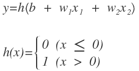
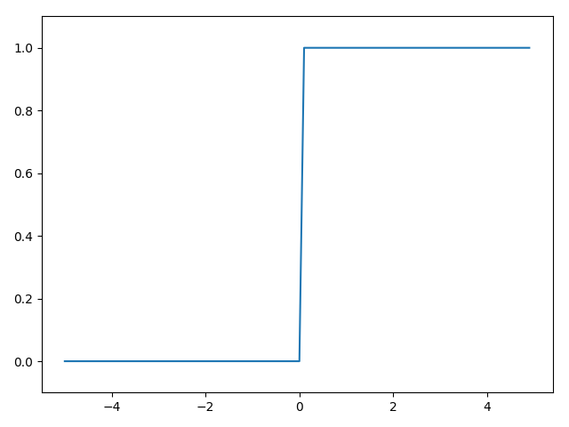
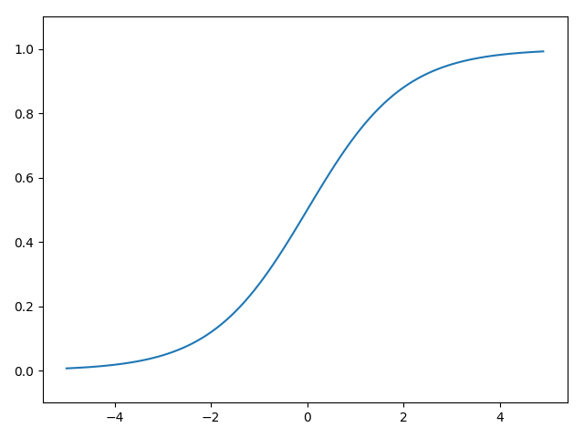
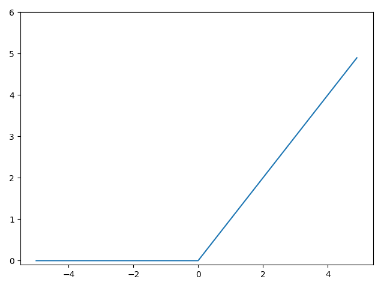
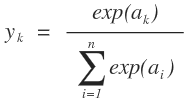
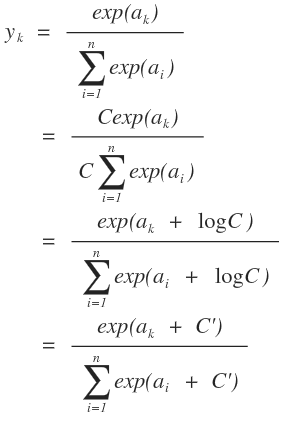

신경망
====

* 퍼셉트론의 좋은면과 나쁜면
  * Good : 퍼셉트론으로 복잡한 함수도 모두 표현할 수 있다. 심지어 컴퓨터까지! (이론상)
  * Bad : 가중치를 설정하는 작업은 여전히 사람이 수동으로 해야한다.

**가중치 매개변수의 적절한 값을 데이터로부터 자동으로 학습** 할 수 있다면 얼마나 좋을까? => 신경망!

## 구조


* 입력층 (Input Layer)
* 은닉층 (Hidden Layer)
* 출력층 (Output Layer)


## 퍼셉트론

### 퍼셉트론 기본 차트


### 바이어스를 포함한 퍼셉트론 차트
바이어스는 입력이 1이고 가중치가 b(bias)인 뉴런으로 표현할 수 있다.


### 퍼셉트론 공식을 간결하게 바꿔보자


위의 공식에서 0과 1로 나뉘는 로직을 함수로 빼서 간결화 해보자.



여기서 h(x) 는 입력(x)이 어떤 출력값을 끌어낼지 결정해주는 역할을 하는데, 이 함수를 **활성화 함수**라 부른다.


## 활성화 함수

입력 값의 총합을 결과적으로 활성화(1) 시킬지 말지를 결정하는 함수라 활성화 함수라는 이름을 가지고있다!

이 흐름에 따라 다시 보면, 퍼셉트론은 **총합을 계산하는 공식**과 **그 결과값을 활성화 함수에 입력해 활성화 결과를 확인**하는 2가지 단계로 나뉜다.


이 과정을 차트로 그려보면 아래와 같다. 입력값과 가중치값을 조합한 결과가 `a` 노드가 되고 활성화 함수인 `h()`를 통해 `y`라는 결과값 노드로 변환되는 과정이다.


### 계단함수

경계값(임계값)을 기준으로 출력이 바뀐다. 단층 퍼셉트론에서 사용했던 함수임.


```python
import numpy as np
import matplotlib.pylab as plt

def step_function(x):
    return np.array(x > 0, dtype=np.int)

def main():
    x = np.arange(-5.0, 5.0, 0.1)
    y = step_function(x)
    plt.plot(x, y)
    plt.ylim(-0.1, 1.1) # y 축의 범위 지정
    plt.show()
```



### 시그모이드 함수

신경망에서 자주 사용하는 활성화 함수. 


```python
def sigmoid(x):
    return 1 / (1 + np.exp(-x))
```



### 비교해보기

* 계단함수 : 0 or 1
* 시그모이드 : 0 ~ 1
* 공통점 
  * 입력이 중요할 수록 큰 값을 출력한다.ㅔ
  * 비선형 함수

### 비선형 함수

신경망은 활성화 함수로 비선형 함수만을 사용해야 한다.

선형 함수를 사용하면 은닉층의 의미가 없어지기 때문이다.

> example)
>
> h(x) = cx를 활성화 함수로 사용하여 3층 신경망을 만들어보자.
>
> y = h(h(h(x))) = c * c * c * x = ax (a=c^3)
>
> 위와 같이 결국 원형으로 회귀함을 알 수 있다.


### ReLU (Rectified Linear Unit, 렐루)

최근에 신경망에서 주로 사용하는 활성화 함수.

0 이하는 0을 출력하고 0 초과는 그대로 출력하는 함수이다.




```python
def relu(x):
    return np.maximum(0, x)
```


## 출력층

### 분류와 회귀

* 분류(Classification) : 데이터가 어느 클래스에 속하는가
* 회귀(Regression) : 입력 데이터의 연속적인 수치를 예측

### 출력충의 활성화 함수

출력층의 활성화 함수는 풀고자하는 문제의 성질에 맞게 정한다.

> 왜일까?

- 회귀 : 항등 함수
- 2클래스 분류 : 시그모이드 함수
- 다중 클래스 분류 : 소프트맥스 함수

#### 항등 함수 (identity function) 

입력과 출력이 같은 함수 (입력 신호 = 출력 신호)


* 회귀에서 주로 사용된다.

```python
def identity_function(x):
    return x
```


#### 소프트맥스 함수 (softmax function)



위의 수식에서 알 수 있듯이, 소프트 맥스 함수는 모든 입력 신호의 합을 분모로 가진다. 즉, 모든 입력 신호를 필요로 한다.


* 다중 클래스 분류에서 주로 사용된다.

```python
def softmax(a):
    exp_a = np.exp(a)
    sum_exp_a = np.sum(exp_a)
    y = exp_a / sum_exp_a
    
    return y
```

위의 구현은 이론적으로는 틀린 점이 없지만 실제로 컴퓨터로 연산해보면 오버플로우가 발생할 수 있다.

이를 개선하기 위해 수식을 변경해보면 다음과 같다.

 

소프트맥스의 지수함수(exp()) 계산시에는 어떤 수를 더해도 결과는 바뀌지 않는다는 뜻이다.

* `C'`에는 일반적으로 입력 신호 중 가장 큰 값을 대입한다.

```python
def softmax(a):
    c = np.max(a)
    exp_a = np.exp(a - c)
    sum_exp_a = np.sum(exp_a)
    y = exp_a / sum_exp_a

    return y
```

* 소프트맥스 함수 출력의 총합은 **1**이다. => 이 때문에 '확률'로도 해석할 수 있다.
* 출력값의 대소관계는 소프트맥스 함수를 적용해도 변하지 않는다. 정규화 시키는 것에 의미가 있을 뿐이다.
  * 실제로 연산량을 관리하기 위해 출력층의 소프트맥스 함수를 생략하는 경우도 많다.


> 왜 지수함수를 쓰지?


### 출력층의 뉴런 수 정하기

* 분류 : 분류하고 싶은 클래스의 수
* 회귀 : 1개

> 회귀는 답이 하나로 딱 나오기땜시 뉴런 수를 1개로 해도 됨


