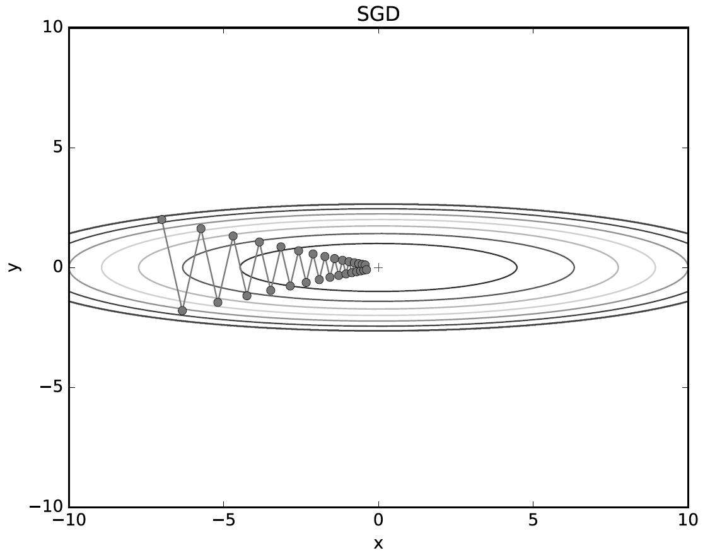

학습관련기술들
====

# 1. 매개변수 최적화 (Optimize)

## 확률적 경사 하강법(SGD)의 한계점

학습률만큼 곱해서 기울기만큼 이동시킨다 = 기울기가 큰 곳을 가리킨다!

 

* 비등방성(anisotropy) 함수에서의 탐색 경로가 비효율적이다.
  * 비등방성 함수 : 방향에 따라 성질(기울기)가 달라지는 함수
* 기울어진 방향이 본래의 최솟값과 다른 방향을 가리킨다.

## SGD를 대체할 수 있는 최적화 기법들

### 모멘텀 (Momentum)

'운동량'을 뜻한다!

W : 갱신할 가중치 매개변수

v : 속도 (velocity)

av : 물체가 아무런 힘을 받지 않을 때 서서히 하강시키는 역할(!) (공기저항/마찰 등...)

a(알파) : 0.9 등의 값으로 설정한다.

x축은 일정한 가속도로 진행. y축은 속도가 일정하지 않음 => x 축으로 빠르게 다가가 지그재그의 움직임이 줄어든다.

### AdaGrad (Adaptive Gradient)

학습률 감소(learning rate decay) 기법 중 하나

* 학습을 진행해나가면서 학습률을 점차 줄여나간다
* 처음에는 크게 학습하다가 조금씩 작게 학습하겠다는 뜻!

AdaGrad : 각각의 매개변수에 맞춤형 값을 만든다.

h : 기존 기울기 값을 제곱하여 더한 값.

W 계산 시, h루트분의 1을 곱해서 움직임이 큰 만큼 줄어들게끔 조정하는 역할을 한다.

즉, 매개변수의 원소 중 많이 움직인(크게 갱신된) 원소는 학습률이 낮아지게 한다.

> 이렇게 계속 변경하다보면 갱신량이 0이 되는 순간이 오기도 함. 이를 개선하기 위해 RMSProp 기법이 등장. 지수이동평균을 사용하여 과거 기울기의 반영규모를 기하급수적으로 감소시킨다. 즉, 먼 과거의 기울기의 영향은 점점 줄어들고 새로운 기울기의 영향을 더욱 증가시킨다.

### Adam (Momentum + AdaGrad)

# 2. 가중치의 초깃값 조절하기

## 가중치 감소 (weight decay)

오버피팅을 억제해서 범용 성능을 높히는 테크닉.

가중치 매개변수의 값이 작아지도록 학습하는 방법.

* 주의사항 : 가중치 초기값을 균일한 값으로 하면 안된다. => 모든 가중치의 값이 똑같이 갱신되기 때문이다. => 초기값은 무작위로 설정해야 한다.

## 초기값 정하기

### 정규분포로 흩뿌려보자!

정규분포

### Xavier 초깃값

활성화 함수로 선형함수를 이용할 때 쓰면 좋다. (sigmoid, tanh)

### He 초깃값

ReLU에 특화된 초깃값

# 3. 배치 정규화

# 4. 오버피팅 막기

## 오버피팅

학습데이터에 너무 딥하게 디펜던시가 걸리도록 학습된 경우...!

* 매개변수가 많고 표현력이 높은 모델의 경우
* 훈련데이터가 너무 적은 경우

# 5. 적절한 하이퍼파라미터 값 찾기

* 하이퍼파라미터 : 미리 정의해둬야하는 값 (ex. 학습률 등...)