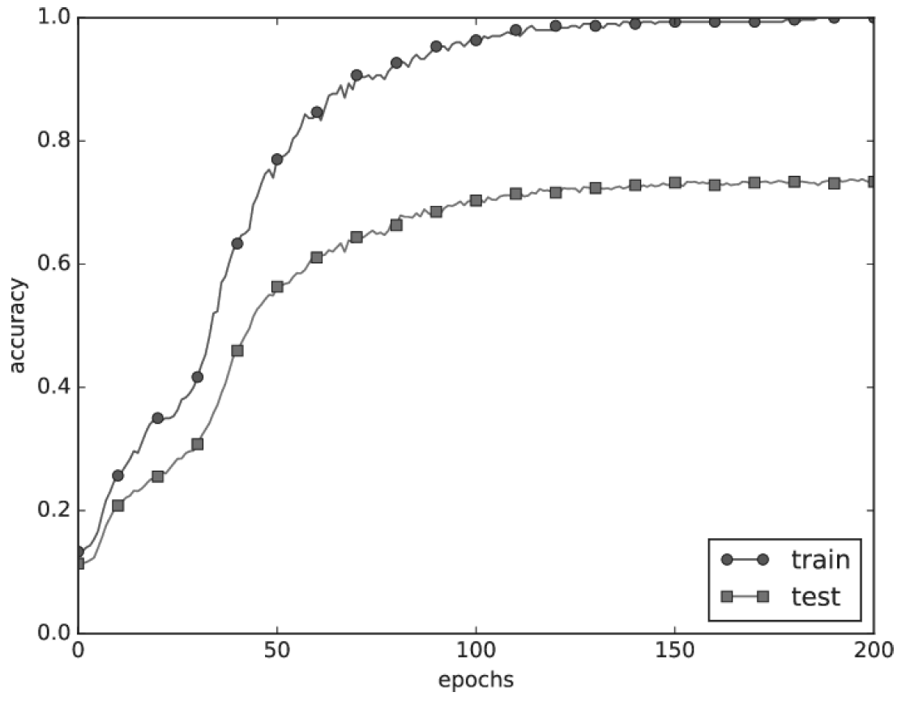
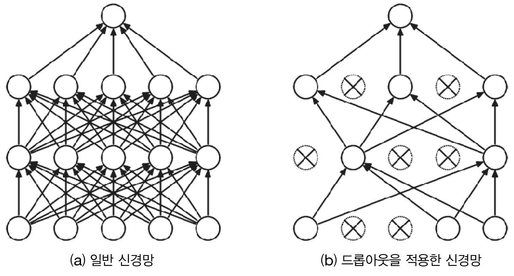

학습 관련 기술들
====


# 1. 매개변수 최적화 (Optimize)

## 확률적 경사 하강법(SGD)의 한계점


학습률만큼 곱해서 기울기만큼 이동시킨다 = 기울기가 큰 곳을 가리킨다!

 

* 비등방성(anisotropy) 함수에서의 탐색 경로가 비효율적이다.
  * 비등방성 함수 : 방향에 따라 성질(기울기)가 달라지는 함수
* 기울어진 방향이 본래의 최솟값과 다른 방향을 가리킨다.

## SGD를 대체할 수 있는 최적화 기법들

### 모멘텀 (Momentum)

'운동량'을 뜻한다!


W : 갱신할 가중치 매개변수

v : 속도 (velocity)

av : 물체가 아무런 힘을 받지 않을 때 서서히 하강시키는 역할(!) (공기저항/마찰 등...)

a(알파) : 0.9 등의 값으로 설정한다.


x축은 일정한 가속도로 진행. y축은 속도가 일정하지 않음 => x 축으로 빠르게 다가가 지그재그의 움직임이 줄어든다.


### AdaGrad (Adaptive Gradient)

학습률 감소(learning rate decay) 기법 중 하나

* 학습을 진행해나가면서 학습률을 점차 줄여나간다
* 처음에는 크게 학습하다가 조금씩 작게 학습하겠다는 뜻!

AdaGrad : 각각의 매개변수에 맞춤형 값을 만든다.


h : 기존 기울기 값을 제곱하여 더한 값.

W 계산 시, h루트분의 1을 곱해서 움직임이 큰 만큼 줄어들게끔 조정하는 역할을 한다.

즉, 매개변수의 원소 중 많이 움직인(크게 갱신된) 원소는 학습률이 낮아지게 한다.

> 이렇게 계속 변경하다보면 갱신량이 0이 되는 순간이 오기도 함. 이를 개선하기 위해 RMSProp 기법이 등장. 지수이동평균을 사용하여 과거 기울기의 반영규모를 기하급수적으로 감소시킨다. 즉, 먼 과거의 기울기의 영향은 점점 줄어들고 새로운 기울기의 영향을 더욱 증가시킨다.


### Adam (Momentum + AdaGrad)


# 2. 가중치의 초깃값 조절하기

## 가중치 감소 (weight decay)

오버피팅을 억제해서 범용 성능을 높히는 테크닉.

가중치 매개변수의 값이 작아지도록 학습하는 방법.

* 주의사항 : 가중치 초기값을 균일한 값으로 하면 안된다. => 모든 가중치의 값이 똑같이 갱신되기 때문이다. => 초기값은 무작위로 설정해야 한다.

## 초기값 정하기

### 정규분포로 흩뿌려보자!

정규분포

### Xavier 초깃값

활성화 함수로 선형함수를 이용할 때 쓰면 좋다. (sigmoid, tanh)

### He 초깃값

ReLU에 특화된 초깃값


# 3. 배치 정규화

**가중치의 초기 값을 적절히 설정**하면 각 층의 **활성화 값 분포가 적당히 퍼지면서** 학습이 원활하게 된다. 

=> **각 층의 활성화 값 자체를 그냥 적당히 퍼트리도록 강제**하면 어떨까?

## 배치 정규화 (Batch Normalization)

- 학습 속도 개선

- 초기 값에 크게 의존하지 않는다. (골치 아팠던 초기 값 선택장애 ㅂㅂ)

- 오버피팅을 억제한다. (드롭아웃 등의 필요성 감소)

  

미니배치 단위로 정규화 시킨다!

### 수식 & 정규화 과정


위의 수식은 데이터 분포 ([ x1, x2, ...., xm ])를 **평균이 0, 분산이 1**인 분포([ ^x1, ^x2, ... ^xm ])가 되도록 정규화한다. (적절하게 분포시키기 위해서)


정규화된 데이터에 확대(scale)와 이동(shift) 변환을 수행한다. (왜?)

* 확대 인자 : γ (배율)
* 이동 인자 : β
* 초기값 : γ=1, β=0 (1배, 0만큼 이동한 상태에서 시작 == 처음에서 시작)

학습을 진행하며 적절한 γ, β 값을 찾아간다.


# 4. 오버피팅 피하기

올바른 학습을 하기 위해서는 **오버피팅**을 피해야 한다.

## 오버피팅



학습데이터에 너무 딥하게 디펜던시가 생긴 상태로 학습된 경우...!

* 매개변수가 많고 표현력이 높은 모델의 경우 (층이 지나치게 많다든지...)
* 훈련데이터가 너무 적은 경우


## 해결방법들

### 가중치 감소 (weight decay)

오버피팅은 가중치의 값이 지나치게 커져서 발생하는 경우가 많기 때문에 제안된 방법으로서,

학습과정에서 큰 가중치에 대해 그에 상응하는 큰 페널티를 부과하여 오버피팅을 억제하는 방법이다.

각각의 모든 가중치의 손실함수에 L2 norm(제곱 노름, **1/2 * 람다 * 가중치^2**) 를 더한다. (역전파에서는 **람다 * 가중치**를 더하게 됨 (미분하니까))

* 람다 (λ) : 정규화의 세기를 조절하는 하이퍼파라미터


가중치 감소 기법을 적용하면 위와 같이 차이를 좀 더 좁힐 수 있다. 크게 좁혀지지는 않지만 구현이 간단하기 때문에 자주 사용된다.

하지만 신경망 모델이 복잡해질수록 가중치 감소만으로는 부족해진다.

### 드롭아웃 (dropout)

뉴런을 임의로 삭제하면서 학습하는 방법이다.



* 훈련(트레이닝) 시 : 은닉층의 뉴런을 무작위로 골라서 삭제한다
* 시험(테스팅) 시 : 모든 뉴런에 신호를 전송한다. (삭제됬던 뉴런에게도 전달)

#### 구현

순전파(forward) 구현 시, 랜덤으로 0을 리턴하도록 구현하면 된다.

#### 결과


좌 : 오버피팅된 학습 결과 / 우 : 드롭아웃을 적용한 학습 결과 (dropout_ratio = 0.15)


## 앙상블 학습 (ensemble learning)

개별적으로 학습시킨 **여러 모델의 출력을 평균내어 추론하는 방식**이다. 즉, 여러 방식으로 학습시켜보고 그 결과 값들의 평균을 최종 결과로 처리하는 것이다.

드롭아웃도 앙상블 학습과 비슷하다고 볼 수 있다. 드롭아웃 시 뉴런을 무작위로 삭제하는 행위를 매번 다른 모델을 학습시키는 것으로 해석할 수 있기 때문이다. 

비슷한 맥락에서 드롭아웃을 적용하였을 때, **추론시 뉴런의 출력에 드롭아웃한 비율을 곱하면 앙상블 학습시의 '결과 값 평균내기'와 동일한 효과**를 얻을 수 있게 된다.

즉, 드롭아웃은 앙상블 학습과 같은 효과를 하나의 모델(신경망에서는 네트워크)으로 구현한 것이라 생각하면 된다.


# 5. 적절한 하이퍼파라미터 값 찾기

* 하이퍼파라미터 : 미리 정의해둬야하는 값 (ex. 학습률, 뉴런의 수, 배치 크기 등...)

하이퍼파라미터는 미리 결정해야하기 때문에 적절한 값을 처음부터 알아내기 어렵고 시행착오를 많이 겪게된다.

하이퍼파라미터를 최대한 효율적으로 탐색할 수 있는 방법을 알아보자.

## 검증 데이터 (validation data)

하이퍼 파라미터의 성능(적절성)을 측정하기 위한 전용 확인 데이터이다.

> 주의 : 하이퍼파라미터의 성능을 평가할때는 시험데이터를 사용하면 안된다. 시험데이터를 사용하여 하이퍼파라미터를 조정하면 하이퍼파라미터 값이 시험데이터에 오버피팅 되기 때문이다.


음... 헷깔리니까 여기서 다시 용어 정리를 해보자:

* 훈련 데이터 (training data) : 매개변수(가중치, 편향) 학습에 사용되는 데이터
* 검증 데이터 (validation data) : 하이퍼파라미터 성능 평가에 사용되는 데이터
* 시험 데이터 (test data) : 신경망의 범용 성능 평가에 사용되는 데이터


검증 데이터는 보통 아래와 같이, 훈련데이터의 20% 정도를 분리하여 선정한다.

```python
(x_train, t_train), (x_train, t_test) = load_mnist()

# 훈련 데이터를 뒤섞는다!
x_train, t_train = shuffle_dataset(x_train, t_train)

# 20%를 검증 데이터로!
validation_rate = 0.20
validation_num = int(x_train.shape[0] * validation_rate)

x_val = x_train[:validation_num]
t_val = t_train[:validation_num]
x_train = x_train[validation_num:]
t_train = t_train[validation_num:]
```


## 최적화

하이퍼파라미터의 범위(scope)를 조금씩 줄여가며 최적 값을 찾는다.

### 단계

1. 하이퍼 파라미터 값의 범위를 설정한다.

   - 대략적인 범위를 설정하고 그 범위에서 무작위로 선정(sampling)하고 정확도를 평가한다. 이 과정을 여러번 반복하면서 최적 값의 범위를 좁혀나간다.

   > 신경망의 하이퍼파라미터는 규칙적인 탐색보다는 무작위로 샘플링해서 탐색하는 편이 더 좋은 결과는 내는 것으로 알려져있다. 그 이유는 최종 정확도에 미치는 영향이 하이퍼파라미터마다 다르기 때문이다.

   - 그럼 그 '대략적인 범위'는 어떻게 정하는 걸까? 일반적으로 10의 거듭제곱 단위. 즉, 로그스케일로 지정한다. (ex. 0.001~1000)

2. 설정된 범위에서 하이퍼 파라미터의 값을 무작위로 추출한다.

3. 2번 단계에서 샘플링한 하이퍼파라미터 값을 사용하여 학습한다.

4. 검증 데이터로 정확도를 평가한다. (에폭은 작게!)

   * 하이퍼파라미터 최적화시에는 에폭의 크기를 작게해서 1회 평가에 걸리는 시간을 단축하는 것이 좋다. 어차피 나쁠 것 같은 값은 빠르게 포기하는 것이 이득이기 때문이다.

5. 2~4번 단계를 특정 횟수(100회 등...) 반복하며 정확도와 결과를 확인하여 하이퍼파라미터 범위를 좁힌다.

### 더 나아가서...

위의 단계들이 너무 직관에 의존하는 느낌이 들지 않는가? 베이즈 정리를 활용한 **베이즈 최적화 (Bayesian optimization)** 를 수행하면 적절한 하이퍼파라미터의 예측이 가능하다. [#논문](https://papers.nips.cc/paper/4522-practical-bayesian-optimization-of-machine-learning-algorithms.pdf)

