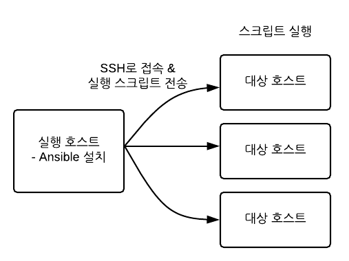

프로비저닝 도구
=====
인프라 구축 작업을 자동화하는 구성 관리 도구.

# 현황
프로비저닝 도구에는 대표적으로 Ansible, Chef, Puppet 이 존재한다.

[Ansible vs Chef vs Puppet 구글 트렌드를 확인](https://trends.google.co.kr/trends/explore?cat=5&date=today%205-y&q=ansible,chef,puppet)해보니 최근에는 Ansible이 대세인 듯 하다.


각 도구들의 구체적인 차이점은 다음과 같다.

 도구명 | 개발언어 | 정의 | Agent/SSH | 통신방법 | github와의 연동성 
------ | ------ | -------- | -------- | -------- | --------
 puppet | ruby | DSL | Agent | http ssl | 중 
 chef | ruby | DSL | Agent | Reset / STOMP | 중 
 ansible | python | YAML | SSH | json | 상 


# Ansible이란?
Python 으로 구현된 오픈소스 IT 자동화 도구. 쉽게 말하자면 **서버에 SSH 로그인하여 명령을 실행하는 형태의 작업들을 자동화**할 수 있도록 도와주는 툴이다.
* 대부분이 멱등성을 제공함.
    * 멱등성을 제공하지 않는 모듈들 : shell, command, file module)
* Agent-less
    * 굳이 Agent 도구를 따로 설치할 필요 없이 SSH로 접속하여 실행 가능.
* 이해하기 쉽다 (SSH, YAML)
    * `playbook`(ansible에서 태스크를 기술하는 파일)이 YAML 형식으로 되어있어 읽기 편하다.
* 다양한 모듈
* 애드혹 (Ad-hoc) 명령
    * 일일히 `playbook`을 작성하지 않아도 `ansible`명령으로 단일 모듈만을 실행할 수 있다.

## 이용 환경

* 실행 호스트 : Windows 환경 지원 X, Python 2.6 이상 (Python3은 지원 X)
* 대상 호스트 : SSH로 접속가능한 모든 OS 지원, Python 2.4 이상 (Python3은 지원 X)

# Ansible 사용해보기
* https://github.com/shin1x1/gihyo-devops-ansible

## 사전 준비
### VirtualBox & Vagrant 설치
1. [Virtual Box](https://www.virtualbox.org/wiki/Linux_Downloads)
1. [Vagrant 설치](https://www.vagrantup.com/downloads.html)

### Ansible 설치
```bash
$ sudo apt-get update
$ sudo apt-get install software-properties-common

$ sudo apt-add-repository ppa:ansible/ansible

$ sudo apt-get update
$ sudo apt-get install ansible
```

### Vagrant 로 가상서버 구축
1. `Vagrantfile` 생성
```ruby
# -*- mode: ruby -*-
# vi: set ft=ruby :

Vagrant.configure(2) do |config|
    config.ssh.insert_key = false
    config.vm.box = "bento/centos-7.1"
    config.vm.hostname = "yenarue-devops-ansible.dev"
    config.vm.network "private_network", ip: "192.168.34.21"
end
```
2. vagrant 업로드 후 ssh 접속
```bash
$ vagrant up
$ vagrant ssh
Last login: Sun Apr 15 15:59:45 2018 from 10.0.2.2
[vagrant@yenarue-devops-ansible ~]$
```

## `ansible.cfg`
ansible 실행시 참조되는 컨피그 파일은 다음과 같은 우선순위로 참조된다.
[공식매뉴얼](docs.ansible.com/ansible/intro_configuration.html)

1. 환경변수 `ANSIBLE_CONFIG`에 지정된 경로
2. `.ansible.cfg`
3. `~/.ansible.cfg`
4. `/etc/ansible/ansible.cfg`

## 인벤토리
태스크를 실행할 대상 호스트의 정보를 기술하는 텍스트 파일.

```bash
# inventoryfile
192.168.34.21 ansible_ssh_user=vagrant ansible_ssh_private_key_file=~/.vagrant.d/insecure_private_key
```

변수 | 내용
-----|-----
ansible_ssh_host | 대상 호스트명
ansible_ssh_port | SSH 접속 포트
ansible_ssh_user | SSH 로그인 사용자명
ansible_ssh_private_key_file | 공개키 인증 비밀키 파일
ansible_ssh_pass | 패스워드 인증할 때의 패스워드

### 호스트 별명 지정
FQDN이나 IP대신에 다른 별명을 지정할 수 있다.

```bash
# inventoryfile-alias
vm1 ansible_ssh_host=192.168.34.21 ansible_ssh_user=vagrant ansible_ssh_private_key_file=~/.vagrant.d/insecure_private_key
```

### 그룹 지정
호스트를 그룹핑 할 수 있다. 역할별/종류별 등등...
즉 그룹별로 설정을 다르게 할 수 있다는 뜻이다. development 그룹 / production 그룹으로 나눠 사용하면 개이득.

```bash
# inventoryfile-group
# 아래와 같이 alias 설정을 해줘야 인식을 한다.
vm1 ansible_ssh_host=192.168.34.21 ansible_ssh_user=vagrant ansible_ssh_private_key_file=~/.vagrant.d/insecure_private_key

[web]
vm1
web01.example.com
web02.example.com
web03.example.com

[db]
vm1
db_a.example.com
db_b.example.com

[development]
vm1

[production]
web01.example.com
web02.example.com
web03.example.com
db_a.example.com
db_b.example.com
```

아래는 위와 같은 표현이다
```bash
# inventoryfile-group-short
vm1 ansible_ssh_host=192.168.34.21 ansible_ssh_user=vagrant ansible_ssh_private_key_file=~/.vagrant.d/insecure_private_key

[web]
vm1
web[01:03].example.com

[db]
vm1
db_[a:b].example.com

[development]
vm1

[production]
web[01:03].example.com
db_[a:b].example.com
```

#### 그룹에 변수 지정하기
그룹 내 호스트들에 대해 일괄적으로 변수 지정 가능.

```bash
# inventoryfile-group-variables
[groupA]
host-a.example.com
host-b.example.com

[groupA:vars]
ansible_ssh_user=vagrant
ansible_ssh_private_key_file=~/.vagrant.d/insecure_private_key
```

### 다이나믹 인벤토리
AWS의 EC2나 VPC와 같은 정보를 동적으로 얻는 스크립트 => 이용해서 동적으로 변경되는 인벤토리를 만들면 된다.
* [ec2.py](https://raw.githubusercontent.com/ansible/ansible/devel/contrib/inventory/ec2.py)
* [ex2.ini](https://raw.githubusercontent.com/ansible/ansible/devel/contrib/inventory/ec2.ini)

## Ansible 실행
ansible의 대상 호스트로, 아까 준비했던 vagrant를 올려놓고 (`vagrant up`) ansible을 실행해보자!

`ansible` 명령으로 실행한다.
### `ansible`의 옵션들
자세한 건 man 페이지 참조.
* `-i` : 인벤토리 지정
* `--list-hosts` : 지정된 호스트들의 목록 출력
* `-m` : 모듈 지정
    * 모듈이란? 대상 호스트에서 실행할 처리를 구현한 라이브러리.
    * `-a` : 모듈의 매개변수
* `-v` : verbose 옵션. 상세 표시.
    * `-vv`, `-vvv` ... : `v`를 중첩시킬수록 메세지가 상세해짐.


```bash
# 모든 호스트
$ ansible all -i inventoryfile-group-short --list-hosts
  hosts (6):
    vm1
    web01.example.com
    web02.example.com
    web03.example.com
    db_a.example.com
    db_b.example.com

# web 호스트 그룹만 지정
$ ansible web -i inventoryfile-group-short --list-hosts
  hosts (4):
    vm1
    web01.example.com
    web02.example.com
    web03.example.com

# web01.example.com 호스트만 지정
$ ansible web01.example.com -i inventoryfile-group-short --list-hosts
  hosts (1):
    web01.example.com

```

### 모듈 적용해보기
```bash
# shell 모듈로 쉘을 띄우고 uname 명령 날림
$ ansible vm1 -i inventoryfile-alias -m shell -a 'uname -a'
vm1 | SUCCESS | rc=0 >>
Linux yenarue-devops-ansible.dev 3.10.0-229.el7.x86_64 #1 SMP Fri Mar 6 11:36:42 UTC 2015 x86_64 x86_64 x86_64 GNU/Linu
```

### Verbose 옵션 적용해보기
```bash
$ ansible vm1 -i inventoryfile-alias -m shell -a 'uname' -v
Using /etc/ansible/ansible.cfg as config file
vm1 | SUCCESS | rc=0 >>
Linux

# 메세지 출력이 보다 상세해짐
$ ansible vm1 -i inventoryfile-alias -m shell -a 'uname' -vv
ansible 2.5.0
  config file = /etc/ansible/ansible.cfg
  configured module search path = [u'/home/yenarue/.ansible/plugins/modules', u'/usr/share/ansible/plugins/modules']
  ansible python module location = /usr/lib/python2.7/dist-packages/ansible
  executable location = /usr/bin/ansible
  python version = 2.7.12 (default, Nov 20 2017, 18:23:56) [GCC 5.4.0 20160609]
Using /etc/ansible/ansible.cfg as config file
META: ran handlers
vm1 | SUCCESS | rc=0 >>
Linux

META: ran handlers
META: ran handlers
```

### `yum` 모듈을 이용하여 패키지 갱신하기
가장 유용하게 쓰일 것 같음. 여러개의 호스트에 동시에 패키지 업데이트 가능.
```bash
$ ansible all -i hosts -b -m yum -a "name=openssl state=latest"
```

# Ansible Playbook

# 관련자료
* [Naver D2 김용환 님의 'Ansible의 이해와 활용' 발표자료](https://www.slideshare.net/deview/1a7ansible)