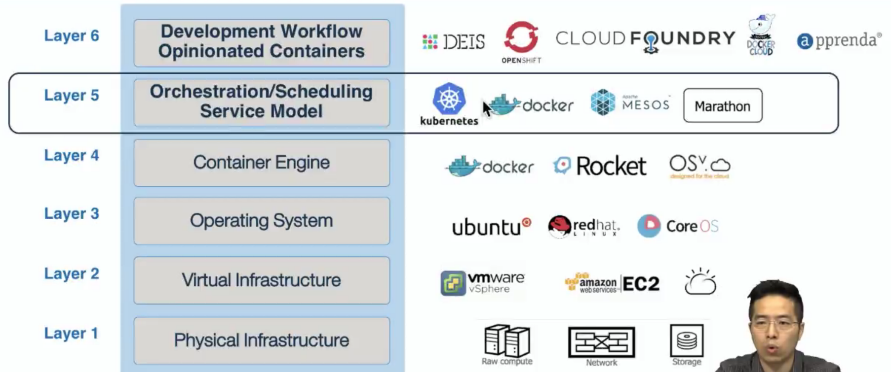

Docker
======
> "Package software into standardized units for development, shipment and deployment"


# 기존
개발 환경에서 프로덕션 환경으로 올릴때마다 환경이 달라져 제대로 동작하지 않았던 적이 많았음.
표준화되어있지 않은 방법으로 개발하고 배포하고 있었음.

# Container
컨테이너는 격리된 공간에서 프로세스가 동작하는 기술이다. 굉장히 좋은 기술이었으나 그렇게 자주 쓰이진 않았다.

## Container vs VM
Container는 가상화가 아니다!

- | Container | VM
------ | ------ | ------
비교 |  | 
특징 | 가상화X. Infrastructure위에 그냥 HostOS가 깔리고 그 위 Docker 엔진이 각각의 컨테이너를 **격리**만시킨다. | Infrastructure (물리서버) - Hypervisor (VMware) - 이 위에 아예 OS가 올라간다.
비교 |격리된 파일시스템/네트워크/프로세스 관리. **커널을 공유하기 때문에 꼭 필요한 라이브러리/바이너리만 배포함으로서 용량이 크게 감소한다.** | OS 자체를 포함하다보니 이미지 용량이 너무 크다. 새로운 이미지를 만들때 시간이 너무 오래걸린다.
결론 | 컨테이터 배포/운영하는 과정에서 부담이 줄어든다. 좀 더 클라우드 환경에 적합해짐 | 스케일업 할 때 힘들다. 마이크로서비스/클라우드 환경에서는 가상머신이 한계가 있다.


즉, Container와 VM은 전혀 다른 개념. 아래와 같이 함께 쓸 수도 있다.


## Container의 큰 특징
* Ship More Software
    * 환경설정의 어려움 제거, 환경 간 차이점 해결 => 클라우드에 올려놓고 그냥 쓰면 된다.
    * 개발, CI, CD 파이프라인 가속화. => 평균적으로 Docker 사용자가 SW를 7배 더 자주 출하한다.
* Resource Efficiency
    * 커널 부분만 공유하고 이미지는 공통 파일을 공유하는 계층화된 파일시스템 구조이기 때문에 디스크/RAM을 많이 잡아먹지 않고 효율적으로 사용할 수 있다.
* App Portability
    * App 종속성 및 구성/설정 까지 함께 패키징 된다. 이 컨테이너는 어떤 환경/인프라로 이동하더라도 동일하게 동작한다. (멱등성?)

# Docker
## Container의 혁명을 일으켰다.
Image System 통일. 배포. => 컨테이너를 쉽게 쓸 수 있도록 해줌

## Docker의 Mission
어떤 앱이든 어떤 환경이든 표준화된 프로세스로 개발하고 묶어서 보낸다음에 운영까지 걱정없이 똑같은 환경에서 돌아갈 수 있도록 하자!

> Build -> Ship -> Run -> Any App (Ubuntu, CentOS, MySQL, Node.js, Wordpress, mongoDB, redis, Nginx, Hadoop 등...) -> AnyWhere (HDD, VMware, OpenStack, AWS, MS Azure, IBM Bluemix 등...)

## 기본적인 용어
* Image : 운영해야 할 환경이 구성되어있는 일종의 FS. ReadOnly Snapshot :-)
* Container : Image를 Docker에 띄우면 Conatiner가 된다.
* Docker Hub : Public Docker Registry
    * Docker Registry : Image들을 보관하는 곳. 여기에 보관한 Image들을 끌어다가 배포해서 Container로 만든다.
    * Private Docker Registry : SaaS, Enterprise... (AWS, IBM Bluemix, MS Azure 등... 아무데나)
* Docker Engine : Container를 관리하는 Docker 프로세스.

## 실제로 사용해보자
* [튜토리얼1](http://docker-dwmeetup.mybluemix.net/docker1.html)

### Image 빌드하기
```bash
$ docker image build -t hello-world:3 .

$ docker images
REPOSITORY                                             TAG                 IMAGE ID            CREATED             SIZE
hello-world                                            3                   983614308d13        37 seconds ago      74.1MB
```

### Image Deploy 전 변경하기
```bash
$ kubectl edit deployment hello-world-deployment
## yml
#  spec:
#      containers:
#      - image: registry.au-syd.bluemix.net/yenarue/hello-world:3
##
deployment.extensions "hello-world-deployment" edited
```

### Image Push
```bash
$ docker image tag hello-world:3 
registry.au-syd.bluemix.net/$MY_NAMESPACE/hello-world:1
$ docker image push registry.au-syd.bluemix.net/$MY_NAMESPACE/hello-world:3
The push refers to repository [registry.au-syd.bluemix.net/$MY_NAMESPACE/hello-world]
14d780d043d8: Pushed 
68128e2e7bd2: Pushed 
7e33cf1c23d7: Pushed 
0804854a4553: Layer already exists 
6bd4a62f5178: Layer already exists 
9dfa40a0da3b: Layer already exists 
3: digest: sha256:a50f53150b57598ea0b53afcba9e4564a2e9e1d3d5e6403a7adb3e269cef6959 size: 1576
```

### Image Deploy
* 쿠베네티스 디플로이 참고

### 싹 다 지워버리기
```bash
$ sudo docker container rm $(docker container ls -a -q)
$ sudo docker image ls -q | sudo xargs docker image rm
Untagged: hello-world:latest
Untagged: hello-world@sha256:f5233545e43561214ca4891fd1157e1c3c563316ed8e237750d59bde73361e77
Deleted: sha256:e38bc07ac18ee64e6d59cf2eafcdddf9cec2364dfe129fe0af75f1b0194e0c96
Deleted: sha256:2b8cbd0846c5aeaa7265323e7cf085779eaf244ccbdd982c4931aef9be0d2faf
Untagged: alpine:latest
Untagged: alpine@sha256:7df6db5aa61ae9480f52f0b3a06a140ab98d427f86d8d5de0bedab9b8df6b1c0
Deleted: sha256:3fd9065eaf02feaf94d68376da52541925650b81698c53c6824d92ff63f98353
Deleted: sha256:cd7100a72410606589a54b932cabd804a17f9ae5b42a1882bd56d263e02b6215
```
### Host 내부 바인딩 가능

```bash
# mynginx3에 Host의 /home/ibmcloud/workspace:/usr/share/nginx/html 하위경로를 바인딩하도록 설정.
$ sudo docker container run -d --name mynginx3 -p 8083:80 -v /home/ibmcloud/workspace:/usr/share/nginx/html nginx:alpine

# Host 파일 수정
$ cd ~/workspace
~/workspace$ echo "hello??" > index.html 
~/workspace$ cat index.html
hello??

# 브라우저에서 ip:8083 접속시 "hello??"으로 나타나는 것 확인 가능
$ curl http://169.56.107.244:8083/
hello??
```


# [Kubernetes](https://kubernetes.io/)
Docker 클러스터를 관리하는 컨테이너 오케스트레이션 플랫폼.
* 컨테이너를 실행하고 관리함
* 이식성이 뛰어나다. (다양한 클라우드, 환경 지원)
* 100% Open Source
* Manage Applications, not machines.
* 스케쥴링, 스토리지, 네트워킹 관련 Plugin이 겁나 많다.

## Container Stack


## 구조
[Kubernetes Master] ------ [Worker Nodes]

## 사용해보기
* [튜토리얼](http://docker-dwmeetup.mybluemix.net/k8s1.html)
* [깃헙](https://github.com/IBM/container-service-getting-started-wt)
* [Kubernetes를 AWS EC2에 올리기](https://kubernetes.io/docs/getting-started-guides/aws/)

### 설치
```bash
$ sudo apt update && sudo apt install -y apt-transport-https
$ curl -s https://packages.cloud.google.com/apt/doc/apt-key.gpg | sudo apt-key add -
$ echo "deb http://apt.kubernetes.io/ kubernetes-xenial main" |sudo tee /etc/apt/sources.list.d/kubernetes.list
$ sudo apt update
$ sudo apt install -y kubectl
```
### 쿠버네티스 옵션 자동완성
```bash
$ source <(kubectl completion bash)
$ kubectl completion bash |sudo tee /etc/bash_completion.d/kubect
```

### deployment
```bash
$ kubectl describe service hello-world-service-real
Name:                     hello-world-service-real
Namespace:                default
Labels:                   run=hello-world-deployment
Annotations:              <none>
Selector:                 run=hello-world-deployment
Type:                     NodePort
IP:                       172.21.147.207
Port:                     <unset>  8080/TCP
TargetPort:               8080/TCP
NodePort:                 <unset>  32715/TCP
Endpoints:                172.30.224.73:8080
Session Affinity:         None
External Traffic Policy:  Cluster
Events:                   <none>
$ bx cs workers mycluster20180417
OK
ID                                                 Public IP       Private IP      Machine Type   State    Status   Zone    Version   
kube-mel01-pa851b24b8665d4541b0d0e8e71d11642a-w1   168.1.140.136   10.118.180.82   free           normal   Ready    mel01   1.8.8_1508   
$ curl http://168.1.140.136:32715
Hello world from hello-world-deployment-5958d5f944-7rfmm! Your app is up and running in a cluster!
```

### Scale UP
* [[Tutorial] Scale and update apps -- services, replica sets, and health checks](https://github.com/IBM/container-service-getting-started-wt/tree/master/Lab%202)
#### yml수정
```bash
$ kubectl edit deployment hello-world-deployment
spec:
  replicas: 5

## 확인해보기
$ kubectl get pod
NAME                                      READY     STATUS              RESTARTS   AGE
hello-world-deployment-5958d5f944-5tqm5   0/1       ContainerCreating   0          17s
hello-world-deployment-5958d5f944-65vzx   0/1       ContainerCreating   0          17s
hello-world-deployment-5958d5f944-6h6mw   1/1       Running             0          4m
hello-world-deployment-5958d5f944-7rfmm   1/1       Running             0          21m
hello-world-deployment-5958d5f944-d8cjn   0/1       ContainerCreating   0          17s
```

#### command 사용
```bash
$ kubectl scale --replicas=5 deployment hello-world-deployment
deployment.extensions "hello-world-deployment" scaled

## 확인해보기
$ kubectl get pod
NAME                                      READY     STATUS              RESTARTS   AGE
hello-world-deployment-5958d5f944-6h6mw   1/1       Running             0          6s
hello-world-deployment-5958d5f944-7rfmm   1/1       Running             0          17m
hello-world-deployment-5958d5f944-ffmpn   0/1       ContainerCreating   0          6s
hello-world-deployment-5958d5f944-mkjs4   0/1       ContainerCreating   0          6s
hello-world-deployment-5958d5f944-tb6kt   1/1       Running             0          6s
```

### RollBck
```bash
# Undo 가능. 이전 버전으로 돌아감.
$ kubectl rollout undo deployment hello-world-deployment
deployment.apps "hello-world-deployment"
```