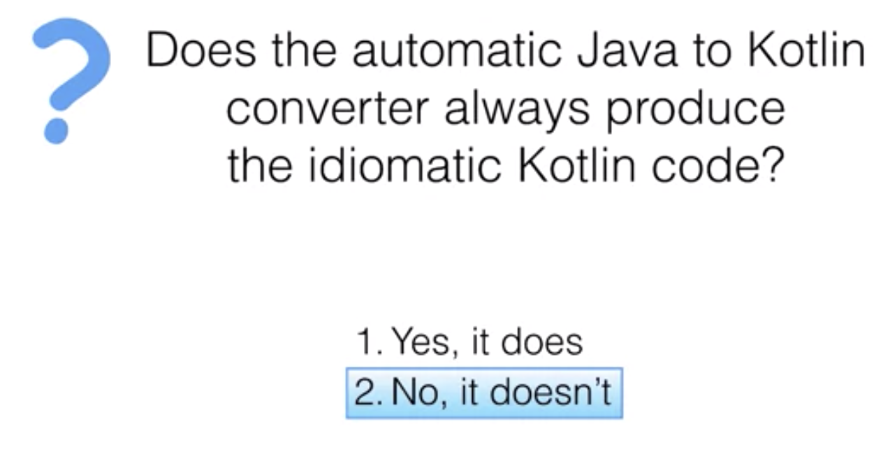

Kotlin
====

> 스터디파이의 '코틀린 입문' 스터디 진행과 함께 [Coursera 의 'Kotlin for Java Developers'](<https://www.coursera.org/learn/kotlin-for-java-developers>) 강의를 참고하며 작성하는 TIL 입니다.

함수형 프로그래밍과 객체지향 프로그래밍을 동시에 지원하며 Java와 상호운용 될 수 있으면서도 Java의 단점을 개선하는 실용적인 언어를 지향한다.

JVM 생태계에 잘 녹아들어가는 것으로 시작하여 다른 플랫폼으로 확장해가고 있다.

- Kotlin/JVM
- Kotlin/JS
- Kotlin/Native

## Kotiln의 디자인 철학

* 간결성 (Concise)
* 안전성 (Safe)
  * Null-safety, smart casts
* 상호운용성 (Interoperable, interop)
  * Java와의 호환성을 유지한다.
* 툴 친화성 (Tool-friendly)

## Scala와의 비교

### Scala

> 자바보다 훨씬 더 많은 것을 계획하고 있어!
>
> 자바보다 강력하도록!

* Academy 에서 학문적 용도로 설계함
* 함수형 프로그래밍 + 타 패러다임 간의 하이브리드를 실현하기 위해 탄생
* 새로운 JVM 정적언어를 만들 수 있다는 것을 입증함
* **원하는 모든 것을 제공한다** - 컴파일 속도가 느림
* 함수형 프로그래밍, 객체지향 프로그래밍 패러다임을 지원함 (하스켈의 대부분의 기능을 갖춤)

### Kotlin

> 더 나은 자바가 되고 싶어!
>
> formal 하기 보다는 단순하게!

* 소프트웨어 회사에서 개발 시작 (킹-갓-Jetbrain)
* 실용적인 문제를 해결하기 위해 탄생
  * Tool-friendly
* **필요한 모든 것을 제공한다**
* 함수형 프로그래밍 패러다임을 완전히 지원하지는 않는다

## Java로부터 Kotlin까지

Kotlin은 Java ByteCode로 컴파일된다.

Java 코드에서 Kotlin 코드로 자동 변환을 할 수 있다. (IntelliJ계열 IDE에서 모두 가능 > `convert Java to Kotlin`)

> [Tip]  `Tools` > `Kotlin` > `Show Kotlin Bytecode` > `Decompile` 을 통해 Kotlin 코드가 Java Bytecode 및 Java 소스코드에 어떻게 대응되는지 확인해볼 수 있다.

## Before (Java) & After (Kotlin)

### 클래스를 정의해보자!

```java
// Java
public class Person {
    private final String name;
    private final int age;
    
    public Person(String name, int age) {
        this.name = name;
        this.age = age;
    }
    
    public String getName() {
        return name;
    }
    
    public int getAge() {
        return age;
    }
}
```

```kotlin
// Kotlin
class Person(val name: String, val age: Int)
```

Boilerplate 코드의 양이 확연히 줄어든다. 마치 Java의 lombok 라이브러리를 사용한듯한 느낌. 어노테이션조차 없어 훨씬 장황하지 않고 깔끔한 느낌이 든다.

`equals`, `hashCode`, `toString` 메소드들도 포함하고 싶다면 아래와 같이 작성하면 된다.

```kotlin
// Kotlin
data class Person(val name: String, val age: Int)
```

### 인스턴스를 생성해보자!

그렇다면 Person 클래스를 사용할때는 어떻게 다른지 확인해보자!

```java
//Java
Person person = new Person("Alice", 27);
System.out.println(person.getName());
```

```kotlin
// Kotlin
val person = Person("Alice", 27)
println(person.name)
```

완벽하게 동일한 동작을 하는 코드임에도 Kotlin으로 변환한 경우, 훨씬 간결해진다는 것을 알 수 있다. ☺️

### 조건문이 포함된 평범한 로직을 짜보자!

```java
public void updateWeather(int degrees) {
    String description;
    Color color;
    if (degrees < 10) {
        description = "cold";
        color = BLUE;
    } else if (degrees < 25) {
        description = "mild";
        color = ORANGE;
    } else {
        description = "hot";
        color = RED;
    }
}
```

위 Java 코드를 JetBrain 계열의 IDE를 이용해 Kotlin 으로 **자동 변환**을 하면 아래와 같이 변환된다.

```kotlin
fun updateWeather(degress: Int) {
    val description: String
    val color: Color
    if (degrees < 10) {
        description = "cold"
        color = BLUE
    } else if (degrees < 25) {
        description = "mild"
        color = ORANGE
    } else {
        description = "hot"
        color = RED
    }
}
```

몇가지 빌트인 키워드가 변경된 것을 제외하면… Java 코드와 굉~장히 유사하게 변환되었다.

이를 좀 더 **'코틀린'스럽게** 바꿔보자!

```kotlin
// 1단계. Pair 이용하기
fun kotlinish_2_updateWeather(degrees: Int) {
    val (description: String, color: Color) =
	    if (degrees < 10) {
    	    Pair("cold", BLUE)
	    } else if (degrees < 25) {
    	    Pair("mild", ORANGE)
	    } else {
    	    Pair("hot", RED)
    	}
}

// 2단계. 타입 추론 - 문맥상 타입이 명확하다면 생략 가능
fun kotlinish_2_updateWeather(degrees: Int) {
    val (description, color) =
	    if (degrees < 10) {
    	    Pair("cold", BLUE)
	    } else if (degrees < 25) {
    	    Pair("mild", ORANGE)
	    } else {
    	    Pair("hot", RED)
    	}
}

// 3단계. if를 when으로 치환 (Java의 switch 구문과 유사)
// - use case 파악이 좀 더 수월해진다.
fun kotlinish_3_updateWeather(degrees: Int) {
    val (description, color) = when {	   
    	degrees < 10 -> Pair("cold", BLUE)
	    degrees < 25 -> Pair("mild", ORANGE)
	    else -> Pair("hot", RED)
   }
}

// 4단계. Pair를 to로 변경
// - to : Pair를 생성하는 또 다른 방법!
fun kotlinish_4_updateWeather(degrees: Int) {
    val (description, color) = when {	   
            degrees < 10 -> "cold" to BLUE
	    	degrees < 25 -> "mild" to ORANGE
	    	else -> "hot" to RED
    	}
}
```

4단계에 걸쳐 좀 더 '코틀린스러운' 코드로 변경해보았다.

Java 코드로 작성되었던 기존 코드보다 훨씬 간결해지고 가독성이 향상되었음을 느낄 수 있었다.

그리고 처음 자동변환된 Kotlin 코드와 4단계에 걸쳐 매뉴얼로 수정한 코드도 굉장히 차이가 크게 난다. 자동 변환 기능은 자연스러운, 코틀린스러운 변환이 보장되지는 않는걸까?



코틀린 개발자가 직접 강의하는 coursera의 Kotlin for Java Developers 강의에서도 위의 질문에 아예 **No** 라고 단호하게 답변했다.

그러므로, Java -> Kotlin 으로 자동 변환해주는 기능이 꽤 편하긴 하지만 제대로 코틀린스럽게 변경하려면 매뉴얼로 코드를 변경하여야 한다 :-)

## 기존 프로젝트에 Kotlin 적용하기

부분 적용이 가능함. 천천히 적용하셈

unit test 부터 시작해서 전체 프로젝트에 적용하도록!

## Hello, Kotlin!

```kotlin
package intro

fun main(args: Array<String>) {
    val name = "Kotlin"
    println("Hello, $name!")	// Hello, Kotlin!
    println("Hello, ${args.getOrNull(0)}!")		// Hello, null!
}
```

### String templates

`"…$variable…."`, `"….${functionCall()}…."` 등의 인라인 호출이 가능

- 위의 예제에서 `name` 변수를 스트링에 인라인시켰다.
- 위의 예제에서 `args.getOrNull(0)` 메소드를 스트링에서 인라인 콜을 했다. 


## 결론

지금까지 Kotlin 을 짧게 훑어보았다.

다음부터는 Kotlin의 문법을 살펴보도록 하겠따!


## 참고자료

* [[coursera] Kotlin for Java Developers - 1. Introduction / 2. Starting up with Kotlin](https://www.coursera.org/lecture/kotlin-for-java-developers/introduction-to-the-course-1bpIV)
* [[번역] 스칼라 vs 코틀린 : 더 나아진 자바를 목표로 경쟁하는 2개의 언어](https://hamait.tistory.com/895)
* [Try Kotlin, Web IDE](https://try.kotlinlang.org/)