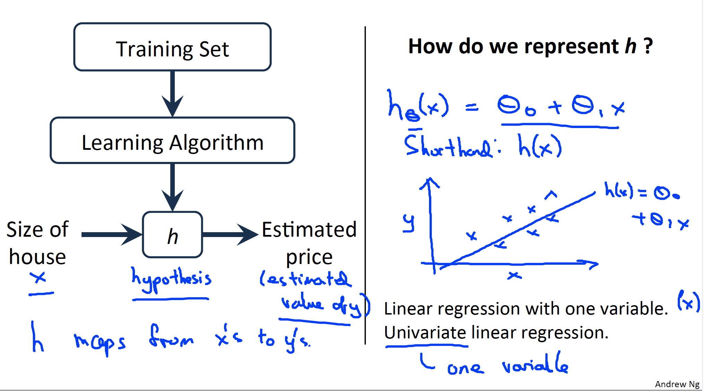
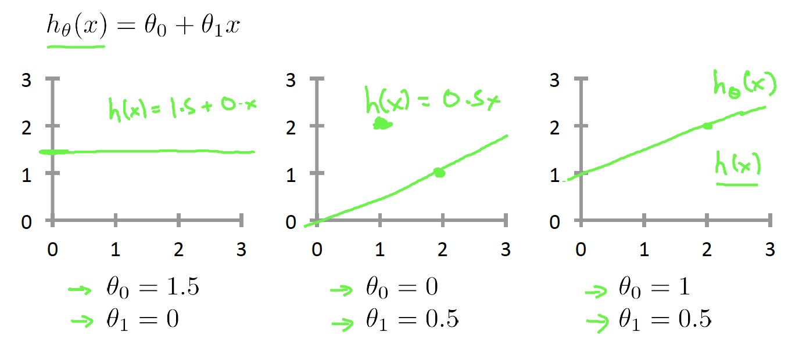
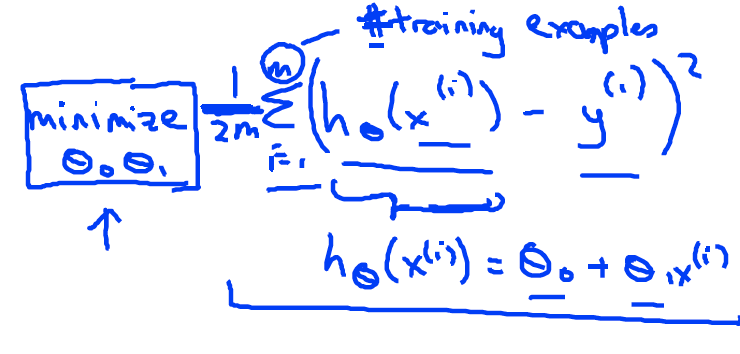
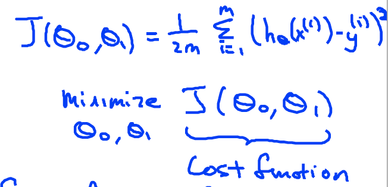
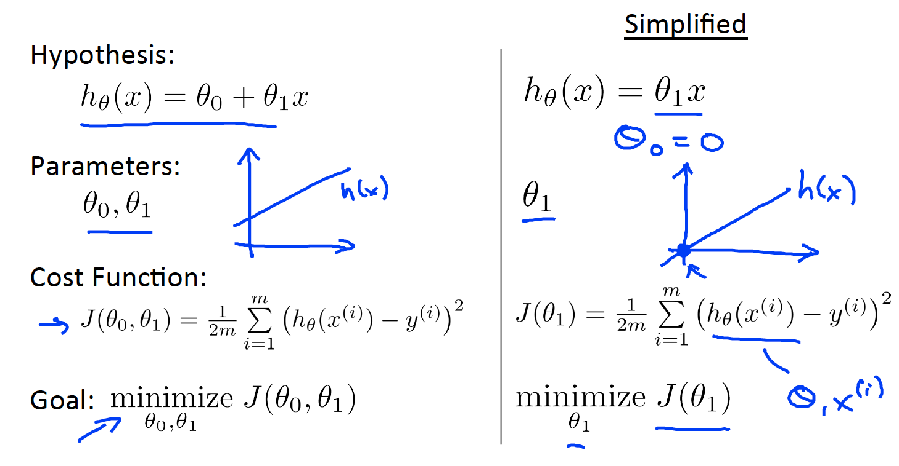
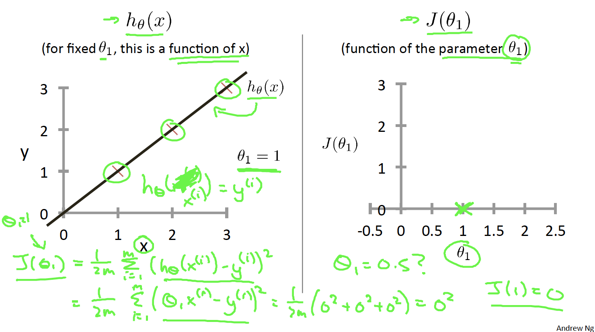
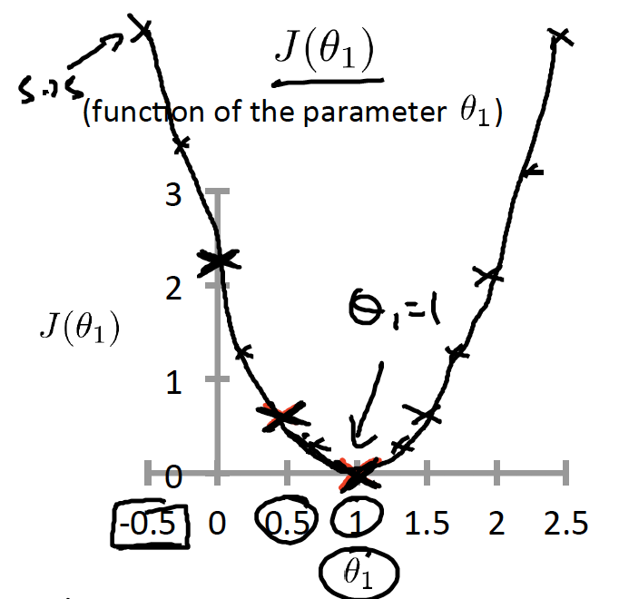

Coursera의 유명 강의, Andrew Ng 교수님의 Machine Learning 를 들으며 정리한 개인 학습자료입니다.

# W1-2. Supervised Learning - Linear Regression with one variable

지도학습 (Supervised Learning) 중의 하나인 선형 회귀 (Linear Regression) 에 대해서 알아보자.

# Model and Cost Function

## Model Representation

Week1 - 1. Introduction 에서 살펴봤듯이, 선형회귀는 **데이터의 양상을 가장 잘 표현할 수 있는 선형의 직선을 그려, 새로운 input(x) 값이 들어왔을 때 그에 적합한 ouput(y)을 예측하는 것**이다.

위의 스크린샷에서 집 값 예시를 살펴보며 선형 회귀를 이해해보자.

빨간색 x로 표현된 기존 데이터의 양상을 표현하는 선형의 선을 그으면, 1250 feet^2 라는 새로운 input 값이 제시되었을 때 그 선을 기반으로 집 값이 220,000 달러 정도 될 것이라 예측할 수 있다.

여기서 "선형의 선"을 그은 것이 데이터를 표현하는 모델을 선정한 것이며, 이것이 바로 선형 회귀의 모델 표현법이다.

### 모델 표현법을 도식화 & 수식화 해보자

위 흐름을 플로우 차트로 도식화 해보면 아래와 같이 표현된다.

**학습 데이터(Training Set)**를 통해 **학습 알고리즘(Learning Algorithm)**을 이용하여 **가설(h)**을 만들어내는 흐름으로 도식화 되었다. 각 파트를 자세히 살펴보면 아래와 같다 : 

* 학습 데이터 (Training Set) : 학습에 사용될 데이터 셋
  * 집 값 예시 : feet^2와 집 값에 대한 데이터들

* 학습 알고리즘 (Learning Algorithm) : 학습 데이터를 학습하는 방식
  * 집 값 예시 : "직선의 방정식으로 학습하겠다"는 방식
* h (Hypothesis, 가설) : 학습데이터를 학습 알고리즘으로 학습한 결과물
  * Error가 최소이거나 최적인 모델
  * 집 값 예시 : 도출된 직선 (1차 방정식의 형태)

#### 여기서 가설 (Hypothesis) 에 대해서 좀 더 살펴보도록 하자 :

* h (Hypothesis, 가설) : x에서 y으로까지의 연결지도 (h maps from x to y)

  * input(x)이 들어오면 h(가설)을 통해 예측된 값을 output(y)으로서 내놓는다.

  > 여기서 h는 "가설"이라는 단어의 사전적 의미와는 조금 다르다. 이는 그냥 기계학습 초기에서부터 사용되어오던 용어다. 앤드류 응 교수님께서도 이 단어가 과연 적합한지에 대해 의문을 품고 계신다. 그냥 머신러닝 전문용어니까 그러려니 하자고한다 (!)

* 하나의 변수를 가지는 선형함수 **h(x) = Θ0 + Θ1x**
  * 단일변량 선형 함수 = 하나의 변수를 가지는 선형 함수
  * 처음 보면 좀 어려워 보일 수 있지만 그냥 1차 방정식이다. (f(x) = ax + b 와 동일한 형태)

지금까지 선형 회귀 모형에 대해서 알아보았다. 이제 이 모형을 어떻게 실행할 것인지에 대해 살펴보자.

## Cost Function (비용 함수)

**비용함수를 이용하면 데이터에 가장 가까운 일차함수 그래프를 알아 낼 수 있다.**

비용함수를 알아보기 앞서 가설의 형태를 다시한번 살펴보자:

여기서 **Θ0, Θ1은 모형의 파라미터**를 뜻한다. 각 파라미터 값에 따라 아래와 같이 가설함수가 달라진다.

선형회귀에서는 훈련집합에 가장 잘 적합하는 직선을 구해야한다. 위 그림에서 알 수 있듯이 Θ0, Θ1값에 따라 직선의 형태가 결정되므로 모형의 성능을 결정하는 값들임을 의미하며 선형회귀에서는 이 **Θ0, Θ1 파라미터 값을 어떻게 고를 것인지가 중요 포인트**라고 볼 수 있다

그렇다면 Θ0, Θ1가 데이터와 잘 일치하는지는 어떻게 알 수 있을까? (평가)

### 최소화 문제 (minimize Θ0, Θ1)

다시한번 우리의 목적을 살펴보자. 우리는 **훈련집합을 가장 잘 표현하는 직선**을 구하고싶다. 이것을 바꿔 이야기하면 해당 **직선을 통해 예상된 결과값과 실제 결과값의 차이를 최소화하는 Θ0, Θ1의 값**을 찾고 싶은 것이다. 이것을 수학적 표현(수식)으로 표현해보자.

* h(x) : x가 입력되었을 때의 예상 결과 값
* y : 실제 결과값
* 1/2m : 평균을 내기 위함
* m : 훈련집합의 크기 (개수)

위 수식을 해석해보면, 가설(직선)을 통해 예상된 결과값(h(x))과 실제 결과값(y)의 차이의 평균을 구하고있다. 즉, 오차의 평균을 구하는 것이다. 우리는 이제 이 값을 최소화하는 Θ0, Θ1를 구하면 된다. 이것을 "최소화 문제"라고 하며, minimize Θ0, Θ1이라고도 한다.

보통 이러한 기능을 하는 함수를 J(Θ0, Θ1) 로 표현한다. 그리고 이것이 바로 이번 장에서 알아보고있는 **비용함수 (cost function)** 이다. 

### Linear Regression 의 Cost Function

비용함수 (cost function) 은 하나의 역할자를 칭하는 명칭으로서 학습 목적에 따라 다양한 함수가 적용될 수 있다.

지금까지 우리가 알아본 비용함수는 **제곱오차함수(Squared error function)** 으로서 "오차의 제곱의 평균을 구하는 함수"이다. 제곱오차함수는 통상적으로 선형회귀(Linear Regression)에서 비용함수로 자주 사용되는 함수이다.

>  [한줄 요약] Linear Regression에서는 Cost Function으로 주로 Squared Error Function을 이용한다!

### Deep Dive To Cost Function (좀 더 깊게 들어가보기)

비용함수가 무슨일을 하는지, 왜 사용해야 하는지에 대해 알아보기 위해 좀 더 자세히 살펴보도록하자.

#### 단순화하여 이해해보기 (Θ1만 생각해보자)

일단 이해하기 쉽도록, 왼쪽과 같이 Θ0, Θ1를 둘 다 가지는 기존 가설을 오른쪽과 같이 Θ1만 가지는 가설로 단순화(Simplify) 해보자. 단순화한 가설에서는 Θ0이 0이라는 뜻인데, 이 말은 함수가 원점(0,0)을 지난다는 뜻이다.

간소화한 가설을 간단하게 정의해보면 아래와 같다

* 가설함수 (h) : x의 함수
* 비용함수 (J) : 가설함수의 경사를 결정하는 Θ1의 함수

이제 간소화된 가설을 이용하여 비용함수를 직접 그려보면서 왜 비용함수의 값을 최소화하는 것이 좋은 가설을 찾는 방법인지에 대해 알아보도록 하겠다.

먼저 빨간색 X를 정확하게 표현하는 가설인 경우를 살펴보자.

좌측의 그래프를 살펴보면 가설 h(x)의 그래프가 자료들을 정확하게 표현하고 있음을 알 수 있다. 이 때, 가설 h(x)의 기울기(Θ1)은 1이다.

비용함수는 가설의 결과값과 실제값의 차이를 계산하는 함수이므로 이 경우에는 두 값의 차이가 전혀 없기 때문에 비용함수의 값은 0으로 도출된다(J(1) = 0).

즉, Θ1 가 1일 때 J(Θ1)의 값은 0이 되어 우측의 비용함수 그래프에 좌표가 (1, 0)으로 표시된다.

이번에는 기울기(Θ1)가 0.5인 경우를 살펴보자.

이 경우에는 가설 h(x)의 그래프가 실제 자료들과는 꽤나 동떨어지게 그려졌다. 비용함수를 통해 실제 데이터와의 차이를 계산해보면 `(0.5*0.5 + 1 + 1.5*1.5 )/6 = 0.58333 ` 으로 대략 0.58이 도출된다. 이를 비용함수 그래프에 그려보면 (0.5, 0.58) 으로, 우측 그래프와 같이 표시된다.

이번에는 기울기(Θ1)가 0인 경우를 살펴보자.

이 경우에는 가설 h(x)의 그래프의 기울기가 0이므로 x축과 동일한 선이 그려진다. 똑같이 비용함수를 이용해 실제 데이터와의 차이를 계산해보면 `(1 + 4 + 9) / 6 = 2.3333 ` 으로 대략 2.3이 도출된다. 이를 비용함수 그래프에 그려보면 (0, 2.3) 으로, 우측 그래프와 같이 표시된다.

똑같이 기울기를 0.5 감소시켰는데 비용함수의 값은 이전과는 매우 큰 차이로 커졌다.

그렇다면 기울기(Θ1)가 음수가 되면 어떨까? 비용함수의 값은 더더욱 커질것이다. 기울기가 1보다 커지는 경우에도 마찬가지이다. 모든 Θ1에 따른 비용함수의 값을 좌표로 찍어보면,

위와 같이 x^2 형태의 그래프가 그려진다. 가설이 실제 데이터와 멀어질수록 급격하게 비용함수의 값이 증가하는 형태를 보이며 비용함수의 값이 0이 되는 좌표를 기준으로 동일한 값을 같는다. 즉, **비용함수의 값이 0에 가까울수록 가설이 실제 데이터와 가까워짐을 의미**하며 이것이 바로 왜 **"비용함수를 최소화하는 파라미터 값을 찾는 것"이 "데이터를 잘 설명하는 직선을 찾는 것"과 동일한 것**인지를 알 수 있는 대목이라 할 수 있다 :-) 

#### 이번엔 Θ0까지 고려해보자!

세타0까지 적용하여 이를 다시 살펴보자

세타1만 적용했을 때 -> 2차원 그래프 -> 활모양

3차원 그래프 -> 아래쪽으로 볼록한 그래프 (Convex Function, Bowl-shaped Graph)

매번 3D그래프로 보기 힘드니 등고선 그래프 (Contor Plot, Contour Plot) 로 살펴보자

중앙 동그라미에 가까울수록 최소값 => 더 좋은 가설

더 많은 파라미터를 사용하는 고차원 형태를 알아보자. 시각화하기 점점 어려워질 것이지만 J를 최소화하는 세타0, 1의 값을 찾는 건 똑같을 것이다. 

