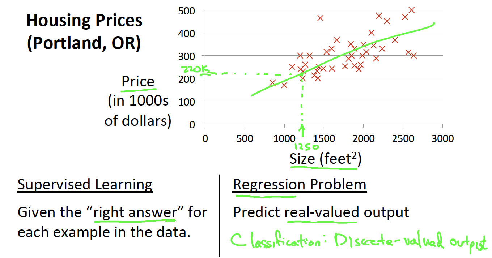

Coursera의 유명 강의, Andrew Ng 교수님의 Machine Learning 를 들으며 정리한 개인 학습자료입니다.

# W1-2. Supervised Learning - Linear Regression

지도학습 (Supervised Learning) 중의 하나인 선형 회귀 (Linear Regression) 에 대해서 알아보자.

## Model Representation

Week1 - 1. Introduction 에서 살펴봤듯이, 선형회귀는 **데이터의 양상을 가장 잘 표현할 수 있는 선형의 직선을 그려, 새로운 input(x) 값이 들어왔을 때 그에 적합한 ouput(y)을 예측하는 것**이다.

위의 스크린샷에서 집 값 예시를 살펴보며 선형 회귀를 이해해보자.

빨간색 x로 표현된 기존 데이터의 양상을 표현하는 선형의 선을 그으면, 1250 feet^2 라는 새로운 input 값이 제시되었을 때 그 선을 기반으로 집 값이 220,000 달러 정도 될 것이라 예측할 수 있다.

여기서 "선형의 선"을 그은 것이 데이터를 표현하는 모델을 선정한 것이며, 이것이 바로 선형 회귀의 모델 표현법이다.

### 모델 표현법을 도식화 & 수식화 해보자

위 흐름을 플로우 차트로 도식화 해보면 아래와 같이 표현된다.

**학습 데이터(Training Set)**를 통해 **학습 알고리즘(Learning Algorithm)**을 이용하여 **가설(h)**을 만들어내는 흐름으로 도식화 되었다. 각 파트를 자세히 살펴보면 아래와 같다 : 

* 학습 데이터 (Training Set) : 학습에 사용될 데이터 셋
  * 집 값 예시 : feet^2와 집 값에 대한 데이터들

* 학습 알고리즘 (Learning Algorithm) : 학습 데이터를 학습하는 방식
  * 집 값 예시 : "직선의 방정식으로 학습하겠다"는 방식
* h (Hypothesis, 가설) : 학습데이터를 학습 알고리즘으로 학습한 결과물
  * Error가 최소이거나 최적인 모델
  * 집 값 예시 : 도출된 직선 (1차 방정식의 형태)

#### 여기서 가설 (Hypothesis) 에 대해서 좀 더 살펴보도록 하자 :

* h (Hypothesis, 가설) : x에서 y으로까지의 연결지도 (h maps from x to y)

  * input(x)이 들어오면 h(가설)을 통해 예측된 값을 output(y)으로서 내놓는다.

  > 여기서 h는 "가설"이라는 단어의 사전적 의미와는 조금 다르다. 이는 그냥 기계학습 초기에서부터 사용되어오던 용어다. 앤드류 응 교수님께서도 이 단어가 과연 적합한지에 대해 의문을 품고 계신다. 그냥 머신러닝 전문용어니까 그러려니 하자고한다 (!)

* 하나의 변수를 가지는 선형함수 **h(x) = 세타0 + 세타1x**
  * 단일변량 선형 함수 = 하나의 변수를 가지는 선형 함수
  * 처음 보면 좀 어려워 보일 수 있지만 그냥 1차 방정식이다. (f(x) = ax + b 와 동일한 형태)

지금까지 선형 회귀 모형에 대해서 알아보았다. 이제 이 모형을 어떻게 실행할 것인지에 대해 살펴보자.

## Cost Function (비용 함수)

