01_신경망 복습하기
====

['밑바닥부터 시작하는 딥러닝'](,./DeepLearning_from_Scratch) 에서 학습한 내용들을 복습하며 숲을 다시 살펴보는 시간을 가져보자.

## 수학 & 파이썬

* 벡터 (vector) : 크기와 방향을 가진 양. 숫자가 늘어선 집합. 1차원 배열로 표현
* 행렬 (matrix) : 2차원 배열로 표현 (행 row, 열 column)
* 텐서 (tensor) : 벡터와 행렬을 확장하여 숫자 집합을 N차원으로 표현

### 기본적인 선언

```python
>>> import numpy as np
>>> x = np.array([1, 2, 3])
>>> x.__class__
<class 'numpy.ndarray'>
>>> x.shape		## 형쌍
(3,)
>>> x.ndim		## 차원
1
>>> W = np.array([[1,2,3], [4,5,6]])
>>> W.shape
(2, 3)
>>> W.ndim
2
```

### 원소별 연산

```python
>>> W = np.array([[1,2,3], [4,5,6]])
>>> X = np.array([[0,1,2], [3,4,5]])
>>> W + X
array([[ 1,  3,  5],
       [ 7,  9, 11]])
>>> W * X
array([[ 0,  2,  6],
       [12, 20, 30]])
```

### 브로드캐스트

형상(shape)이 달라도 연산하고자 하는 형상으로 확장되어 연산됨.

```python
>>> A = np.array([[1,2], [3,4]])
>>> A * 10
array([[10, 20],
       [30, 40]])
>>> b = np.array([10, 20])
>>> A * b
array([[10, 40],
       [30, 80]])
```

### 벡터의 내적, 행렬의 곱

```python
>>> a = np.array([1,2,3])
>>> b = np.array([4,5,6])
>>> np.dot(a,b)
32
>>> A = np.array([[1,2], [3,4]])
>>> B = np.array([[5,6], [7,8]])
>>> np.matmul(A,B)
array([[19, 22],
       [43, 50]])
```

### 넘파이 익숙해지기

* [100 numpy exercises](https://labex.io/courses/100-numpy-exercises)

## 신경망의 추론

* 추론 : 다중 클래스 분류 등의 문제에 대한 값을 구하는 과정

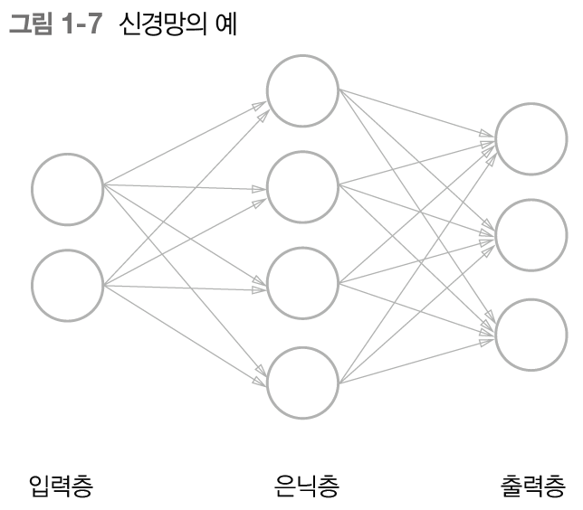

그림1-7의 신경망은 완전연결계층(fully connected layer) 라고 불린다.


* h : 은닉층의 뉴런
* x : 입력
* W : 가중치
* b : 편향

```python
>>> W1 = np.random.randn(2,4)
>>> b1 = np.random.randn(4)
>>> x = np.random.randn(10, 2)
>>> h = np.matmul(x, W1) + b1
>>> h
array([[-3.19091028,  0.18154017, -0.46989107, -1.87099662],
       [-1.35680971,  0.47955055, -0.81106666, -1.6720642 ],
       [-2.16290483, -0.10750651, -0.41514298, -1.56034895],
       [-1.61654786,  0.01600793, -0.53551168, -1.5162588 ],
       [-1.884305  ,  1.96782214, -1.56183048, -2.4165549 ],
       [-2.96049644, -1.01852197,  0.15466299, -1.30565202],
       [-1.59046901,  2.90635067, -2.09691209, -2.77364483],
       [-1.60557313,  0.58543679, -0.84369877, -1.76293027],
       [-1.58923513,  0.96094951, -1.04782967, -1.92396625],
       [-2.10535224,  2.74813129, -1.96092274, -2.79693437]])
```

위의 수식에서도 알 수 있듯이, 완전연결계층은 **선형 변환**이다. **비선형 효과를 부여하기 위해 [활성화 함수(activated function)](../DeepLearning_from_Scratch/Neural_Network.md)을 적용**한다. 이는 신경망의 표현력을 높일 수 있다. 활성화 함수 중 하나로서 0과 1사이의 실수를 출력시키는 시그모이드 함수를 적용하여 최종 결과 값을 얻어보자:

```python
>>> def sigmoid(x):
...     return 1 / (1 + np.exp(-x))
... 
>>> a = sigmoid(h)
>>> a
array([[0.03950922, 0.54526081, 0.38464203, 0.13342645],
       [0.2047593 , 0.61764174, 0.30766324, 0.15814916],
       [0.10313146, 0.47314923, 0.39767957, 0.17359658],
       [0.16568151, 0.5040019 , 0.3692323 , 0.18001309],
       [0.13189517, 0.877377  , 0.17338414, 0.08191898],
       [0.04924276, 0.2653154 , 0.53858886, 0.21321533],
       [0.16931792, 0.94815948, 0.10939731, 0.05876509],
       [0.16720413, 0.64231745, 0.30075635, 0.14642372],
       [0.16949154, 0.72331187, 0.25964208, 0.12741993],
       [0.1085777 , 0.93980773, 0.12336722, 0.05749006]])
```

출력 값인 `a` 를 또 다른 완전연결계층에 통과시켜 변환시키며 진행한다.

```python
>>> W2 = np.random.randn(4,3)
>>> b2 = np.random.randn(3)
>>> score = np.matmul(a, W2) + b2
>>> score
array([[ 0.74427537, -1.54291142,  0.20289961],
       [ 0.99507584, -1.66799682,  0.34098772],
       [ 0.77576581, -1.43829082,  0.27015135],
       [ 0.87171147, -1.48995025,  0.32122456],
       [ 1.10503419, -2.07833844,  0.23046849],
       [ 0.54311903, -1.09889709,  0.27748214],
       [ 1.22396825, -2.20085488,  0.20861584],
       [ 0.96852279, -1.70546248,  0.3069537 ],
       [ 1.02740602, -1.83206951,  0.299602  ],
       [ 1.14418457, -2.18553593,  0.17010741]])
```

* 점수 (score) : 확률이 되기 전의 값. 소프트맥스 함수를 적용하면 확률을 얻어낼 수 있다.

### 구현

계층(layer)으로 클래스화하고 순전파(forward propagation)를 구현해보자. 이 때, 구현 규칙이 정립되어 있으면 서로 다른 계층도 동일한 규칙으로 구현되어 있으니 각 계층의 사용성, 코드의 유연함이 향상한다.

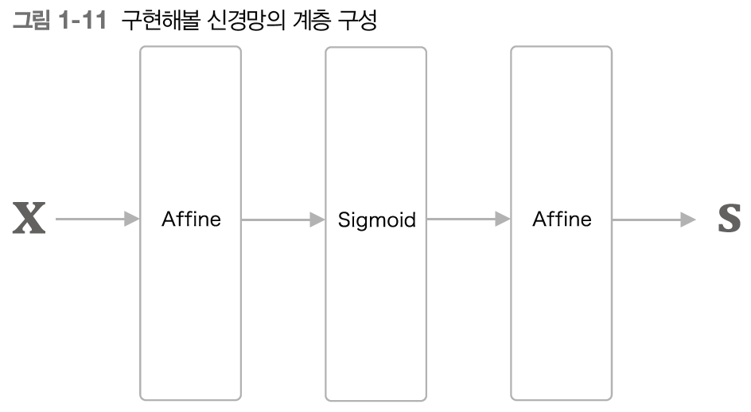

- Affine Layer : 완전연결계층에 의한 변환 (기하학에서의 아핀, affine 변환에 해당되기 때문)
- Sigmoid Layer : 시그모이드 함수에 의한 변환

```python
import numpy as np

class Sigmoid:
    def __init__(self):
        self.params = []

    def forward(self, x):
        return 1 / (1 + np.exp(-x))

class Affine:
    def __init__(self, W, b):
        self.params = [W, b]

    def forward(self, x):
        W, b = self.params
        out = np.matmul(x, W) + b
        return out
    
class TwoLayerNet:
    def __init__(self, input_size, hidden_size, output_size):
        I, H, O = input_size, hidden_size, output_size

        # 파라미터(가중치, 편향) 초기화
        W1 = np.random.randn(I, H)
        b1 = np.random.randn(H)
        W2 = np.random.randn(H, O)
        b2 = np.random.randn(O)

        # 계층 생성
        self.layers = [
            Affine(W1, b1),
            Sigmoid(),
            Affine(W2, b2)
        ]

        self.params = []
        for layer in self.layers:
            self.params += layer.params

    def predict(self, x):
        for layer in self.layers:
            x = layer.forward(x)
        return x

x = np.random.randn(10, 2)
model = TwoLayerNet(2, 4, 3)
score = model.predict(x)
# [[ 0.38547788  1.31150443 -0.99325363]
# [ 0.14837015  1.15420198 -1.26992065]
# [-0.05285869  0.81809907 -0.62487086]
# [-0.02547962  0.89146412 -0.82177855]
# [ 0.01212004  0.93573242 -0.87450075]
# [ 0.03568252  0.9426139  -0.71403541]
# [-0.1599505   0.69901276 -0.60883607]
# [-0.01857379  0.93449137 -1.00975819]
# [ 0.00149082  0.93637125 -0.95118402]
# [-0.19271774  0.69502684 -0.65575982]]
```

## 신경망의 학습

* 학습 : 최적의 매개변수 값을 찾는 작업

### [손실함수 (loss function)](../DeepLearning_from_Scratch/Neural_Network_Learning.md)

학습 데이터와 신경망이 예측한 결과를 비교하여 예측이 얼마나 나쁜가를 산출한 단일 값(스칼라). 이는 학습이 얼마나 잘 되고 있는지 알기 위한 '척도'로서 사용된다.

* 교차 엔트로피 오차 (Cross Entropy Error) : 다중 클래스 분류 (multi-class classification) 신경망에서 사용됨. 확률과 정답 레이블을 이용하여 구할 수 있다.

위의 신경망 코드에 Softmax 계층을 추가하여 점수를 확률로 변환시키고 CEE계층을 추가하여 손실을 확인해보자.

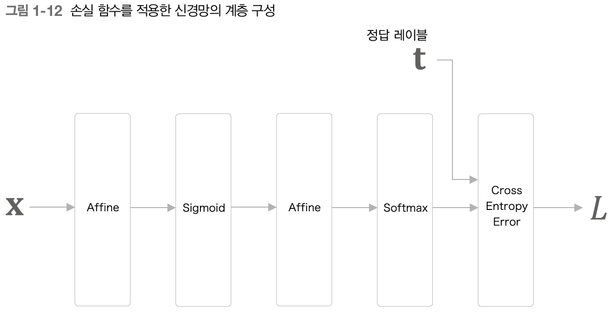

* x : 입력 데이터
* t : 정답레이블
* L :  손실

편의상 `Softmax with Loss` 계층으로 통합하여 구현하기로 하자.

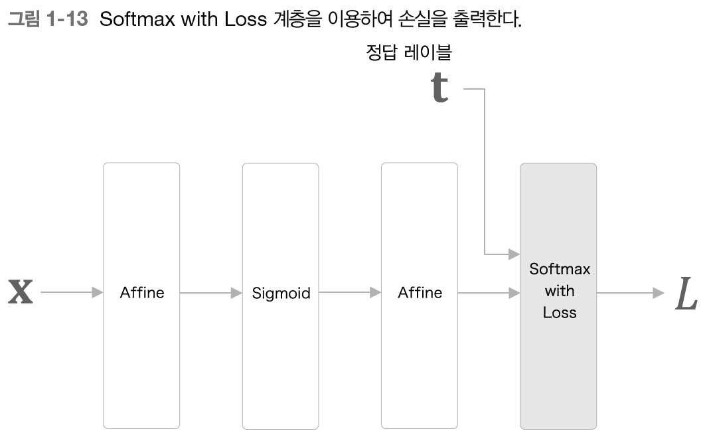

### 오차역전파법 (back-propagation)

각 매개변수에 대한 손실의 기울기(변화량)을 구하여 매개변수를 갱신하며 학습의 성능을 향상시켜야 한다. 그렇다면 그 기울기는 어떻게 구할까? => **오차역전파법**!

다음 계층과 현재 계층의 오차를 이전(앞) 계층에 전해주는 것. 

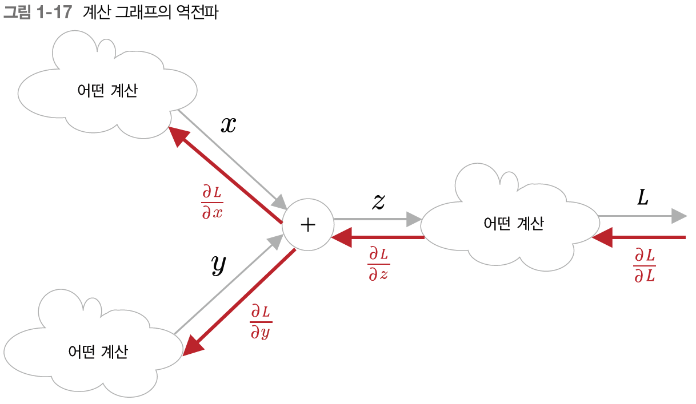

위의 경우에는 덧셈이기 때문에 해석학적으로 미분값이 1임을 알 수 있다. 그러므로 로스 값이 저렇게 흘러가는 것

#### 곱셈 노드

기울기에 순전파의 입력 값을 서로 바꿔 곱한다. (왜냐면 z = xy 의 미분값이 그러하니까)

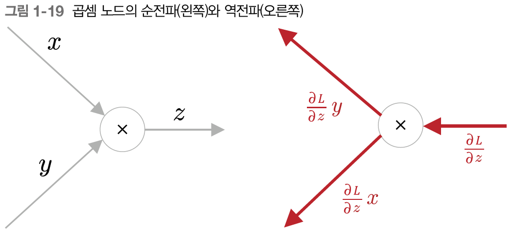

#### 분기노드 (복제노드)

기울기들의 합

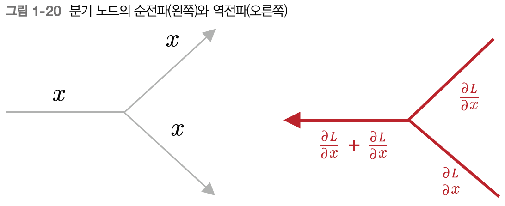

#### 반복노드 (Repeat)

N개로 복제하는 노드. 역전파는 N개의 기울기를 모두 더해서 구한다.

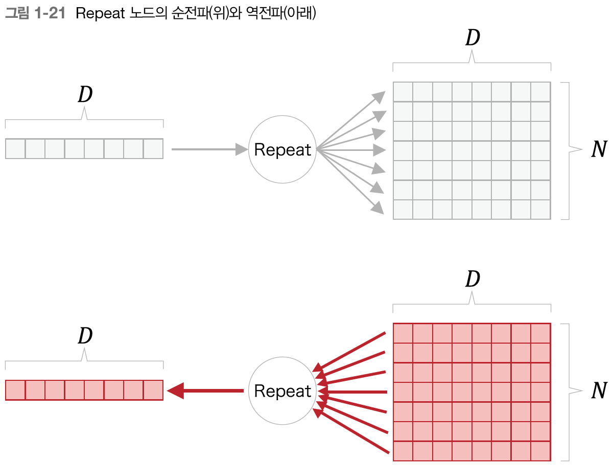

```python
>>> D, N = 8, 7
>>> x = np.random.randn(1, D)				# 입력
>>> y = np.repeat(x, N, axis=0)				# 순전파 (axis=복제할 방향)
>>> dy = np.random.randn(N, D) 				# 무작위 기울기
>>> dx = np.sum(dy, axis=0, keepdims=True) 	# 역전파 (keepdims=차원유지)
```

#### 범용 덧셈 노드 (Sum 노드)

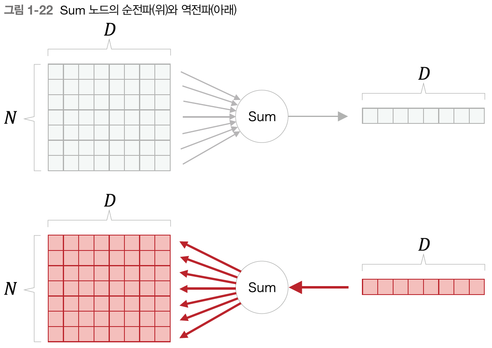

```python
>>> D, N = 8, 7
>>> x = np.random.randn(N, D)				# 입력
>>> y = np.sum(x, axis=0, keepdims=True)	# 순전파
>>> dy = np.random.randn(1, D)				# 무작위 기울기
>>> dx = np.repeat(dy, N, axis=1)			# 역전파
```

* sum노드와 repeat노드는 서로 반대관계이다 :-)  : sum노드의 순전파가 repeat 노드의 역전파, sum노드의 역전파가 repeat 노드의 순전파.

#### MatMul 노드 (행렬의 곱셈 노드, Matrix Multiply 노드)

| 순전파                     | 역전파                     |
| -------------------------- | -------------------------- |
| 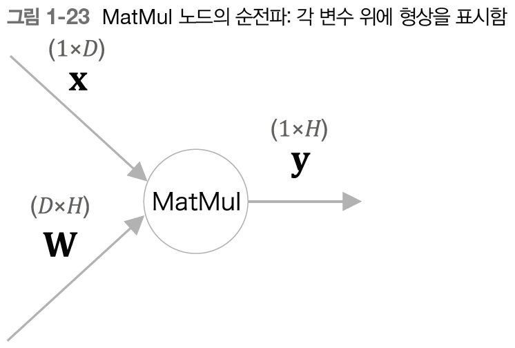 | 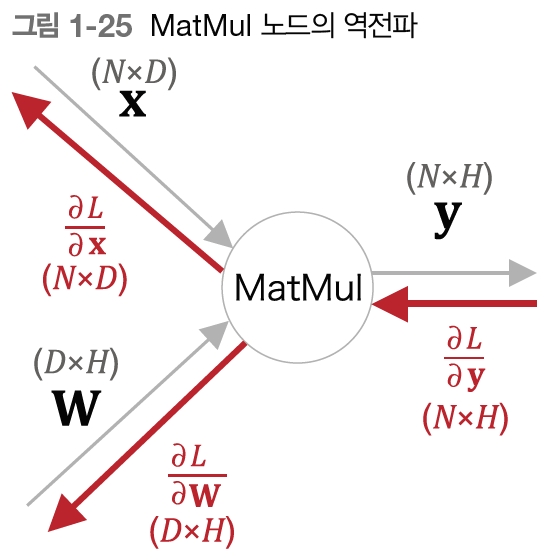 |

```python
class MatMul:
    def __init__(self, W):
        self.params = [W]
        self.grads = [np.zeros_like(W)] # Return an array of zeros with the same shape and type as a given array.
        self.x = None
    
    def forward(self, x):
        W, = self.params
        out = np.matmul(x, W)
        self.x = x
        return out
    
    def backward(self, dout):
        W, = self.params
        dx = np.matmul(dout, W.T)
        dW = np.matmul(self.x.T, dout)
        self.grads[0][...] = dW # 깊은 복사
        return dx
```

#### Sigmoid 계층

시그모이드 계층의 순전파와 역전파의 수식을 보면 다음과 같다.

| 순전파                  | 역전파                   |
| ----------------------- | ------------------------ |
| 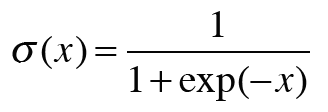 | 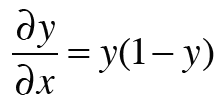 |

출력층 계층으로부터 전해진 기울기에 시그모이드 함수의 미분을 곱한다.

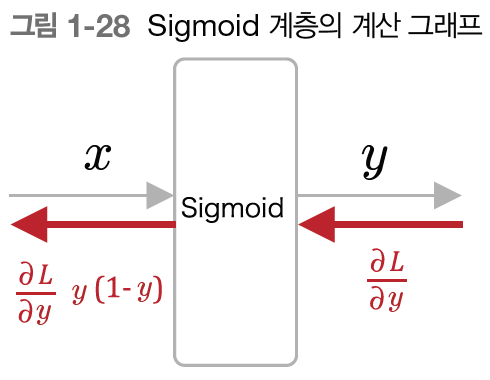

기존의 sigmoid 클래스에 역전파를 추가해보면 다음과 같다. 순전파 시 결과를 저장하고 역전파 수행시에 사용한다.

```python
class Sigmoid:
    def __init__(self):
        self.params = []
        self.grads = []
        self.out = None

    def forward(self, x):
        out = 1 / (1 + np.exp(-x))
        self.out = out
        return out

    def backward(self, dout):
        dx = dout * self.out * (1.0 - self.out) # 역전파 입력 * y * (1-y)
        return dx
```

#### Affine 계층

| 순전파 | 역전파 |
| ------ | ------ |
|        |        |

y = np.matmul(x, W) + b

Affine 계층은 MatMul과 Repeat 계층의 조합이기 때문에 이 두 계층의 역전파를 수행하면 된다.

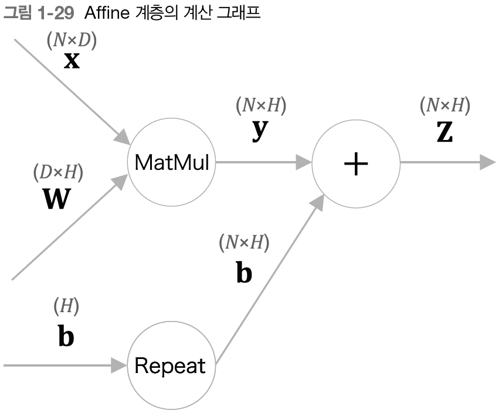

```python
class Affine:
    def __init__(self, W, b):
        self.params = [W, b]
        self.grads = [np.zeros_like(W), np.zeros_like(b)]
        self.x = None

    def forward(self, x):
        W, b = self.params
        out = np.matmul(x, W) + b
        self.x = x
        return out

    def backward(self, dout):
        W, b = self.params
        dx = np.matmul(dout, W.T)
        dW = np.matmul(self.x.T, dout)
        db = np.sum(dout, axis=0)

        self.grads[0][...] = dW
        self.grads[1][...] = db
        return dx
```

이미 구현해둔 MatMul 계층의 역전파를 활용하면 아래와 같이 구현가능하다:

--추가하기--

#### Softmax with Loss 계층

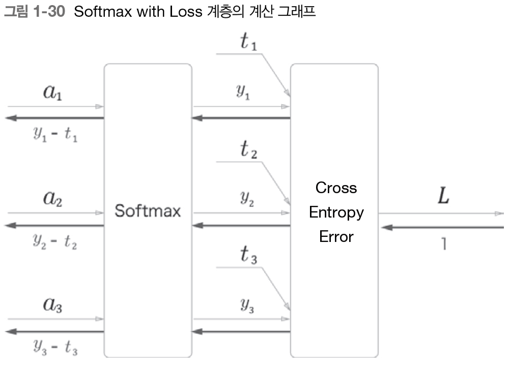

### 가중치 갱신하기

오차역전파법으로 구한 기울기를 사용하여 신경망의 매개변수를 갱신해보자.

#### 학습의 4단계

* 1단계 : 미니배치 - 훈련 데이터 중에서 무작위로 다수의 데이터를 골라낸다.

* 2단계 : 기울기 계산 - 오차역전파법으로 각 가중치 매개변수에 대한 손실함수의 기울기를 구한다.

* **3단계 : 매개변수 갱신 - 기울기를 사용하여 가중치 매개변수를 갱신한다.**

* 4단계 : 반복 - 1~3단계를 필요한 만큼 반복한다.

#### [경사하강법 (Gradient Descent)](https://github.com/jjungyooni/Study/blob/master/DeepLearning_from_scratch/chapter_06.md)

3단계에서 구한 '기울기' 는 손실을 가장 크게 하는 방향을 가리킨다. 즉, 이 기울기의 반대방향으로 갱신하면 손실을 줄일 수 있다는 뜻이다. => 경사하강법!

* 확률적 경사하강법 (Stochastic Gradient Descent, SGD) : 미니배치에 대한 기울기를 이용한다.
  * 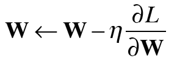
  * W : 가중치 매개변수
  * W미분 : W에 대한 손실함수의 기울기
  * 에타 : 학습률 (learning rate)


