word2vec
====

'통계 기반 기법'에 이어서 '추론 기반 기법'으로 단어의 분산 표현을 얻는 방법을 알아보자.

## 통계 기반 기법의 문제점

### 통계 기반 기법

주변 단어의 빈도를 베이스로 하여 단어를 표현한다.

* 단어의 동시발생 행렬
* SVD
* 단어의 분산 표현을 나타내는 밀집벡터
* 단 1회의 처리만으로 분산표현을 얻는다.

### 문제점

말뭉치의 사이즈가 커질 수록 연산 복잡도 및 메모리 사이즈가 매우 커지게 된다. 

* 행렬 크기 : 어휘 사이즈의 제곱
* SVD 연산 비용 : O(n^3)

## 추론 기반 기법

추론 기반 기법도 기본적으로 "어떤 것의 특징은 주변에 의해 형성된다" 라는 '분포 가설'에 기초한다. 다만, 이를 기반으로 결과를 도출해내는 기법과 접근의 차이가 존재한다.

| 통계 기반 기법                                               | 추론 기반 기법                                               |
| ------------------------------------------------------------ | ------------------------------------------------------------ |
| 배치 학습                                                    | 미니 배치                                                    |
| ㄴ모든 데이터를 대상으로 1회의 처리로 분산 표현 겟           | ㄴ신경망 이용 & 미니배치로 여러번 학습해가며 가중치 갱신     |
| 어휘수가 많을 경우 연산 자체가 커져 동일 환경에서의 연산이 불가능해질 수 있음 | 어휘수가 많아도 작게 나눠가며 학습하므로 연산 가능           |
|                                                              | ㄴ병렬 처리가 가능하여 여러 머신에서 연산 가능 => 속도 업그레이드 |

맥락(주변 단어)이 주어졌을 때, 빈 칸에 무슨 단어가 들어가는지를 추측하는 작업, 즉, '추론'이 주된 작업이다.


이러한 추론문제를 모델(신경망)을 이용해 여러번 반복해서 풀며 단어의 출현 패턴을 학습한다. 

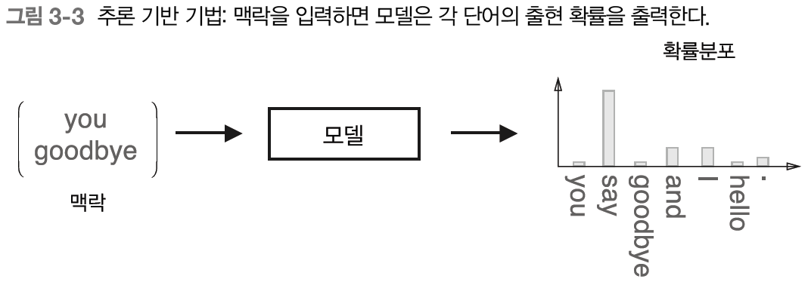

### 신경망에서의 단어 처리

신경망을 이용해 단어를 처리하기 위해서는 각 단어들을 **원핫 벡터(one-hot vector)** 등의 '고정 길이의 벡터'로 변환시켜야 한다. **'고정 길이의 벡터'로 변환하면 [그림3-5]와 같이 신경망의 입력층 뉴런의 수를 '고정'시킬 수 있다.**

> * 원핫 벡터 (원핫 표현, one-hot vector) : 벡터의 원소 중 하나만 1이고 나머지는 0인 벡터.
>
> 아래는 "you say goodbye and i say hello." 문장에서 사용된 어휘의 배열 ["you", "say", "goodbye", "and", "i", "hello", "."] 의 인덱스(단어 ID)를 이용하여 각 단어를 원핫벡터로 변환시킨 예시이다.
>
> 

이렇게 고정길이 벡터로 단어를 표현할 수 있게 되면 신경망을 구성하는 계층 (레이어)들은 벡터를 처리할 수 있기 때문에 신경망이 단어를 처리할 수 있게 된다. 

| 원핫벡터로 나타낸 모습    | 신경망에 적용시킨 모습    |
| ------------------------- | ------------------------- |
| 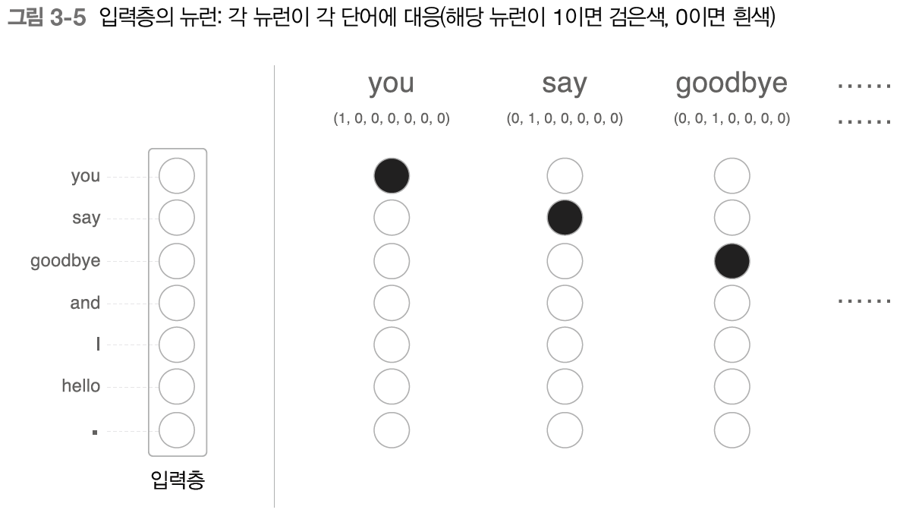 |  |

이를 간단한 코드로 작성해보기 위해 신경망에 적용 시킨 모습을 살짝 추상화해보자.

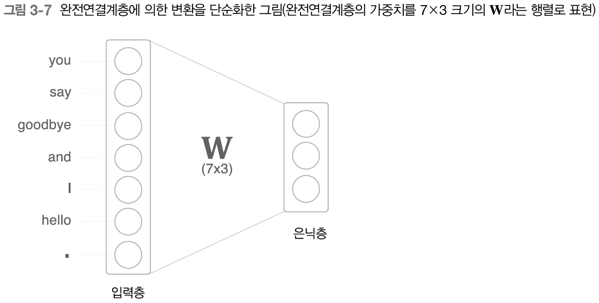

은닉층(h)는 입력층(c)와 가중치(W)의 행렬곱(matmul)로 계산된다. 그럼 이제 이를 코드로 작성해보자:

```python
import numpy as np

c = np.array([[1, 0, 0, 0, 0, 0, 0]])   # 입력 (미니배치임을 고려하여 "you"의 벡터만 넣었다)
W = np.random.randn(7, 3)               # 가중치
h = np.matmul(c, W)                     # 중간 노드
print(h)

# 우리가 직접 구현했던 matmul을 이용할수도 있다ㅎㅎ
from layers import MatMul
layer = MatMul(W)
h = layer.forward(c)
print(h)
```

위의 코드는 아래와 같이 특정 단어에 대한 가중치의 행벡터를 뽑아내게 된다.

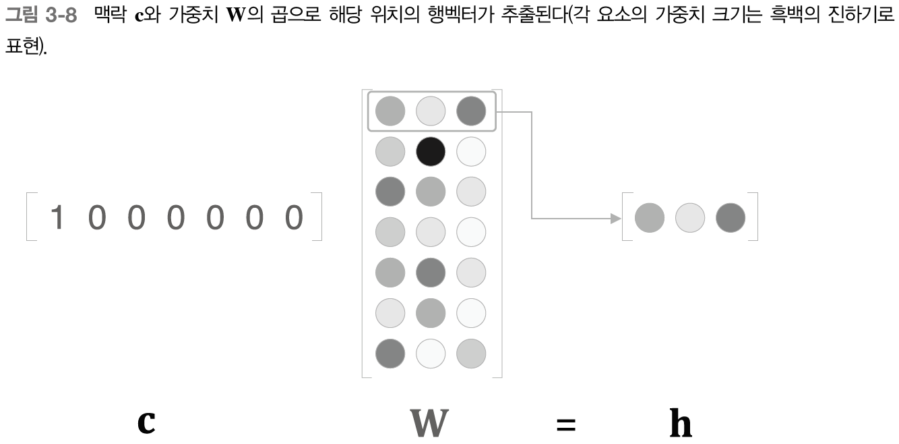


## 단순한 word2vec - CBOW (Continuous bag-of-words)

맥락(context)으로부터 타깃(target)을 추측하는 용도의 신경망

* 입력 : 맥락 (context)
* 출력 : 점수 (score)

### 뉴런 관점에서 바라보는 CBOW

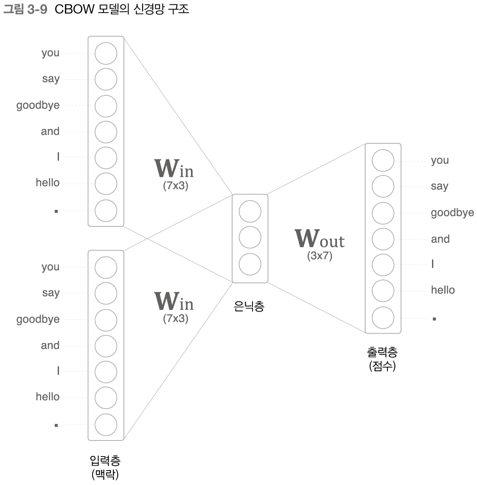

* 입력층의 개수 : 맥락으로 고려할 단어의 개수
* 은닉층 : 입력층의 완전연결계층에 의해 변환된 값 (입력층의 평균)
  * 은닉층의 뉴런 수를 입력층의 뉴런 수보다 적게 해야 단어 예측에 필요한 정보를 최대한 간결하게 담고, 밀집벡터를 만들어 낼 수 있다. (인코딩)
* 출력층 : 각 단어에 대응되는 점수. 값이 높을 수록 대응 단어의 출현 확률이 높아진다.
  * 이 점수에 softmax 함수를 적용하면 확률이 만들어진다.

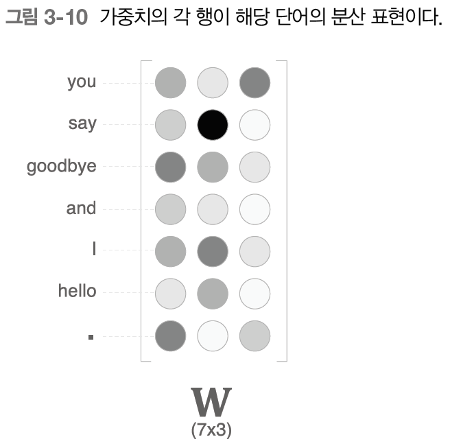

* **입력층에서 은닉층으로 이어지는 가중치** : 단어의 분산표현이 담겨있다. 이는 맥락에서 출현하는 단어를 잘 추측할 수 있는 방향으로 업데이트 될 것이다. 즉, **단어의 의미**가 들어있다고 볼 수 있다.

### 계층 관점에서 바라보는 CBOW

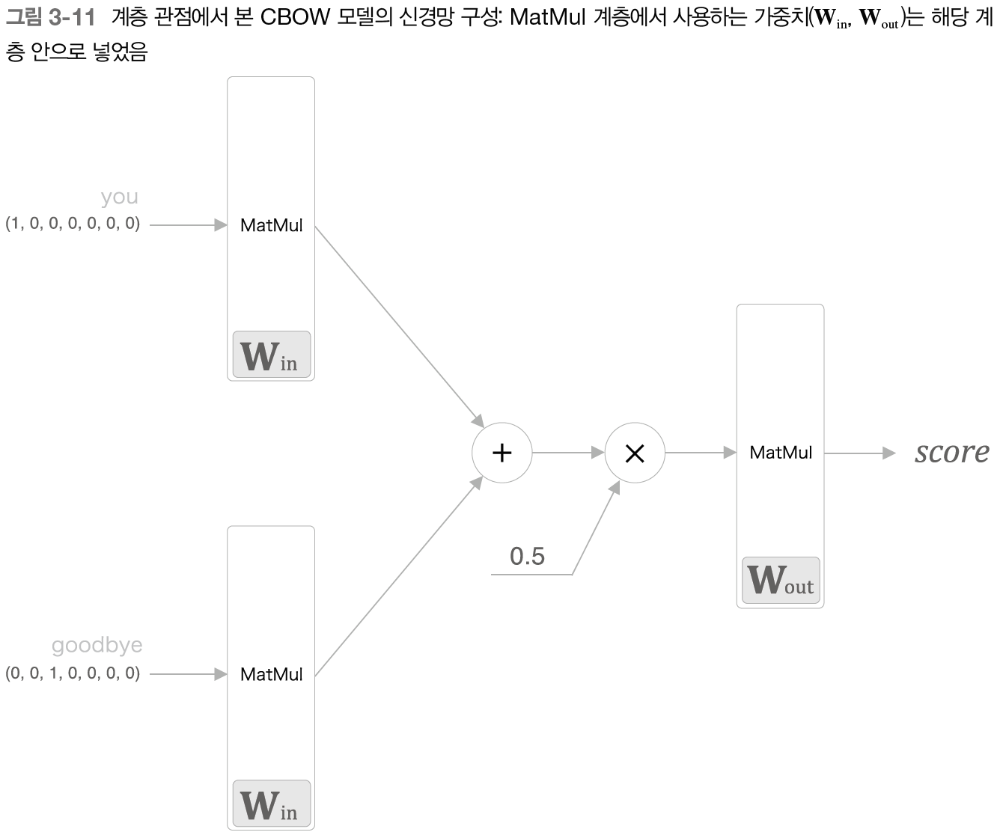

위의 그림에서 0.5를 곱한 것은 평균을 구하기 위함이다. 입력층이 2개이기 때문에 1/2=0.5...

### 파이썬으로 작성해본 CBOW 추론

활성화 함수를 사용하지 않는 간단한 구성의 신경망. 여러개의 입력층이 하나의 가중치를 공유한다.

```python
import numpy as np
from layers import MatMul

# 샘플 맥락 데이터 (입력)
c0 = np.array([[1, 0, 0, 0, 0, 0, 0]])
c1 = np.array([[0, 0, 1, 0, 0, 0, 0]])

# 가중치
W_in = np.random.randn(7, 3)
W_out = np.random.randn(3, 7)

# 계층
in_layer0 = MatMul(W_in)
in_layer1 = MatMul(W_in)
out_layer = MatMul(W_out)

# 순전파
h0 = in_layer0.forward(c0)
h1 = in_layer0.forward(c1)
h = 0.5 * (h0 + h1)
s = out_layer.forward(h)

print(s)
```

## CBOW 모델로 학습해보기

CBOW 모델을 활용하여 출현 단어에 대한 학습을 진행해보자. 정답에 가까운 요소의 확률이 가장 높게 나타날 것이라 기대해볼 수 있겠다!


> - 책에서 갑자기 언급되는 [skip-gram 모델](https://reniew.github.io/22/) : Word2Vec의 모델 중 하나로서,  CBOW와 비슷한 아이디어지만 반대의 개념이다. CBOW는 주변 단어들을 통해서 중간의 단어를 예측하는 모델이였다면 Skip-Gram은 중심 단어를 통해 주변단어를 예측하는 모델이다. (출처 : 링크)

다중 클래스 분류를 위해, 점수를 출력하는 CBOW 모델의 출력층에 **소프트맥스 함수**와 **교차 엔트로피 오차**를 적용하여 확률을 얻고 오차를 구한 후 오차 값을 손실값으로 사용하여 아래와 같이 학습을 진행해보자.

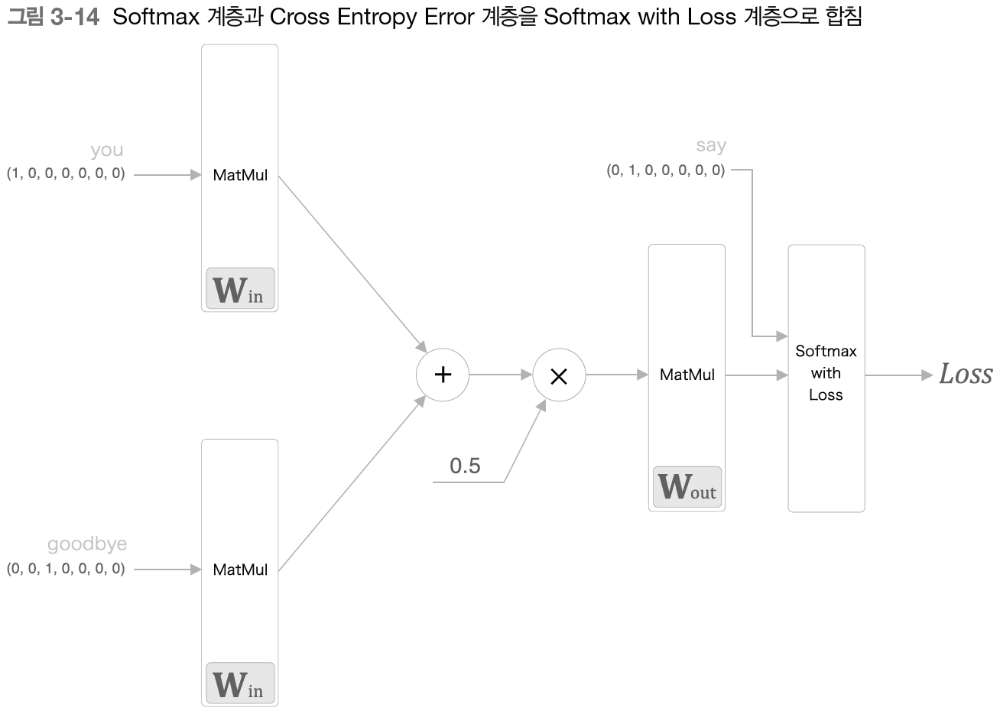

word2vec 에서 사용되는 신경망에는 두가지 가중치가 존재한다:

* W_in : 입력층 완전연결계층의 가중치. 각 행이 단어의 분산 표현에 해당.
* W_out : 출력층 완전연결계층의 가중치. 각 열에 단어의 의미가 인코딩된 벡터가 저장됨.

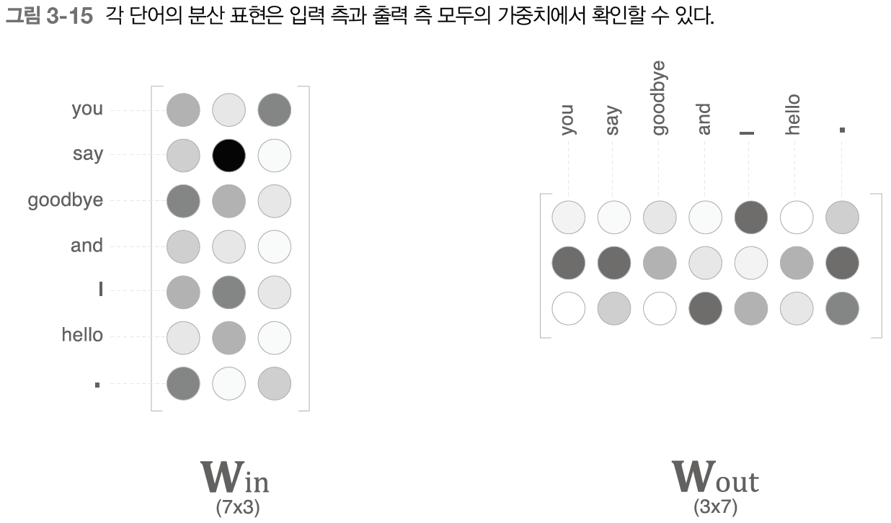

이 두개의 가중치중에 최종적으로 사용하는 가중치를 무엇으로 결정하느냐(물론 둘 다 사용하는 것도 포함된다)에 따라 학습방법이 달라질 수 있다. word2vec, 특히 skip-gram 모델에서는 W_in을 선택하는 것이 가장 일반적이다. (왜지???) 실제 실험 결과에서도 skip-gram 모델에서는 W_in를 선택했을 때의 학습 결과가 가장 좋다는 것이 여러번 확인되었다. 그러므로 여기서 실험할 때에도 W_in을 단어의 분산표현으로서 채택하도록 하겠다.

### 학습데이터 준비하기 (전처리)

여기서도 `You say goodbye and I say hello.` 를 사용해서 간단한 학습을 해보도록 하자.

* 목적 : 맥락(contexts)을 입력했을 때, 타깃(target)이 출현할 확률을 높히는 것.
  * 주변 단어를 입력하였을 때, 중앙 단어가 무엇일지 맞추도록!

#### 1. 말뭉치에서 맥락, 타깃을 추출하기

맥락은 타깃 주변의 단어를 뜻한다. 추출을 위해 먼저 단어를 인덱스로 변환시키고, 해당 인덱스를 아래와 같이 맥락/타깃으로 추출해내보자.

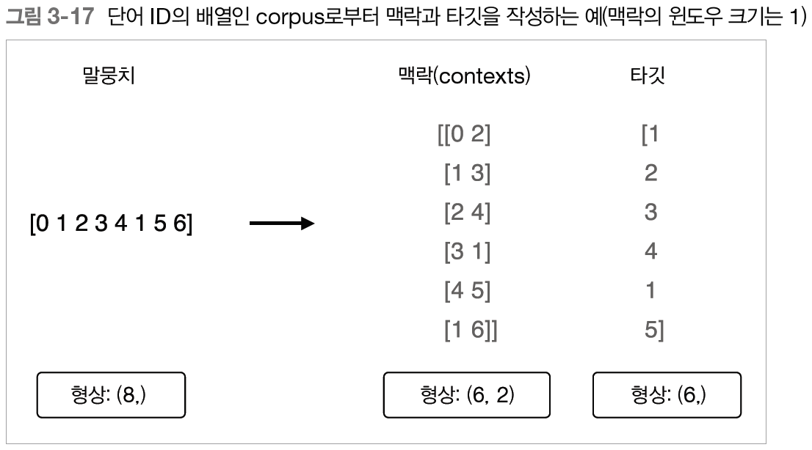

```python
# common/util.py
def create_contexts_target(corpus, window_size=1):
    target = corpus[window_size:-window_size]
    contexts = []

    for index in range(window_size, len(corpus) - window_size):
        cs = []
        for t in range(-window_size, window_size + 1):
            if t == 0:
                continue
            cs.append(corpus[index + t])
        contexts.append(cs)

    return np.array(contexts), np.array(target)

# main.py
from common.util import preprocess, create_contexts_target

text = 'You say goodbye and I say hello.'

# 전처리 (인덱스 설정)
corpus, word_to_id, id_to_word = preprocess(text)
print(corpus)
# [0 1 2 3 4 1 5 6]
print(id_to_word)
# {0: 'you', 1: 'say', 2: 'goodbye', 3: 'and', 4: 'i', 5: 'hello', 6: '.'}

# 맥락/타겟 추출
contexts, target = create_contexts_target(corpus, window_size=1)
print(contexts)
# [[0 2]
#  [1 3]
#  [2 4]
#  [3 1]
#  [4 5]
#  [1 6]]
print(target)
# [1 2 3 4 1 5]
```

이렇게 추출한 맥락과 타겟 데이터를 CBOW 모델에 넣어주면 된다.

#### 2. 원핫표현으로 변환시키기

위에서 추출한 맥락, 타겟 데이터는 인덱스 데이터이므로 이를 원핫표현으로 바꿔 학습 성능을 올려보자.

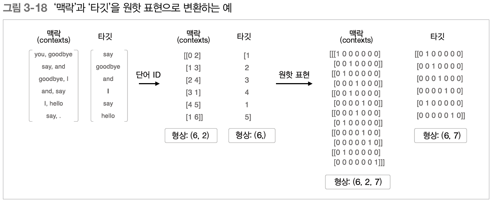

원핫 표현으로 변환시 형상이 변하는 것을 기억하자.

```python
vocab_size = len(word_to_id)
contexts = convert_one_hot(contexts, vocab_size)
target = convert_one_hot(target, vocab_size)
```

### CBOW 모델 구현하기

CBOW 모델의 역전파를 살펴보면 다음과 같다.

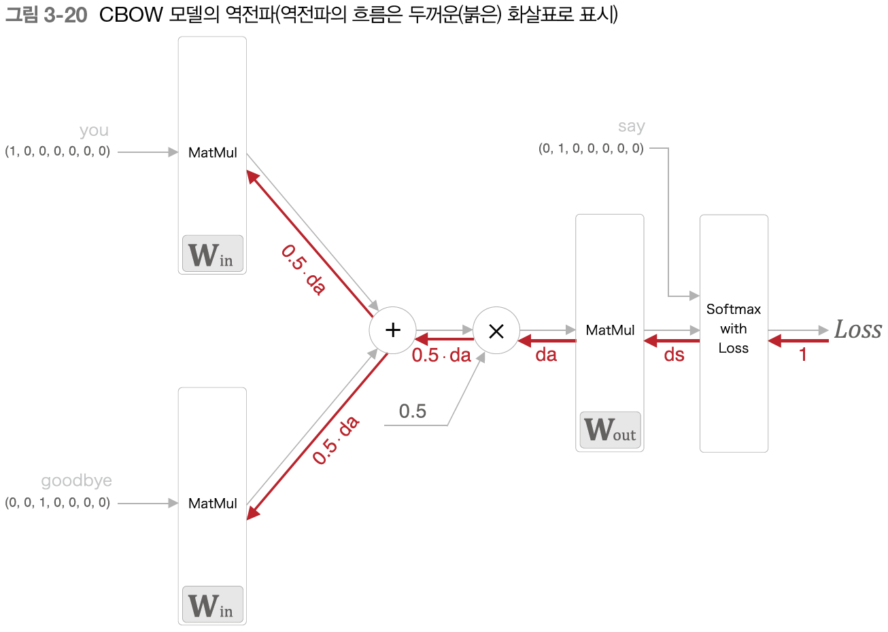

CBOW 모델을 코드로 옮기면 다음과 같다. 

```python
import numpy as np
from layers import MatMul, SoftmaxWithLoss

class SimpleCBOW:
    def __init__(self, vocab_size, hidden_size):
        V, H = vocab_size, hidden_size

        W_in = 0.01 * np.random.randn(V, H).astype('f')
        W_out = 0.01 * np.random.randn(H, V).astype('f')

        # 계층
        ## 입력층은 맥락에서 사용하는 단어의 수 (=윈도우 크기)만큼 만들어야 한다.
        self.in_layer0 = MatMul(W_in)
        self.in_layer1 = MatMul(W_in)
        self.out_layer = MatMul(W_out)
        self.loss_layer = SoftmaxWithLoss()

        # 모든 가중치와 기울기를 리스트에 모은다
        layers = [self.in_layer0, self.in_layer1, self.out_layer]
        self.params, self.grads = [], []
        for layer in layers:
            self.params += layer.params
            self.grads += layer.grads

        # 인스턴스 변수에 단어의 분산표현(W_in)을 저장한다.
        self.word_vecs = W_in

    def forward(self, contexts, target):
        h0 = self.in_layer0.forward(contexts[:, 0])
        h1 = self.in_layer1.forward(contexts[:, 1])

        h = (h0 + h1) * 0.5

        score = self.out_layer.forward(h)
        loss = self.loss_layer.forward(score, target)

        return loss

    def backward(self, dout=1):
        ds = self.loss_layer.backward(dout)
        da = self.out_layer.backward(ds)

        da *= 0.5

        self.in_layer1.backward(da)
        self.in_layer0.backward(da)

        return None
```

### 학습 코드 구현하기

```python
from common.util import preprocess, create_contexts_target, convert_one_hot
from optimizer import Adam
from common.trainer import Trainer
from ch03.simple_cbow import SimpleCBOW

window_size = 1
hidden_size = 5
batch_size = 3
max_epoch = 1000

text = 'You say goodbye and I say hello.'
## 전처리
corpus, word_to_id, id_to_word = preprocess(text)
print(corpus)
print(id_to_word)

contexts, target = create_contexts_target(corpus, window_size=1)

print(contexts)
print(target)

vocab_size = len(word_to_id)
contexts = convert_one_hot(contexts, vocab_size)
target = convert_one_hot(target, vocab_size)
##

model = SimpleCBOW(vocab_size, hidden_size)
optimizer = Adam()
trainer = Trainer(model, optimizer)

trainer.fit(contexts, target, max_epoch, batch_size)
trainer.plot()

# 최종 가중치 출력해보기
word_vecs = model.word_vecs
for word_id, word in id_to_word.items():
    print(word, word_vecs[word_id])
# you [-1.0304887  -0.88736737  1.0471171   1.4050015  -1.4460828 ]
# say [ 1.2629277   0.55965406 -1.2610674   1.038223   -1.0645417 ]
# goodbye [-1.1441501  -1.064517    1.1446682  -0.49481335  0.61529386]
# and [ 0.70398176  1.8906804  -0.6838131   0.7031245  -1.005475  ]
# i [-1.1264895  -1.0454209   1.1091406  -0.50484955  0.61308503]
# hello [-1.0407389  -0.90040267  1.0368307   1.4159017  -1.4459553 ]
# . [ 1.3400834  -1.8283416  -1.3776293   1.0168208  -0.69438136]
```

말뭉치 사이즈가 커질수록 학습효과가 좋아지지만, 현재 CBOW의 구조로는 처리속도가 느리기 때문에 효율적인 학습이 되기 어렵다. 처리 효율을 개선하여 더 큰 말뭉치를 학습시킬 수 있도록 변경시켜보는 작업은 다음 챕터에서 이어가도록 하겠다.

## word2vec 보충학습

위에서는 간단한 모델로 원리를 파악하기 위해 용어나 개념에 대한 자세한 설명은 생략하고 진행하였다. 여기서는 word2vec 에 관한 중요한 몇가지 이야기를 진행해본다.

### CBOW 모델과 확률

확률...사후확률..우도.... 등등....의 개념이 나온다. [여기서 설명했으니](../Math) 생략!

* CBOW 모델의 손실함수 (데이터 1개에 대한)


* CBOW 모델의 손실함수 (말뭉치 전체에 대한)


### skip-gram 모델

CBOW 모델과는 반대로, **타겟을 통해 맥락을 추측**하는 모델이다.


* 입력층 : 1개 (타겟)
* 출력층 : 맥락의 수


타겟으로부터 주변 단어(맥락)을 추측하는 것을 확률표기로 나타내면 다음과 같다.


**Wt가 주어졌을 때, Wt-1과 Wt+1가 발생할 확률**을 뜻한다.

Wt-1, Wt+1에 대해 조건부 독립이라고 가정하면 아래와 같은 식이 도출된다.


손실함수는 맥락의 수만큼 추측해야하므로 각 맥락에서 구한 손실의 총합이다.


#### CBOW와의 차이점

skip-gram 모델이 CBOW 모델보다 단어 분산 표현의 정밀도가 더 좋은 경우가 많다. 타겟을 통해 맥락을 유추하는 것이 맥락을 통해 타겟을 유추하는 것보다 좀 더 복잡하고 어려운 문제이기 때문에 skip-gram 모델이 도출하는 단어의 분산표현이 좀 더 뛰어날 가능성이 높다.

skip-gram 모델은 말뭉치 크기가 클수록, 저빈도 단어/유추 문제의 정답 성능이 뛰어나다. 하지만 학습속도는 CBOW보다 더 느리다. 손실을 맥락의 수만큼 구해야하기 때문이다.

|                | CBOW                       | skip-gram                  |
| -------------- | -------------------------- | -------------------------- |
| 신경망 구성    |  |  |
| 확률           |     |     |
| 손실함수 (1개) |     |     |
| 손실함수       |     |     |

#### 구현

위에서 도출한 수식들을 바탕으로 파이썬 코드로 옮겨보면 다음과 같다.

```python
import numpy as np
from layers import MatMul, SoftmaxWithLoss


class SimpleSkipGram:
    def __init__(self, vocab_size, hidden_size):
        V, H = vocab_size, hidden_size

        # 가중치 초기화
        W_in = 0.01 * np.random.randn(V, H).astype('f')
        W_out = 0.01 * np.random.randn(H, V).astype('f')

        # 계층 생성
        # 입력층 1개
        self.in_layer = MatMul(W_in)
        # 출력층 1개
        self.out_layer = MatMul(W_out)
        # 맥락의 수만큼 손실 계층을 구한다
        self.loss_layer1 = SoftmaxWithLoss()
        self.loss_layer2 = SoftmaxWithLoss()

        # 모든 가중치와 기울기를 리스트에 모은다
        layers = [self.in_layer, self.out_layer]
        self.params, self.grads = [], []
        for layer in layers:
            self.params += layer.params
            self.grads += layer.grads

        # 인스턴스 변수에 단어의 분산 표현을 저장한다
        self.word_vecs = W_in

    def forward(self, contexts, target):
        h = self.in_layer.forward(target)
        s = self.out_layer.forward(h)

        l1 = self.loss_layer1.forward(s, contexts[:, 0])
        l2 = self.loss_layer2.forward(s, contexts[:, 1])

        loss = l1 + l2
        
        return loss

    def backward(self, dout=1):
        dl1 = self.loss_layer1.backward(dout)
        dl2 = self.loss_layer2.backward(dout)
        
        ds = dl1 + dl2
        
        dh = self.out_layer.backward(ds)
        self.in_layer.backward(dh)
        
        return None
```

### 통계기반 vs 추론기반

|                                          | 통계 기반                            | 추론 기반                                                    |
| ---------------------------------------- | ------------------------------------ | ------------------------------------------------------------ |
| 단어의 분산표현을 얻는 방법              | 말뭉치 전체 통계으로부터 1회 학습    | 말뭉치를 일부분씩 여러번 학습한다. (미니배치)                |
| 말뭉치가 변경되어 다시 도출해야하는 경우 | 처음부터 다시 계산해야 한다 (초기화) | 기존에 학습한 가중치를 초기값으로하여 재학습한다 (기존 학습 + a) |
| 단어의 분산표현에 대한 성격/정밀도       | 단어의 유사성이 인코딩               | 단어의 유사성, 단어 사이의 패턴이 인코딩<br />(king - man + woman = queen 유추 가능)<br />=> 유추 문제가 강하다 |
| '단어의 유사성' 에 대한 성능             | 통계기반이나 추론기반이나 비슷       | 통계기반이나 추론기반이나 비슷                               |

두가지 기법은 완전히 분리될 수 있는 서로 다른 개념이 아니라 연결된 개념으로서 서로의 아이디어를 차용하기도 한다.

실제로, word2vec 이후 **통계 기반 기법과 추론 기반 기법을 융합한 GloVe 라는 기법이 등장**했다. GloVe는 말뭉치 전체의 통계 정보를 손실 함수에 도입하여 미니배치 학습을 시키는 아이디어에서 출발한 기법이다.

## 그 외

이번 장을 학습하면서 개인적으로 궁금해졌던, 더 알아보고 싶었던 내용들 정리

* 전이학습 (Transfer Learnning) : 학습 데이터 부족현상을 해결하는 방법 중 하나로서, 데이터가 풍부한 분야에서 훈련된 모델을 재사용하는 기법이다. word2vec가 전이학습에 유용하다고 한다. 다음장에서 이어진다고 하길래 궁금해서 찾아봄.
  * https://finewink.tistory.com/entry/%ED%95%99%EC%8A%B5%EB%8D%B0%EC%9D%B4%ED%84%B0-%EB%B6%80%EC%A1%B1%ED%98%84%EC%83%81-%ED%95%B4%EA%B2%B0%EB%B2%95-%EC%A0%84%EC%9D%B4%ED%95%99%EC%8A%B5Transfer-Learning
  * https://9bow.github.io/PyTorch-tutorials-kr-0.3.1/beginner/transfer_learning_tutorial.html
* word2vec 이론을 정립한 Mikolov Tomas의 논문
  * [논문] Mikolov Tomas ["Efficient Estimation of Word Representations in
    Vector Space"](https://arxiv.org/pdf/1301.3781.pdf)
  * [논문] Mikolov Tomas ["Distributed representations of words and phrases and their compositionality"](https://papers.nips.cc/paper/5021-distributed-representations-of-words-and-phrases-and-their-compositionality.pdf)

