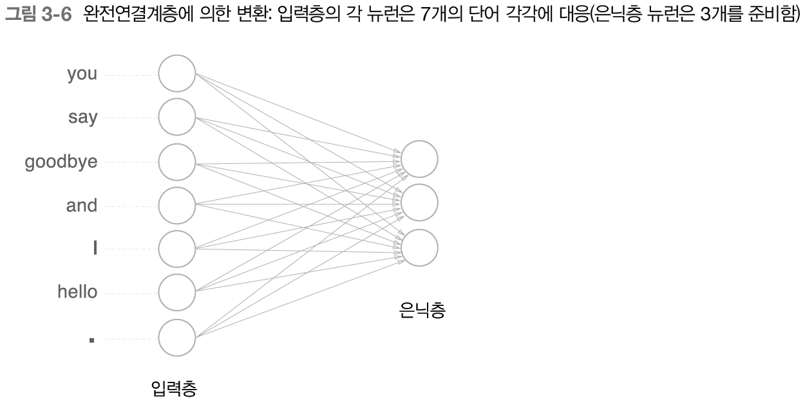

word2vec
====

'통계 기반 기법'에 이어서 '추론 기반 기법'으로 단어의 분산 표현을 얻는 방법을 알아보자.

## 통계 기반 기법의 문제점

### 통계 기반 기법

주변 단어의 빈도를 베이스로 하여 단어를 표현한다.

* 단어의 동시발생 행렬
* SVD
* 단어의 분산 표현을 나타내는 밀집벡터
* 단 1회의 처리만으로 분산표현을 얻는다.

### 문제점

말뭉치의 사이즈가 커질 수록 연산 복잡도 및 메모리 사이즈가 매우 커지게 된다. 

* 행렬 크기 : 어휘 사이즈의 제곱
* SVD 연산 비용 : O(n^3)

## 추론 기반 기법

추론 기반 기법도 기본적으로 "어떤 것의 특징은 주변에 의해 형성된다" 라는 '분포 가설'에 기초한다. 다만, 이를 기반으로 결과를 도출해내는 기법과 접근의 차이가 존재한다.

| 통계 기반 기법                                               | 추론 기반 기법                                               |
| ------------------------------------------------------------ | ------------------------------------------------------------ |
| 배치 학습                                                    | 미니 배치                                                    |
| ㄴ모든 데이터를 대상으로 1회의 처리로 분산 표현 겟           | ㄴ신경망 이용 & 미니배치로 여러번 학습해가며 가중치 갱신     |
| 어휘수가 많을 경우 연산 자체가 커져 동일 환경에서의 연산이 불가능해질 수 있음 | 어휘수가 많아도 작게 나눠가며 학습하므로 연산 가능           |
|                                                              | ㄴ병렬 처리가 가능하여 여러 머신에서 연산 가능 => 속도 업그레이드 |

맥락(주변 단어)이 주어졌을 때, 빈 칸에 무슨 단어가 들어가는지를 추측하는 작업, 즉, '추론'이 주된 작업이다.


이러한 추론문제를 모델(신경망)을 이용해 여러번 반복해서 풀며 단어의 출현 패턴을 학습한다. 


### 신경망에서의 단어 처리

신경망을 이용해 단어를 처리하기 위해서는 각 단어들을 **원핫 벡터(one-hot vector)** 등의 '고정 길이의 벡터'로 변환시켜야 한다. **'고정 길이의 벡터'로 변환하면 [그림3-5]와 같이 신경망의 입력층 뉴런의 수를 '고정'시킬 수 있다.**

> * 원핫 벡터 (원핫 표현, one-hot vector) : 벡터의 원소 중 하나만 1이고 나머지는 0인 벡터.
>
> 아래는 "you say goodbye and i say hello." 문장에서 사용된 어휘의 배열 ["you", "say", "goodbye", "and", "i", "hello", "."] 의 인덱스(단어 ID)를 이용하여 각 단어를 원핫벡터로 변환시킨 예시이다.
>
> 

이렇게 고정길이 벡터로 단어를 표현할 수 있게 되면 신경망을 구성하는 계층 (레이어)들은 벡터를 처리할 수 있기 때문에 신경망이 단어를 처리할 수 있게 된다. 

| 원핫벡터로 나타낸 모습    | 신경망에 적용시킨 모습    |
| ------------------------- | ------------------------- |
|  |  |

이를 간단한 코드로 작성해보기 위해 신경망에 적용 시킨 모습을 살짝 추상화해보자.


은닉층(h)는 입력층(c)와 가중치(W)의 행렬곱(matmul)로 계산된다. 그럼 이제 이를 코드로 작성해보자:

```python
import numpy as np

c = np.array([[1, 0, 0, 0, 0, 0, 0]])   # 입력 (미니배치임을 고려하여 "you"의 벡터만 넣었다)
W = np.random.randn(7, 3)               # 가중치
h = np.matmul(c, W)                     # 중간 노드
print(h)

# 우리가 직접 구현했던 matmul을 이용할수도 있다ㅎㅎ
from layers import MatMul
layer = MatMul(W)
h = layer.forward(c)
print(h)
```

위의 코드는 아래와 같이 특정 단어에 대한 가중치의 행벡터를 뽑아내게 된다.


