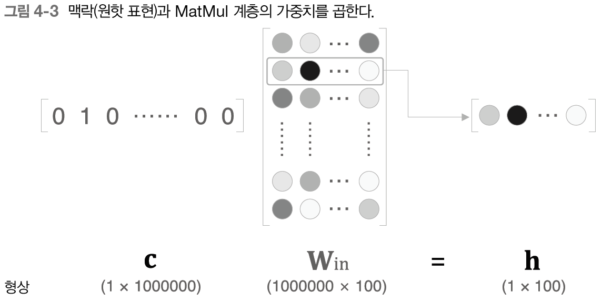
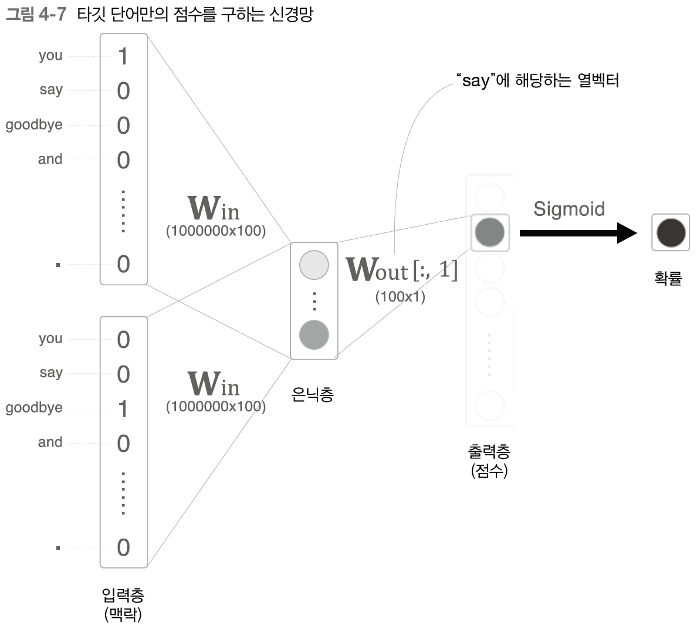
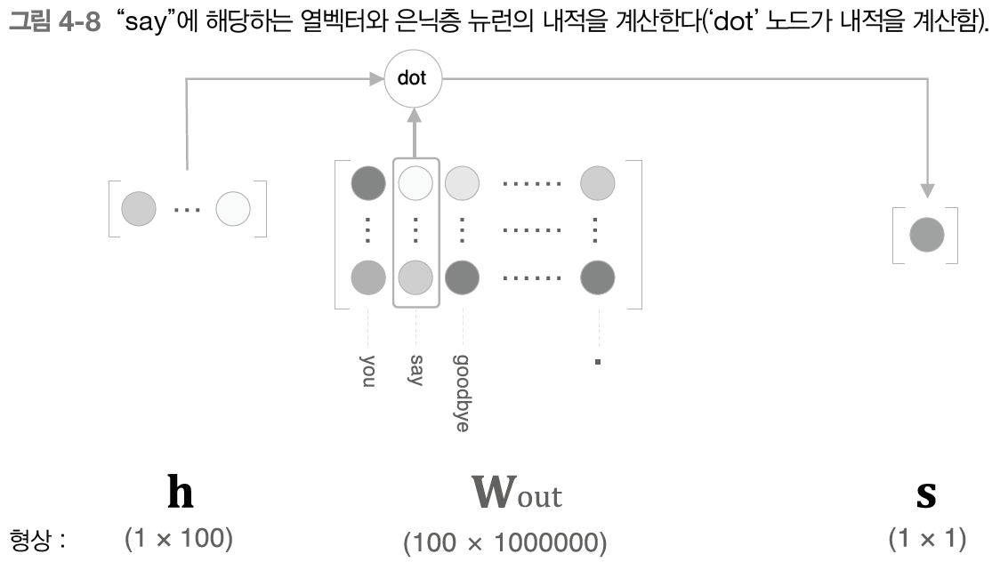
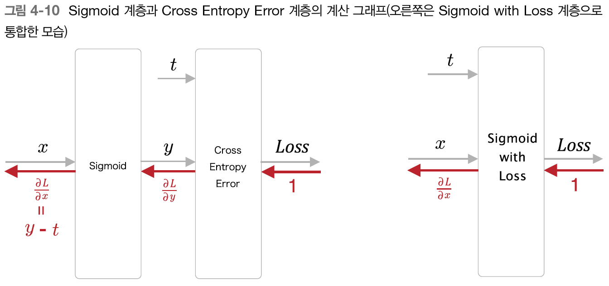

word2vec 속도 개선
====

앞서 익힌 word2vec 모델 중 하나인 CBOW는 어휘량이 많아질수록 계산량이 크게 늘어난다는 단점을 가지고 있다.

이제부터는 속도를 개선시킬 수 있는 방법인 **'Embedding'** 과 **'네거티브 샘플링'** 에 대해 알아보겠다.

## CBOW 의 문제점 살펴보기


위 그림에서 예상 가능하듯, 아래 두 부분에서 계산 병목현상이 발생한다:

* 원핫표현으로 이루어진 입력층과 가중치 행렬 Win의 곱 계산
  * 어휘수가 많아질 수록 원핫 벡터의 크기도 커진다.
  * Embedding 계층 도입으로 해결
* 은닉층과 가중치 행렬 Wout의 곱 및 Softmax 계층의 계산
  * 네거티브 샘플링으로 해결

## 개선하기 - 1. Embedding 계층

먼저 기존 입력층과 가중치 행렬의 연산을 살펴보자:



정말 거대한 연산을 진행하지만, 자세히 살펴보면, 이 연산은 결국 **행렬의 특정 행을 추출해내는 연산**일 뿐이다. 즉, 원핫 표현으로의 변환 & MatMul 계층의 행렬곱 계산이 굳이 필요없다. 그냥 바로 인덱스로 접근하면 훨씬 성능이 개선될 것임을 알 수 있다.

Embedding 계층은 **가중치 매개변수(행렬)로 부터 특정 단어(단어 ID)에 해당하는 행(벡터)를 추출하는 계층**을 뜻한다. 즉, 단어의 분산표현이 저장되는 계층이다.

> Embedding : word embedding. 단어의 밀집벡터 표현. 단어의 분산표현.

그럼, 행렬에서 특정 행을 추출해내는 코드를 구현해보자:

```python
>>> import numpy as np
>>> W = np.arange(21).reshape(7, 3)
>>> W
array([[ 0,  1,  2],
       [ 3,  4,  5],
       [ 6,  7,  8],
       [ 9, 10, 11],
       [12, 13, 14],
       [15, 16, 17],
       [18, 19, 20]])
# 특정 행 추출하기
>>> W[2]
array([6, 7, 8])
>>> W[5]
array([15, 16, 17])

# 여러 행을 한꺼번에 추출하기
>>> idx = np.array([1, 0, 3, 0])
>>> W[idx]
array([[ 3,  4,  5],
       [ 0,  1,  2],
       [ 9, 10, 11],
       [ 0,  1,  2]])
```

위와 같이 이전과 같은 복잡한 연산 없이 간단한 인덱싱 접근으로 빠르게 추출되는 것을 알 수 있다.

### Embedding 계층 구현하기

그럼 이제 Embedding 계층을 구현해보자!


위에서 살펴본 연산이 바로 Embedding 계층의 순전파이다. 이는 행렬의 특정 행만 뽑아낸 것으로서 아무런 변형 없이 그대로 값을 흘려보낸 행위이다. 그러므로 이의 역전파도 그냥 전해진 기울기를 그대로 다음층으로 흘려보내주면 된다.

이를 코드로 옮겨보면 다음과 같다 : 

```python
class Embedding:
    def __init__(self, W):
        self.params = [W]
        self.grads = [np.zeros_like(W)]
        self.idx = None
        
    def forward(self, idx):
        W, = self.params
        self.idx = idx
        out = W[idx]
        return out
    
    def backward(self, dout):
        dW, = self.grads
        dW[...] = 0			# dW의 shape는 유지하고 내용물을 0으로 채워넣는다
        dW[self.idx] = dout	# dout = 앞층에서 전해져온 기울기
        return None
```

그런데 현재 역전파 구현에 문제가 있다. 인덱스에 중복된 값이 들어올 경우에 이전의 dout이 마지막으로 나타난 값의 dout으로 덮어씌워진다는 점이다.


덮어씌워지는 문제를 해결하기 위해서는 단순 할당을 더해지는 연산으로 변경해야 한다:

```python
    def backward(self, dout):
        dW, = self.grads
        dW[...] = 0
        
        # np.add.at(dW, self.idx, dout) 가 더 빠르지만 원리를 보여주기 위해..
        for i, word_id in enumerate(self.idx):
            dW[word_id] += dout[i]
            
        return None
```

구현 끝! 이제 입력층의 MatMul 계층을 Embedding 계층으로 변경해주면 효율적인 메모리 사용 및 계산 최적화가 가능해진다! :-D

## 개선하기 - 2. 네거티브 샘플링 (부정적 샘플링)

은닉층 이후의 처리에 대한 개선!

Softmax 대신 네거티브 샘플링을 이용하면 어휘가 아무리 많아져도 계산량을 낮은 수준에서 일정하게 억제할 수 있다.

먼저 기존 은닉층 이후의 연산을 살펴보자:


아래 두가지 부분이 병목의 원인이 된다.

* 은닉층의 뉴런과 Wout의 행렬곱
  * 크기가 클수록 느려진다
* Softmax 계층의 계산
  * 어휘가 많아지면 softmax의 계산량도 증가한다. 
  * 위 그림의 경우, 소프트맥스의 수식 :

### 다중분류에서 이진분류로

계산을 단순화하기 위해 다중분류(multi class classification) 문제를 이진분류(binary classification) 문제로 근사해보자.

다중분류를 이진분류로 근사하기 위해서는 질문 자체의 관점을 바꾸어야 한다.

* 다중분류 : "앞 단어는 you, 뒤 단어는 goodbye일 때, 타겟 단어는 무엇인가?"
  * 여러 단어 중에서 고르는 다중 분류 문제
* 이진분류 : "앞 단어는 you, 뒤 단어는 goodbye일 때, 타겟 단어가 say인가?"
  * Yes/No question => 정답일 확률을 구하는 이진 분류 문제

위의 예시와 같이, 이진분류 문제는 "정답일 확률(실제로는 점수가 나오면 확률로 변경시킬 것이다)"을 구하는 문제로 단순화 되어 출력층이 하나의 뉴런만 가질 수 있게 된다.



은닉층과 Wout의 계산을 좀 더 자세히 살펴보자면 아래와 같다. 은닉층 뉴런과 특정 단어(say)에 해당하는 가중치 벡터를 추출하여 내적을 구하니 단일 뉴런이 도출되는 것이다.



### Sigmoid with Loss (시그모이드 함수 & 교차 엔트로피 오차)

시그모이드 함수와 교차 엔트로피 오차는 이진분류에서 가장 흔하게 사용되는 조합이다.

위에서 내적으로 구한 점수(S, score) 를 **시그모이드 함수를 이용하여 확률로 변경**시키고 **교차 엔트로피 오차를 이용하여 손실을 계산**하여 학습에 활용한다.

|      | 다중 분류                                       | 이진 분류                                       |
| ---- | ----------------------------------------------- | ----------------------------------------------- |
| 확률 | 소프트맥스                                      | 시그모이드<br />         |
| 손실 | 교차 엔트로피 오차<br /> | 교차 엔트로피 오차<br /> |

그럼 이제 Sigmoid with Loss 계층을 구현해보자!

먼저 Sigmoid with Loss 계층의 계산그래프를 살펴보면 다음과 같다:



