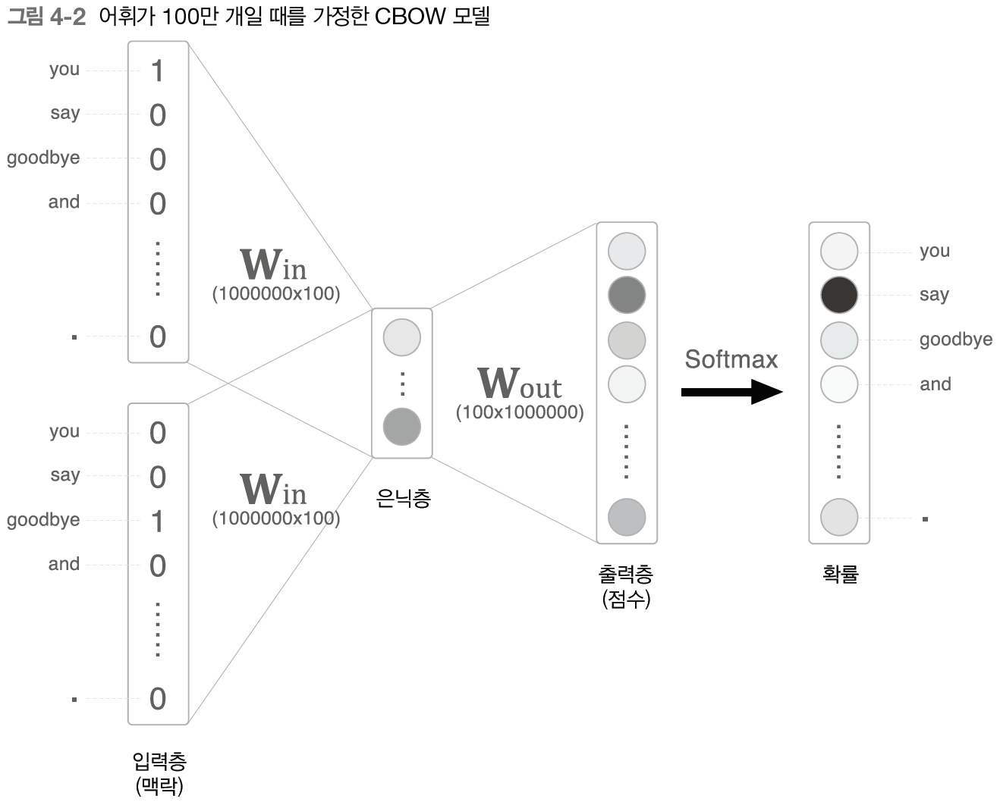
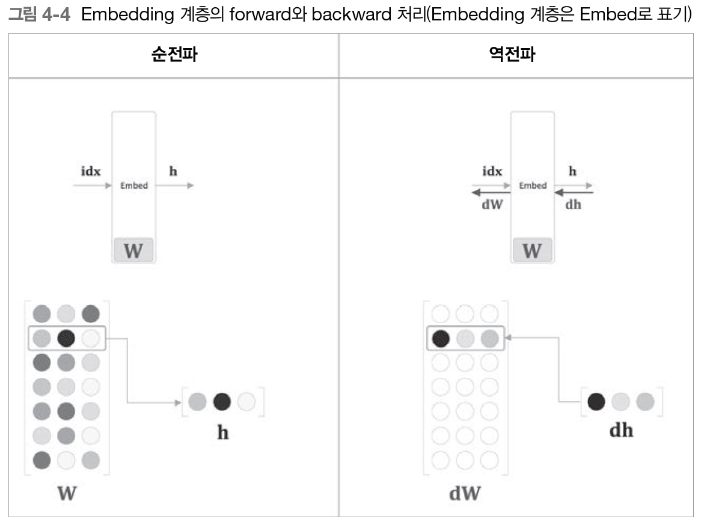
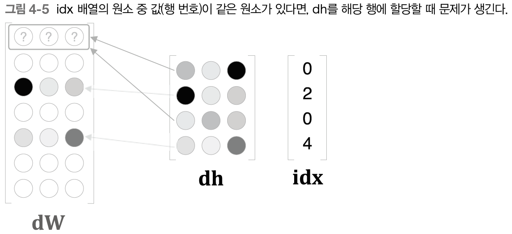
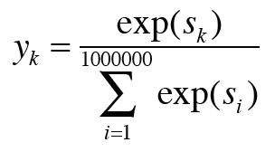
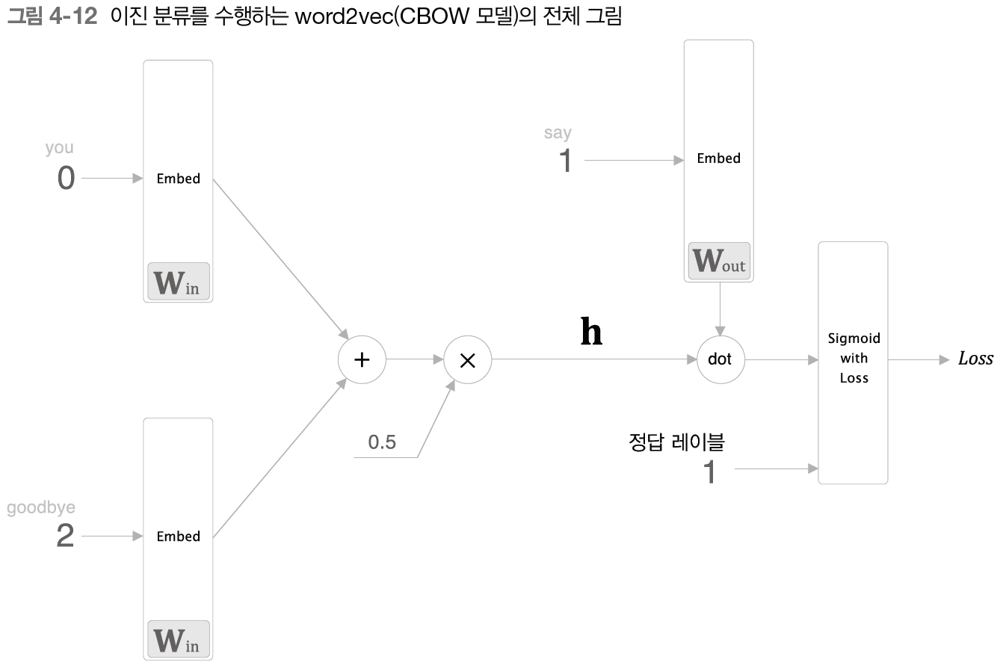
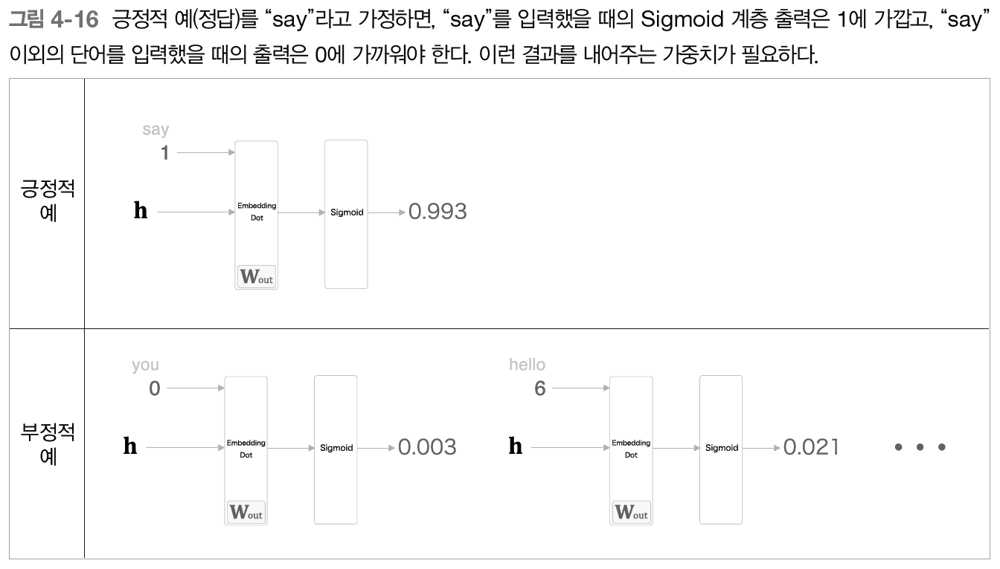
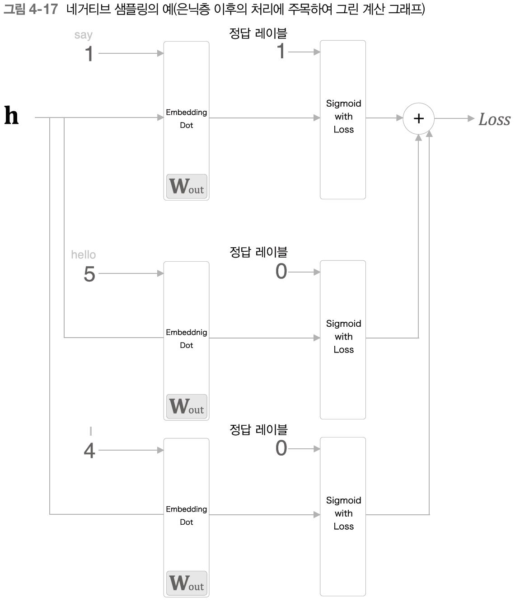
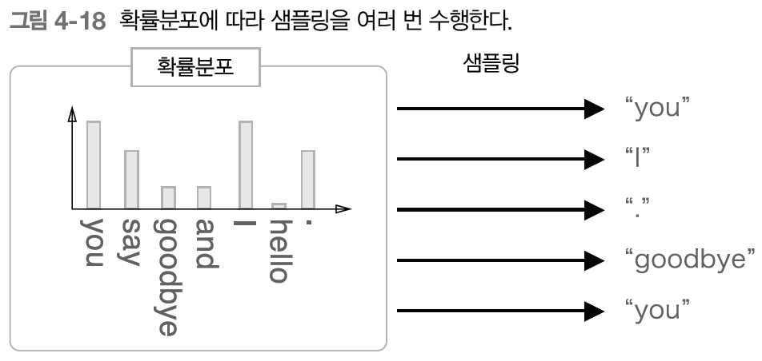
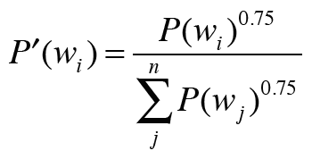
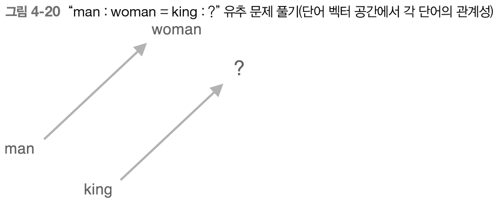

word2vec 속도 개선
====

앞서 익힌 word2vec 모델 중 하나인 CBOW는 어휘량이 많아질수록 계산량이 크게 늘어난다는 단점을 가지고 있다.

이제부터는 속도를 개선시킬 수 있는 방법인 **'Embedding'** 과 **'네거티브 샘플링'** 에 대해 알아보겠다.

## CBOW 의 문제점 살펴보기



위 그림에서 예상 가능하듯, 아래 두 부분에서 계산 병목현상이 발생한다:

* 원핫표현으로 이루어진 입력층과 가중치 행렬 Win의 곱 계산
  * 어휘수가 많아질 수록 원핫 벡터의 크기도 커진다.
  * Embedding 계층 도입으로 해결
* 은닉층과 가중치 행렬 Wout의 곱 및 Softmax 계층의 계산
  * 네거티브 샘플링으로 해결

## 개선하기 - 1. Embedding 계층

먼저 기존 입력층과 가중치 행렬의 연산을 살펴보자:


정말 거대한 연산을 진행하지만, 자세히 살펴보면, 이 연산은 결국 **행렬의 특정 행을 추출해내는 연산**일 뿐이다. 즉, 원핫 표현으로의 변환 & MatMul 계층의 행렬곱 계산이 굳이 필요없다. 그냥 바로 인덱스로 접근하면 훨씬 성능이 개선될 것임을 알 수 있다.

Embedding 계층은 **가중치 매개변수(행렬)로 부터 특정 단어(단어 ID)에 해당하는 행(벡터)를 추출하는 계층**을 뜻한다. 즉, 단어의 분산표현이 저장되는 계층이다.

> Embedding : word embedding. 단어의 밀집벡터 표현. 단어의 분산표현.

그럼, 행렬에서 특정 행을 추출해내는 코드를 구현해보자:

```python
>>> import numpy as np
>>> W = np.arange(21).reshape(7, 3)
>>> W
array([[ 0,  1,  2],
       [ 3,  4,  5],
       [ 6,  7,  8],
       [ 9, 10, 11],
       [12, 13, 14],
       [15, 16, 17],
       [18, 19, 20]])
# 특정 행 추출하기
>>> W[2]
array([6, 7, 8])
>>> W[5]
array([15, 16, 17])

# 여러 행을 한꺼번에 추출하기
>>> idx = np.array([1, 0, 3, 0])
>>> W[idx]
array([[ 3,  4,  5],
       [ 0,  1,  2],
       [ 9, 10, 11],
       [ 0,  1,  2]])
```

위와 같이 이전과 같은 복잡한 연산 없이 간단한 인덱싱 접근으로 빠르게 추출되는 것을 알 수 있다.

### Embedding 계층 구현하기

그럼 이제 Embedding 계층을 구현해보자!



위에서 살펴본 연산이 바로 Embedding 계층의 순전파이다. 이는 행렬의 특정 행만 뽑아낸 것으로서 아무런 변형 없이 그대로 값을 흘려보낸 행위이다. 그러므로 이의 역전파도 그냥 전해진 기울기를 그대로 다음층으로 흘려보내주면 된다.

이를 코드로 옮겨보면 다음과 같다 : 

```python
class Embedding:
    def __init__(self, W):
        self.params = [W]
        self.grads = [np.zeros_like(W)]
        self.idx = None
        
    def forward(self, idx):
        W, = self.params
        self.idx = idx
        out = W[idx]
        return out
    
    def backward(self, dout):
        dW, = self.grads
        dW[...] = 0			# dW의 shape는 유지하고 내용물을 0으로 채워넣는다
        dW[self.idx] = dout	# dout = 앞층에서 전해져온 기울기
        return None
```

그런데 현재 역전파 구현에 문제가 있다. 인덱스에 중복된 값이 들어올 경우에 이전의 dout이 마지막으로 나타난 값의 dout으로 덮어씌워진다는 점이다.



덮어씌워지는 문제를 해결하기 위해서는 단순 할당을 더해지는 연산으로 변경해야 한다:

```python
    def backward(self, dout):
        dW, = self.grads
        dW[...] = 0
        
        # np.add.at(dW, self.idx, dout) 가 더 빠르지만 원리를 보여주기 위해..
        for i, word_id in enumerate(self.idx):
            dW[word_id] += dout[i]
            
        return None
```

구현 끝! 이제 입력층의 MatMul 계층을 Embedding 계층으로 변경해주면 효율적인 메모리 사용 및 계산 최적화가 가능해진다! :-D

## 개선하기 - 2. 네거티브 샘플링 (부정적 샘플링)

은닉층 이후의 처리에 대한 개선!

Softmax 대신 네거티브 샘플링을 이용하면 어휘가 아무리 많아져도 계산량을 낮은 수준에서 일정하게 억제할 수 있다.

먼저 기존 은닉층 이후의 연산을 살펴보자:


아래 두가지 부분이 병목의 원인이 된다.

* 은닉층의 뉴런과 Wout의 행렬곱
  * 크기가 클수록 느려진다
* Softmax 계층의 계산
  * 어휘가 많아지면 softmax의 계산량도 증가한다. 
  * 위 그림의 경우, 소프트맥스의 수식 :

### 다중분류에서 이진분류로

계산을 단순화하기 위해 다중분류(multi class classification) 문제를 이진분류(binary classification) 문제로 근사해보자.

다중분류를 이진분류로 근사하기 위해서는 질문 자체의 관점을 바꾸어야 한다.

* 다중분류 : "앞 단어는 you, 뒤 단어는 goodbye일 때, 타겟 단어는 무엇인가?"
  * 여러 단어 중에서 고르는 다중 분류 문제
* 이진분류 : "앞 단어는 you, 뒤 단어는 goodbye일 때, 타겟 단어가 say인가?"
  * Yes/No question => 정답일 확률을 구하는 이진 분류 문제

위의 예시와 같이, 이진분류 문제는 "정답일 확률(실제로는 점수가 나오면 확률로 변경시킬 것이다)"을 구하는 문제로 단순화 되어 출력층이 하나의 뉴런만 가질 수 있게 된다.


은닉층과 Wout의 계산을 좀 더 자세히 살펴보자면 아래와 같다. 은닉층 뉴런과 특정 단어(say)에 해당하는 가중치 벡터를 추출하여 내적을 구하니 단일 뉴런이 도출되는 것이다.


### Sigmoid with Loss (시그모이드 함수 & 교차 엔트로피 오차)

시그모이드 함수와 교차 엔트로피 오차는 이진분류에서 가장 흔하게 사용되는 조합이다.

위에서 내적으로 구한 점수(S, score) 를 **시그모이드 함수를 이용하여 확률로 변경**시키고 **교차 엔트로피 오차를 이용하여 손실을 계산**하여 학습에 활용한다.

|      | 다중 분류                                       | 이진 분류                                       |
| ---- | ----------------------------------------------- | ----------------------------------------------- |
| 확률 | 소프트맥스                                      | 시그모이드<br />         |
| 손실 | 교차 엔트로피 오차<br /> | 교차 엔트로피 오차<br /> |

#### Sigmoid with Loss 계층 구현

그럼 이제 Sigmoid with Loss 계층을 구현해보자!

먼저 Sigmoid with Loss 계층의 계산그래프를 살펴보면 다음과 같다:


* sigmoid와 CEE의 조합에 대한 역전파 : y - t (출력값과 정답레이블의 차이)



나머지 계층들은 이미 구현코드를 작성한 바가 있으니 마지막 출력층(EmbeddingDot)에 대한 구현만 적어보겠다:

```python
import numpy as np
from layers import Embedding

class EmbeddingDot:
    def __init__(self, W):
        self.embed = Embedding(W)
        self.params = self.embed.params
        self.grads = self.embed.grads
        self.cache = None

    def forward(self, h, idx):
        target_W = self.embed.forward(idx)
        out = np.sum(target_W * h, axis=1)
        self.cache = (h, target_W)
        return out

    def backward(self, dout):
        h, target_W = self.cache
        dout = dout.reshape(dout.shape[0], 1)

        dtarget_W = dout * h
        self.embed.backward(dtarget_W)
        dh = dout * target_W
        return dh
```

### 네거티브 샘플링

지금까지는 옳은 답인 경우에 대해서만 학습을 시켜왔다. 네거티브 샘플링은 틀린 답까지 학습을 시켜 정답률을 더욱 증가시키는 방법이다.

예를 들어, you와 goodbye 사이에 들어갈 단어가 say라는 것을 계속해서 학습시켜왔다면, say 외의 단어들은 정답이 아니라는 것까지 학습을 시키는 것이다.



하지만 이 방법도 어휘수가 많아질수록 부정적인 예를 모두 학습하기에는 어려워진다. 그래서 틀린 답을 몇개만 골라서(샘플링) 학습시키는 방법을 추가 사용하게 되는데 이 아이디어를 차용한 기법이 바로 **네거티브 샘플링** 기법이다.

즉, 네거티브 샘플링 기법을 정리하자면 아래와 같다 : 

* 정답인 경우에 대한 손실 구하기
* 오답인 경우를 몇 개 선별하여 그 대한 손실 구하기
* 정답/오답인 경우의 손실을 더한 값을 최종 손실값으로 처리하기


아래 예시는 정답(say)인 경우와 오답 샘플링(hello, I)의 경우로 학습하는 계산 그래프이다:

정답인 say의 손실값, 오답인 hello, I의 손실값을 모두 더해 최종 Loss를 계산하고 있다.



#### 네거티브 샘플링의 기법

네거티브 샘플링 시, 최대한 많은 수의 오답을 학습하는 것이 성능에는 더 큰 도움이 되지만, 학습 환경 등에 대한 제약사항들로 최적의 개수를 선별하는 것이 좋다.

학습시킬 오답을 선별하기 위해 무작위로 선별하는 것도 방법이겠지만 좋은 방법은 아니다.  그렇다면 적절한 오답을 선별하는 기법에는 어떤 것이 있을까? 

* 단어의 확률분포를 기초로 샘플링하기 (단어 빈도) 

  * 자주 등장하는 단어를 많이 추출, 드물에 등장하는 단어를 적게 추출 

    

확률분포를 사용하여 단어를 샘플링하는 것을 파이썬 코드로 나타내보면 아래와 같다:

```python
p = [0.5, 0.1, 0.05, 0.2, 0.05, 0.1]
np.random.choice(words, p=p)
```

이렇게 하면 확률분포대로 단어가 선정되기 때문에 편하게 네거티브 샘플링을 할 수 있다!

하지만 이렇게되면 출현빈도가 적은 단어는 아예 선별되지 않기때문에 학습이 편향될 위험이 있다. 이를 보완하기 위해 네거티브 샘플링 기법에서는 기본 확률분포에 아래와 같이 0.75 제곱을 하도록 권장하고 있다.



0.75를 제곱함으로써 출현 확률이 낮은 단어의 확률을 살짝 올릴 수 있게 되기 때문이다:

```python
>>> p = [0.7, 0.29, 0.01]
>>> new_p = np.power(p, 0.75)
>>> new_p /= np.sum(new_p)
>>> new_p
array([0.64196878, 0.33150408, 0.02652714])
```

### 네거티브 샘플링 구현

```python
class NegativeSamplingLoss:
    # W : 출력 측 가중치
    # corpus : 말뭉치 (단어 ID 리스트)
    # power : 확률분포에 제곱할 값
    # sample_size : 부정적 예의 샘플링 횟수
    def __init__(self, W, corpus, power=0.75, sample_size=5):
        self.sample_size = sample_size
        self.sampler = UnigramSampler(corpus, power, sample_size)
        self.loss_layers = [SigmoidWithLoss() for _ in range(sample_size + 1)] # 부정적 예 계층 sample_size 개 + 긍정적 예 계층 1개
        self.embed_dot_layers = [EmbeddingDot(W) for _ in range(sample_size + 1)]

        self.params, self.grads = [], []
        for layer in self.embed_dot_layers:
            self.params += layer.params
            self.grads += layer.grads

    def forward(self, h, target):
        batch_size = target.shape[0]
        negative_sample = self.sampler.get_negative_sample(target)

        # 긍정적 예 순전파
        score = self.embed_dot_layers[0].forward(h, target)
        correct_label = np.ones(batch_size, dtype=np.int32)
        loss = self.loss_layers[0].forward(score, correct_label)

        # 부정적 예 순전파
        negative_label = np.zeros(batch_size, dtype=np.int32)
        for i in range(self.sample_size):
            negative_target = negative_sample[:, i]
            score = self.embed_dot_layers[1 + i].forward(h, negative_target)
            loss += self.loss_layers[1 + i].forward(score, negative_label)

        return loss

    # 순전파의 역순으로 각 계층을 호출하면 된다
    def backward(self, dout=1):
        dh = 0
        for l0, l1 in zip(self.loss_layers, self.embed_dot_layers):
            dscore = l0.backward(dout)
            dh += l1.backward(dscore)
        return dh
```

## 개선하기 - 3. 개선판 word2vec 학습

위에서 구현해본 네거티브 샘플링 기법을 신경망 구현에 적용해보자!

### CBOW 모델 구현

```python
import sys
import numpy as np
from layers import Embedding
from ch04.negative_sampling_layer import NegativeSamplingLoss

class CBOW:
    # vocab_size : 어휘 수
    # hidden_size : 은닉층의 뉴런 수
    # corpus : 단어 ID 목록
    # window_size : 맥락의 크기
    def __init__(self, vocab_size, hidden_size, window_size, corpus):
        V, H = vocab_size, hidden_size

        # 가중치 초기화
        W_in = 0.01 * np.random.randn(V, H).astype('f')
        W_out = 0.01 * np.random.randn(V, H).astype('f')

        # 계층 생성
        self.in_layers = []
        for i in range(2 * window_size):
            layer = Embedding(W_in)
            self.in_layers.append(layer)
        self.ns_loss = NegativeSamplingLoss(W_out, corpus, power=0.75, sample_size=5)

        layers = self.in_layers + [self.ns_loss]

        # 모든 가중치와 기울기를 배열에 모은다
        self.params, self.grads = [], []
        for layer in layers:
            self.params += layer.params
            self.grads += layer.grads

        # 인스턴스 변수에 단어의 분산 표현을 저장한다
        self.word_vecs = W_in

    # contexts (2차원), target (1차원) : 단어 ID
    def forward(self, contexts, target):
        h = 0
        for i, layer in enumerate(self.in_layers):
            h += layer.forward(contexts[:, i])
        h *= 1 / len(self.in_layers)
        loss = self.ns_loss.forward(h, target)
        return loss

    def backward(self, dout=1):
        dout = self.ns_loss.backward(dout)
        dout *= 1 / len(self.in_layers)
        for layer in self.in_layers:
            layer.backward(dout)
        return None

```

### 학습

```python
import numpy as np
from common import config

import pickle
from common.trainer import Trainer
from optimizer import Adam

from ch04.cbow import CBOW
from common.util import create_contexts_target, to_cpu, to_gpu
from dataset import ptb

# 하이퍼 파라미터 설정
window_size = 5
hidden_size = 100
batch_size = 100
max_epoch = 10

# 데이터 읽기
corpus, word_to_id, id_to_word = ptb.load_data('train')
vocab_size = len(word_to_id)

contexts, target = create_contexts_target(corpus, window_size)
if config.GPU:
    contexts, target = to_gpu(contexts), to_gpu(target)

# 모델 등 생성
model = CBOW(vocab_size, hidden_size, window_size, corpus)
optimizer = Adam()
trainer = Trainer(model, optimizer)

# 학습 시작
trainer.fit(contexts, target, max_epoch, batch_size)
trainer.plot()

# 나중에 사용할 수 있도록 필요한 데이터 저장
word_vecs = model.word_vecs
if config.GPU:
    word_vecs = to_cpu(word_vecs)
params = {}
params['word_vecs'] = word_vecs.astype(np.float16)
params['word_to_id'] = word_to_id
params['id_to_word'] = id_to_word
pkl_file = 'cbow_params.pkl'
with open(pkl_file, 'wb') as f:
    pickle.dump(params, f, -1)
```

### 평가

```python
from common.util import most_similar
import pickle

pkl_file = 'cbow_params.pkl'

with open(pkl_file, 'rb') as f:
    params = pickle.load(f)
    word_vecs = params['word_vecs']
    word_to_id = params['word_to_id']
    id_to_word = params['id_to_word']

querys = ['you', 'year', 'car', 'toyota']
for query in querys:
    most_similar(query, word_to_id, id_to_word, word_vecs, top=5)
```

### 유추문제 풀어보기

단어의 분산표현은 비슷한 단어를 모으는 것 뿐만 아니라 **유추 문제** 를 풀 수 있다.

king - man + woman = queen 과 같은 유추문제를 풀 수 있다는 뜻이다! 이 문제를 그림으로 나타내보면 아래와 같다.



위와 같이 man -> woman 벡터와 비슷한 방향을 보이는 king -> ? 의 벡터를 찾는 것이다.

과거형, take : took = go : ? (went)

비교급, good : better = bad: ? (worse)

등과 같이 단어 사이의 관계를 유추할 수 있기 때문에 good ? best 순에서 ?가 better 임을 유추할 수도 있다. 

