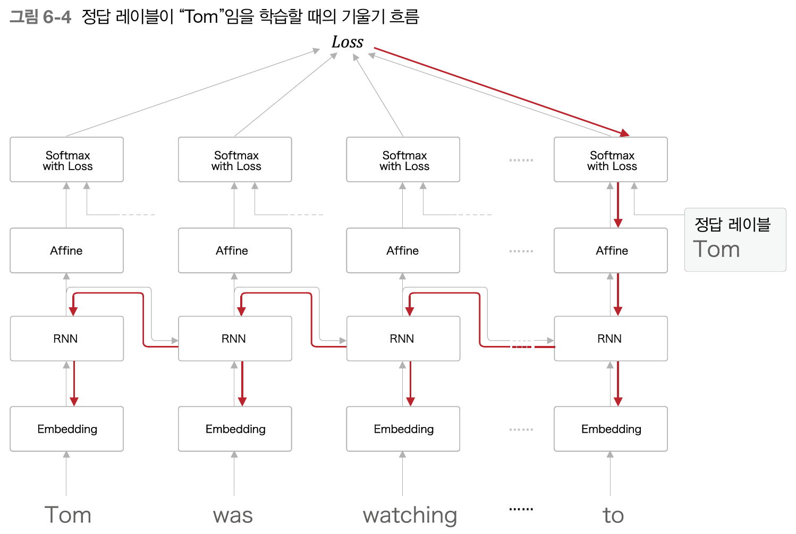
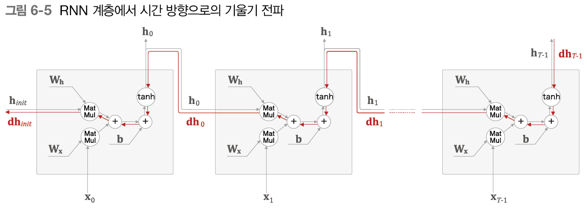
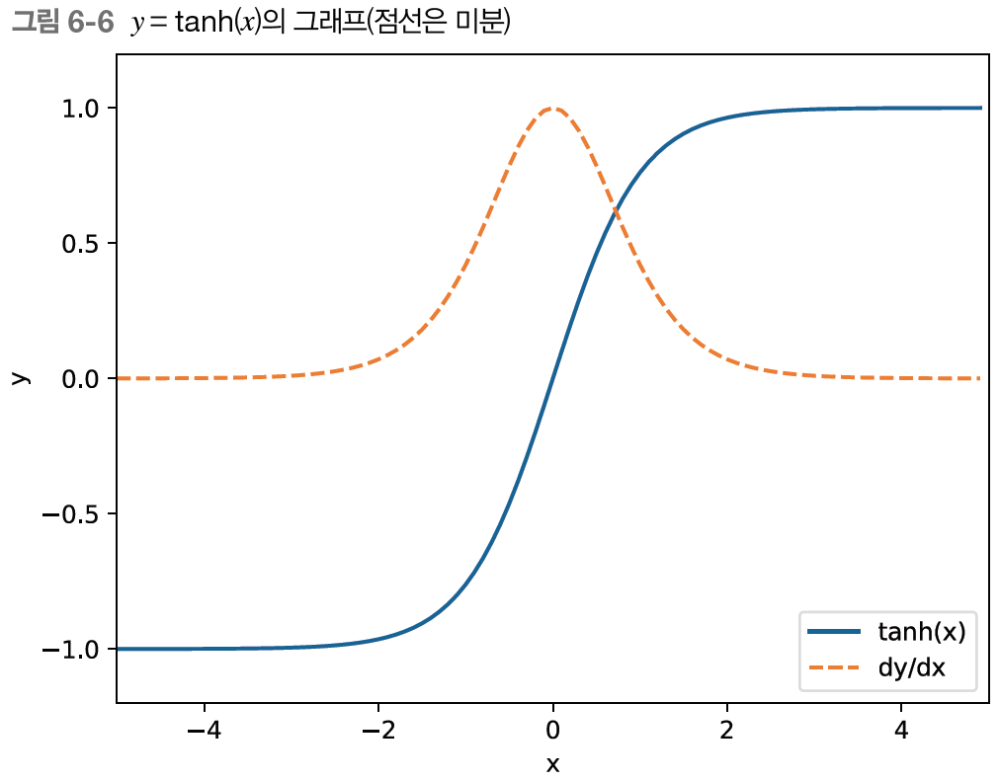
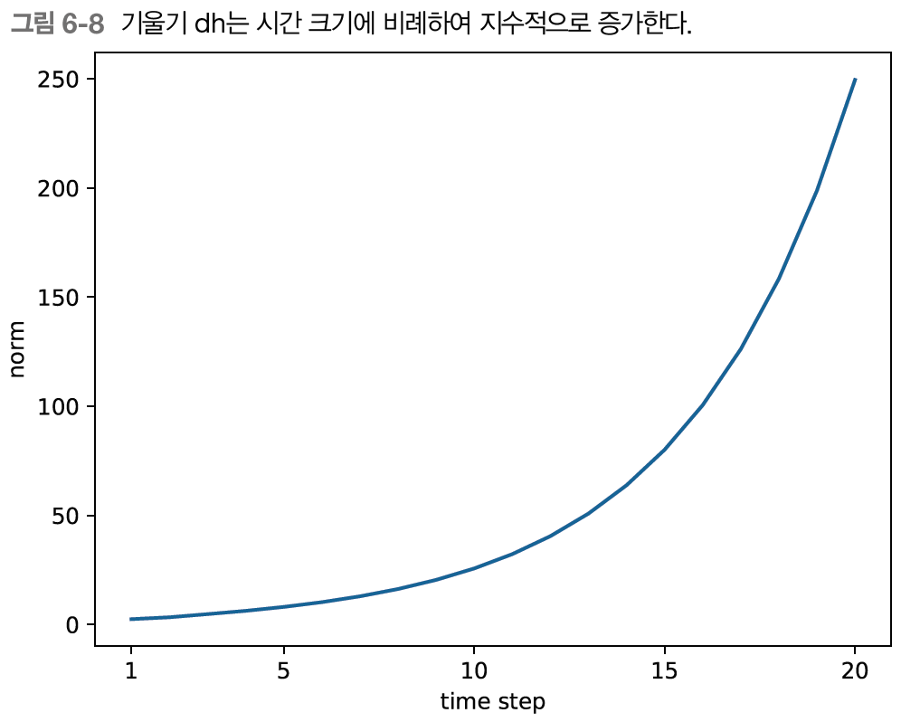
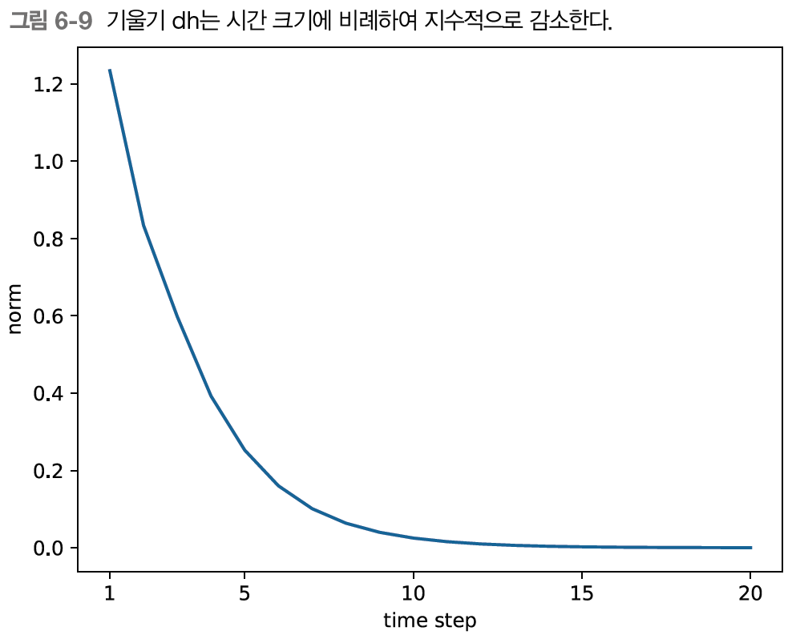
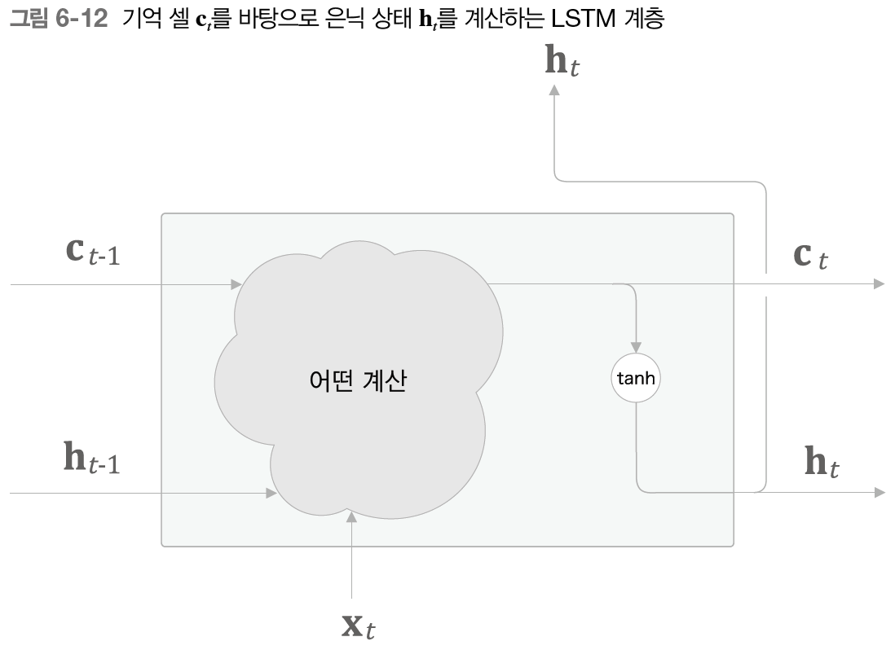

게이트가 추가된 RNN - LSTM
=====

이전 포스트에서 RNN은 순환구조를 통해 과거의 정보를 기억할 수 있음을 알아보았다. 하지만, 사실 일반 RNN은 시간적으로 멀리 떨어진, Long Term 의존 관계를 잘 학습하기에는 어려운 모델이다.

장기 의존 관계를 학습하기 위해서는 **일반 RNN에 게이트(gate)라는 구조를 더한 LSTM이나 GRU 계층**이 주로 사용된다.

## RNN의 문제점

RNN이 장기 의존 관계를 학습하기 어려운 이유는 무엇일까? 바로 **BPTT 진행 시 기울기 소실 or 기울기 폭발**이 일어나기 때문이다.

> - 기울기 소실 : 역전파의 기울기 값이 점점 작아지다가 아예 사라져버리는 현상 (0이 되어버려...)
> - 기울기 폭발 : 역전파의 기울기 값이 점점 커지다가 너무 과도하게 큰 값이 되어버리는 현상


 `?` 칸에 들어가는 단어가 뭘까? 앞의 문장들을 미루어 보았을 때, `Tom` 혹은 `him` 일 것이라 예상해볼 수 있겠다. 즉, 위에서 주어진 모든 문장을 기억하고 있어야 이를 유추할 수 있다는 뜻이다.

이를 RNN 계층 관점과 RNNLM 학습 관점에서 에서 살펴보자

* RNN 계층 : 이 정보들을 은닉상태에 인코딩하여 보관해야 한다.
* RNNLM 계층 : 정답레이블에 대해 과거 방향으로 기울기를 아래와 같이 전달해야 한다.



위와 같이 기울기를 전달하는 과정에서 어느순간 기울기 값이 너무 작아지거나 (기울기 소실) 너무 커져버리면 (기울기 폭발) 그 이후부터는 가중치 매개변수의 갱신의 의미가 사라지게 될 수 있다. 그리고 일반 RNNLM의 경우 기울기를 전달하는 길이가 길어질수록 거의 대부분 그렇게 되어버린다.

### 원인

일반 RNN을 사용하는 언어모델에서 기울기 소실과 기울기 폭발이 일어나는 원인을 구체적으로 살펴보자.

먼저 RNN 계층에서 기울기가 역전파로 전달되는 모습을 다시 한번 자세히 체크해보면 아래 그림과 같다.



역전파 시의 기울기 값이 tanh -> + -> MatMul 연산을 차례로 통과하고 있다. + 연산의 역전파는 값을 그대로 흘려보내기만 하므로 tanh와 MatMul 연산에서 기울기 값이 어떻게 변화하는지 살펴보자.

#### 1) tanh



역전파에서 사용되는 tanh 미분을 살펴보면 결과 값이 1.0 이하이며 x가 0에서 멀어질수록 0에 가까워 짐을 알 수 있다. 이는 **역전파 시 tanh 계층을 지날 때 마다 값은 계속해서 작아질 수 밖에 없다**는 뜻이다. 

이를 방지하기 위해 tanh대신 ReLU를 사용하여 기울기 소실을 줄이기도 한다.

#### 2) MatMul

기존 모델에서 tanh 노드가 없다고 생각하고 MatMul 노드만을 살펴보자.


역전파시 기울기 값은 MatMul 노드를 거치며 **가중치 wh의 전치행렬을 계속해서 곱**해나간다. 여기서 감이 올 것이다. 이 점이 바로 기울기가 급속도로 변화하게 되는 이유이다.

| 기울기가 폭발하는 경우 (기울기 폭발) | 기울기가 급감하는 경우 (기울기 소실) |
| ------------------------------------ | ------------------------------------ |
|             |             |

초기 값의 크기에 따라 폭발 혹은 소실의 길을 걷게 된다. 기울기 값이 지수적으로 증가하게 되면 필연적으로 오버플로우가 발생하여 NaN과 같은 값이 나타나게 된다. 기울기 값이 지수적으로 감소하게 되면 종극에는 기울기 값의 변화가 거의 없어져 학습이 진행되지 않는다. 즉, 두 가지 상황 모두 한번 발생하기 시작하면 신경망 학습이 엉망으로 치닫게 되는 것이다.

### 대책

그렇다면 이 문제점을 어떻게 해결할 수 있을까?

#### 1) 기울기 폭발

기울기 폭발의 경우에는 **기울기 클리핑(gradients clapping)**이라는 전통적인 기법을 사용하여 해결할 수 있다. 이는 특정 threshold에 도달하게 되면 기울기를 수정하는 방법이다.

```python
import numpy as np

dW1= np.random.rand(3, 3) * 10
dW2 = np.random.rand(3, 3) * 10
grads = [dW1, dW2]
max_norm = 5.0

def clip_grads(grads, max_norm):
    total_norm = 0
    for grad in grads:
        total_norm += np.sum(grad ** 2)
    total_norm = np.sqrt(total_norm)
    
    rate = max_norm / (total_norm + 1e-6)
    if rate < 1:
        for grad in grads:
            grad *= rate
```

#### 2) 기울기 소실

기울기 소실의 경우에는 RNN 계층의 구조 자체를 바꿔야한다. 바로 **'게이트가 추가된 RNN'** 을 만들어야 하는데 여기서는 LSTM에 대해서 알아보도록 하겠다!


## LSTM (Long Short-Term Memory) [#](<https://dgkim5360.tistory.com/entry/understanding-long-short-term-memory-lstm-kr>)

'게이트가 추가된 RNN' 중의 하나인 LSTM에 대해 알아보자.


먼저 RNN 계층과 LSTM 계층을 비교해보면 c 라는 인풋이 생겼다는 점을 발견할 수 있다. c는 기억셀 (memory cell, cell) 이며 LSTM전용 기억 메커니즘이다.

기억 셀(c)은 LSTM 계층끼리만 데이터를 주고 받는다. 그에 반해 은닉 상태(h)는 RNN 계층과 마찬가지로 다른 계층으로 출력된다.

RNN계층과의 대략적인 구조 차이점을 살펴봤으니 이번에는 LSTM 계층의 내부를 살펴보자:



* 기억셀 c : 시각 t에서의 LSTM의 기억이 저장되어 있다. 과거로부터 시각 t까지 필요한 모든 정보가 저장되어있다고 생각하자.
* 은닉상태 h : 기억셀 ct-1을 tanh 함수로 변환하여 외부 계층에 은닉상태 ht를 출력한다. 


