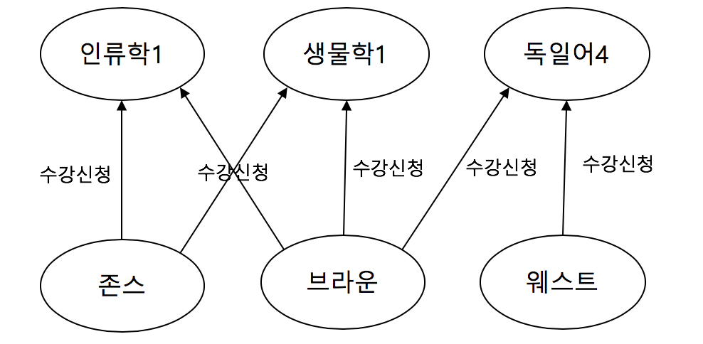

그래프 데이터베이스
====

네트워크 관계를 표현하기에 좋다. 사물간의 관계라는 관점에서 바라보면 거의 모든 것을 표현할 수 있다.

* 방향성을 가지는 관계
* 부분 관계
* 계층 관계
* 소셜 미디어

## 구성

### 정점 (vortex) : 엔터티

고유식별자로 표시된 엔터티. 속성을 가질 수 있다.

* 예시) 고속도로 시스템의 정점 : 도시 - 속성 : 인구, 위도/경도, 도시이름, 지리적위치 등...

### 에지 (edge) : 엔터티 간의 링크 / 연결 정보

정점들 간의 관계 / 정점들을 연결한 객체. 속성을 가질 수 있다

* 예시) 고속도로 시스템의 에지 : 도시를 연결한 고속도로 - 속성 : 거리, 제한속도, 차선 수 등...
* **가중치** 속성 : 관계에 대한 어떤 값을 표현함! 객체간 관계를 **측정**하는 다른 지표를 나타냄.
  * 예시) 고속도로 시스템의 에지의 가중치 속성 : 도시 간 거리
* 방향 에지 : 방향성을 가지며 관계해석이 필요한 경우. ex) 자식과 부모관계를 나타내는 그래프
* 무방향 에지 : 방향성이 필요없거나 양방향으로 이루어지는 관계일 경우. ex) 고속도로 그래프

### 경로

정점과 정점을 잇는 에지의 집합

* 방향 경로 (directed path) : 방향 에지의 집합인 경우
* 무방향 경로 (undirected path) : 무방향 에지의 집합인 경우

### 루프

한 정점에서 시작해 자기 자신으로 돌아오는 엣지

## 연산 작업

데이터 입력, 조회, 갱신, 삭제, **그래프 합집합, 교집합, 순회**

### 합집합

두개의 그래프를 합칠 수 있다. 집합의 합집합처럼 겹치는 정점을 기준으로 합쳐진다.

### 교집합

두개의 그래프의 공통된 정점과 에지를 나타난대

### 순회

그래프에 있는 모든 정점을 방문하는 프로세스.

## 정점의 속성 (특징)

### 동형성 (isomorphism)

두개의 그래프가 동일한 형태를 가지는 특성을 뜻함. 각 정점끼리 상응하는 정점이 있는 경우. 

그래프 집합에서 패턴을 탐지할 때 중요한 역할을 한다. (소셜네트워크, 전염병 등...)

### 순서와 크기

그래프가 얼마나 큰지 측정한다.

* 순서 : 정점의 개수
* 크기 : 에지의 개수

순서와 크기가 작업 수행에 필요한 시간과 공간에 영향을 줌. (커질수록 오래걸린다)

* 클라크 (clique) : 그래프에 있는 모든 정점이 서로 모두 연결된 것

### 차수 (degree)

한 정점에 연결된 에지의 개수. 정점의 **중요도**를 측정하는 수단

### 근접성 (closeness)

그래프에서 한 정점이 다른 모든 정점과 얼마나 떨어져 있는지를 나타낸다.

전파력(?)을 알기위한 매우 중요한 측정치. (소셜 네트워크에서의 정보 전파, 한 사회에서의 전염병 확산 등...)

근접성이 클수록 더 빠르게 다른 정점에 도달한다.

### 매개성 (betweenness)

주어진 정점에 병목현상이 얼마나 발생하는지 나타내는 측정치.

## 유형

### 무방향/방향 그래프

* 무방향 그래프 : 무방향 에지로 이루어진 그래프 (협력 관계)
* 방향 그래프 : 방향 에지로 이루어진 그래프 ('보고'와 같은 상하 관계 등)

### 유동 네트워크 (flow network, 교통 네트워크)

용량을 가진 각각의 에지와 진입/진출 에지로 이루어진 집합을 가진 정점들로 이루어진 방향 그래프

* 소스(source) 정점 : 진출 에지만 있는 정점
* 싱크(sink) 정점 : 진입 에지만 있는 정점

### 이분 네트워크 (biparrtie graph, bigraph)

구별되는 두 정점 집합으로 이루어진 그래프

### 다중 그래프 (multigraph)

정점 사이에 여러 에지가 있는 그래프

### 가중 그래프 (weighted graph)

각 에지에 번호(가중치)가 할당된 그래프

## 장점

### 조인을 피할 수 있어 질의 속도가 빠르다.

관계형 데이터로 표현한 경우, `학생`, `수강신청`, `과목`이라는 세가지 엔터티의 관계로 표현된다. 이 경우, 아래 그림처럼 조인이 필요해져 속도가 퍼포먼스가 좋지 않을 수 있다.

같은 관계를 그래프로 표현해보자. `수강신청`을 엔터티가 아닌 순수하게 관계를 뜻하는 에지로 표현하고 `과목`, `학생`을 정점으로 표현하여 조인이 필요없어지는 아래와 같은 그래프가 만들어진다.

### 단순화한 모델링

위의 예시처럼 모델링 시, 상호작용 정보는 제외하고 모델링하므로 좀 더 단순화시킬 수 있다.

### 엔터티 간의 여러 관계

다양한 유형의 에지를 사용하여 엔터티 간의 여러 관계를 모델링한다.

## 설계

NoSQL 데이터베이스의 공통적인 특징 : 설계에 접근하는 방식

- 설계시 데이터를 대상으로 어떤 질의나 분석을 수행하는지 묻는 것으로 시작한다!

### 그래프 데이터베이스

엔터티와 엔터티들 간의 관계를 쉽게 묘사할 수 있는 영역의 문제 설계시 적합

* 두 엔터티 간의 관계를 식별할 떄
* 한 정점에서 나온 에지들의 공통 속성을 식별할 때
* 한 정점에서 나온 에지들의 집계 속성을 계산할 때
* 정점들의 집계 값 속성을 계산할 떄

### 설계 접근법

* 업무에 특화된 질의부터 검토하여 자연스럽게 그래프 중심 질의로 매핑하는 것이 좋다.
  * ex) 개발자A와 개발자B사이의 팔로우 관계는 몇 개인가? (정점A에서 정점B로 가는 에지는 몇 개인가?)

1. 수행하려는 질의를 식별한다
2. 그래프에 있는 엔터티를 식별한다
3. 엔터티간의 관계를 식별한다
4. 업무에 특화된 질의를 좀 더 추상적인 질의와 매핑해서 그래프 질의를 구현한다.
5. 정점의 추가 속성을 정의/계산한다. (그래프 알고리즘/그래프 질의도구 사용)

### 질의 언어

#### 사이퍼 (Cypier) - 선언적 질의

Neo4j 데이터베이스에서 사용되는 질의언어. 선언에 의한 질의를 한다.

neo4j+graphQL 도 있다. [#](https://neo4j.com/developer/graphql/) [#2](https://www.liip.ch/en/blog/neo4j-and-graphql-a-perfect-match)

> Neo4j-graphql-js translates GraphQL queries to a single Cypher query, eliminating the need to write queries in GraphQL resolvers and for batching queries. 

#### [그렘린 (Gremlin)](http://tinkerpop.apache.org/) - 선회적 질의

그래프 순회에 의한 질의.

정점의 input과 output정보를 활용하여 깊이우선탐색/너비우선탐색으로 질의함.

### 설계 팁

그래프 특성상, 그래프 크기가 커질수록 시간이 너무 오래걸려서 작업을 완료할 수 없는 경우가 생길 수 있다.

#### 인덱스 활용하기 - 검색시간 향상

#### 적절한 유형의 에지 사용하기 - 메모리 관리

* 방향 에지 : 두 정점이 대칭 관계가 아닐 때 사용하는 것을 권장 (ex. 두 사람간의 팔로우 여부)
* 무방향 에지 : 두 정점이 대칭 관계 일 때 사용하는 것을 권장 (ex. 두 도시간의 거리)

그래프 프로세싱은 메모리 집약적인 작업이다. 메모리 관리를 잘 해야 한다.

- 속성 값이 늘어날수록 저장공간을 많이 차지하게 된다. 
- 에지 타입에 따라서도...

#### 그래프 순회 시 사이클 감시하기

사이클 그래프를 고려하여 이미 방문한 정점에 대한 처리를 해야한다.

#### 그래프 데이터베이스의 확장성 고려하기

* 확장 가능성을 파악할 수 있는 요소들
  * 정점과 에지의 증가량
  * 사용자 수의 증가량
  * 정점과 에지에 있는 속성의 증가량 (개수, 크기)

* 메모리 등의 문제로 인해 수직적 스케일링이 필요할 수 있다.
* 수평적 스케일링을 원한다면 [타이탄](http://titan.thinkaurelius.com/)을 고려해보자.

