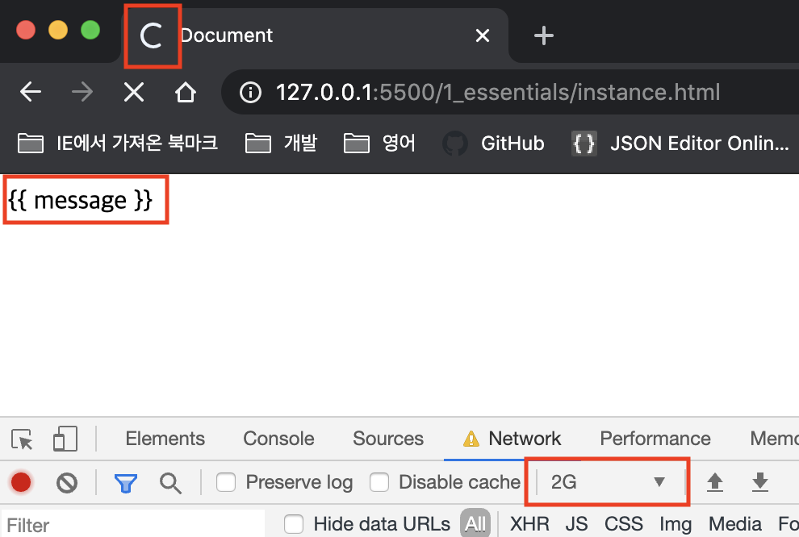
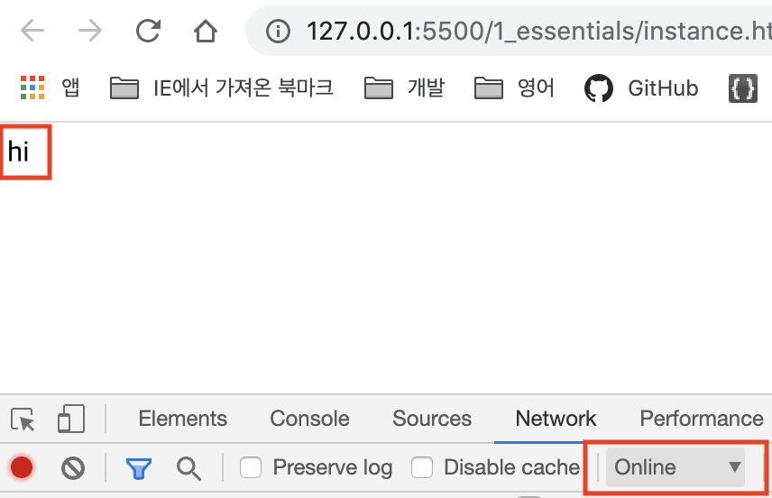
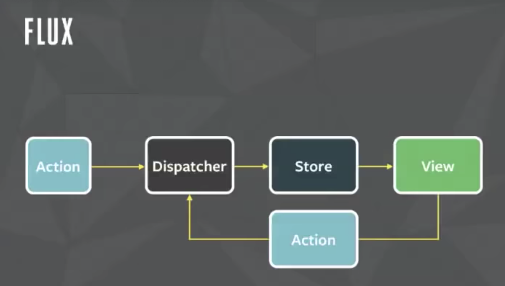
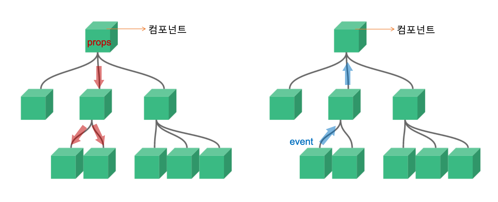
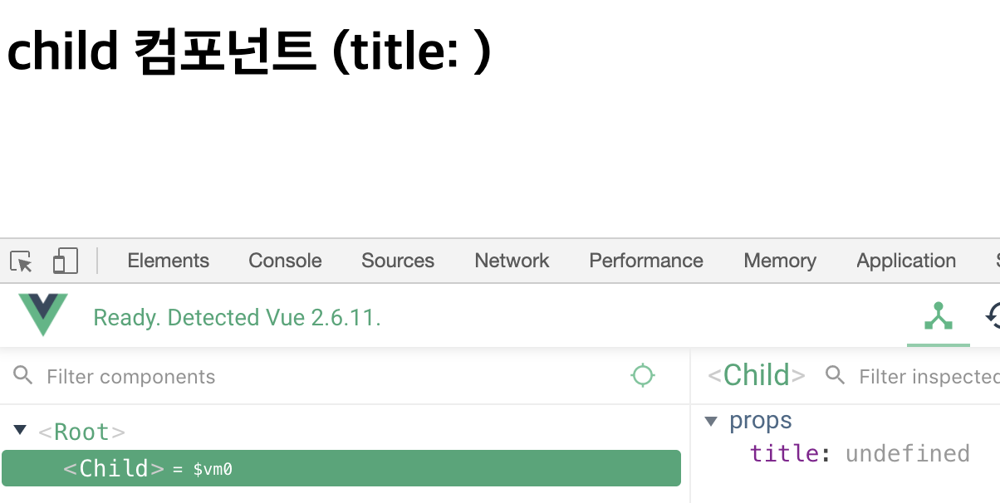
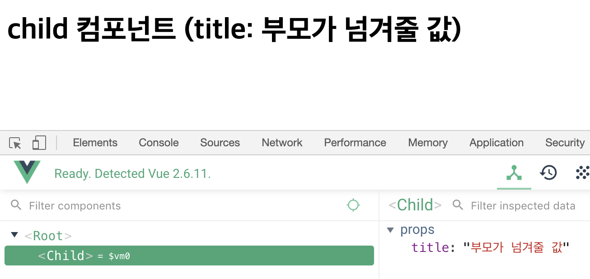
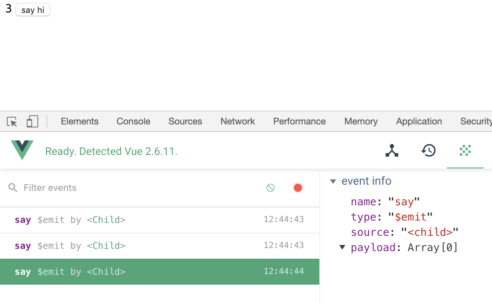
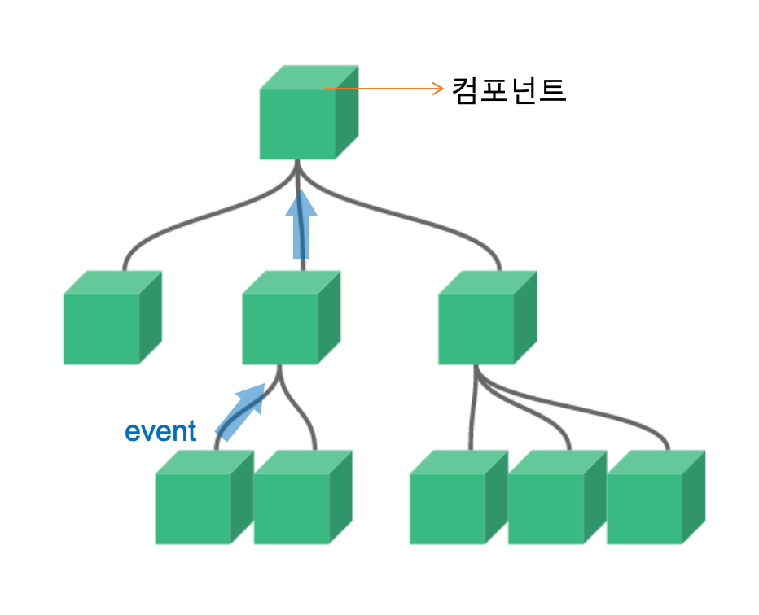

# Vue.js 정복 캠프 6기

출석번호 : 3215

* [강의 자료](https://joshua1988.github.io/vue-camp/)

* [강의 GitHub Repository](https://github.com/joshua1988/vue-camp)


# 강의 시작 전 배경지식 전파

## 그래픽 라이브러리

* [부트스트랩](http://bootstrapk.com/)
* [머터리얼](https://material-ui.com/)
  * 모바일(구글)에서부터 시작된 머터리얼 디자인이 웹쪽에도 이제 완전히 자리를 잡아 표준이되었다

##웹 앱 개발 관련  

* [현대 웹 애플리케이션 개발 개론](./modern-web-dev.pdf)
* [Vue.js - Lightweight Powerful View-layer Library](./vue-basic.pdf)
* [브라우저는 어떻게 동작하는가?](https://d2.naver.com/helloworld/59361)
* [최신 브라우저의 내부 살펴보기 1 - CPU, GPU, 메모리 그리고 다중 프로세스 아키텍처](https://d2.naver.com/helloworld/2922312)
* [웹팩 핸드북](https://joshua1988.github.io/webpack-guide/)


# 본강의

* [Reactivity in Depth](https://vuejs.org/v2/guide/reactivity.html#ad)

## Vue 시작하기

기초부터 파악하기 위해 cdn을 활용하여 Vue.js 라이브러리를 가져오도록 하자!

```html
<body>
    <div id="app">
      {{ message }}
    </div>

<!--Vue.js CDN-->
<script src="https://cdn.jsdelivr.net/npm/vue/dist/vue.js"></script>
<script>
  new Vue({
  	// element
  	el: '#app',
  	data: {
   		message: 'hi',
  	},
	});
</script>
</body>
```

### 렌더링 관련 이야기

방금 추가해준 CDN의 역할을 눈으로 직접 확인해보자.


크롬 개발자도구의 Settings 에서 Custom Network 환경을 만들어줬다. 이름은 그냥 2G라고 했는데 사실상 2G보다 훨씬 느린 1kb/s ㅋㅋㅋㅋㅋ

위의 코드를 Live Server로 띄운 후, 크롬 개발자도구의 `Network` 탭에서 `Online` -> `2G`로 변경하고 새로고침해보자



그러면 브라우저에는 `{{ message }}` 가 출력된 상태로 상단바가 계속 로딩중일 것이다.

vuejs 라이브러리를 아직 불러오지 못해서 vue 렌더링이 끝나지 않은 상태이기 때문이다.



다시 `Online`으로 변경하면 라이브러리 다운로드 및 렌더링이 완료되어 `hi` 라는 문구가 잘 나타나게 된다.

## Vue Instance

* [강의 자료](https://joshua1988.github.io/vue-camp/vue/instance.html#%EC%9D%B8%EC%8A%A4%ED%84%B4%EC%8A%A4-%EC%83%9D%EC%84%B1)
* [Vue.js 공식 가이드 자료 - Vue 인스턴스](https://kr.vuejs.org/v2/guide/instance.html)

```js
new Vue();
```


Vue 인스턴스 안에는 미리 정의되어 있는 속성과 메서드들이 존재한다. 이것들을 활용하여 더욱 빠르게 화면을 개발해나갈 수 있다.

```js
new Vue({
  el: , 				// element - 인스턴스가 그려지는 화면의 시작점
  temaplate: ,	// 화면에 표시할 요소
  data: ,				// 뷰의 반응성 (Reactivity)이 반영된 데이터 속성
  methods: ,		// 메서드
  ceated: ,			// Lifecycle 중 하나 (생성 콜백)
  watch: ,			// data에 정의한 속성의 값이 변화하였을 때 트리거되는 메서드 정의
})
```

이 외에도 속성, 메서드들이 존재한다. 그것은 투비컨티뉴.....


## Component

* [강의자료](https://joshua1988.github.io/vue-camp/vue/components.html)
* Vue.js 공식 가이드 자료 - 컴포넌트

### 아이디어) 데이터는 단방향으로 보내자

페이스북에서 발표한 영상을 보면 이해하기 좋다! (영어주의)

[[YouTube] Hacker Way: Rethinking Web App Development at Facebook](https://youtu.be/nYkdrAPrdcw)

리액트 탄생기라고 보면 된다.

* MVC 로 개발하다가... 이건 특정 시점부터는 도저히 확장성이 없는 그런 모델이라는 생각이 들었다....
* **MVC : Action -> Controller -> 수많은 Model들 <-> 수많은 View 들.... 지옥잼**
* 
* 페북 메세지 관련 버그가 있었는데... 분석을 해보니 원인 찾기도 너무 힘들고 데이터가 다 꼬여가지고 지옥이었음 => 모델링을 아예 바꿔야겠다는 생각이 들었음
* **Flux : Action -> Dispatcher -> Store -> View**
* 
  
* 단방향 처리!!! 
  
* 리액트의 데이터 흐름

**Vue.js 도 이러한 사상을 물려받아서 컴포넌트들 사이의 데이터 흐름을 단방향으로만 구성되게 만들어뒀음!**

### Vue.js 는 여러 컴포넌트들이 연결된 구조


Vue.js 프로젝트는 위와 같이 여러개의 컴포넌트가 서로 유기적으로 연결된 구조로 구성된다. 연결된 컴포넌트끼리 유기적으로 동작하기 위해서는 **상호간의 데이터 전달이 필수적**이다. 그러나 위의 페이스북 사례에서 알아봤듯이, 양방향으로 데이터를 전달하게되면 복잡도가 증가하여 데이터가 어디서 어디로 이동했는지 파악하기 어려워지는 지옥이 펼쳐질 수 있다.

상호간의 데이터 전달은 필수인데 지옥을 맞이해야하는 것도 싫고... 그럼 어떻게 해야할까?



Vue.js 는 "데이터"의 종류별로 방향성을 정해 **종류에 따라 단방향**으로 전달하기로 했다. (사실 Vue.js의 아이디어라기보다는 React의 아이디어지만 어쨌든!)

위의 그림에서도 표시되어있듯이, 데이터를 `props` 와 `event` 로 나누고 흐름을 지정했다.

* `props` : Vue Instance의 `data` 의 필드들. [상위 -> 하위]
* `event` : `click` 과 같은 이벤트. 시그널이라고 이해해도 좋다. [하위 -> 상위]

상위에서는 `data` 를 내려주도록, 하위에서는 `event` 를 올리도록 하여 양방향 의사소통이 가능하면서도 데이터 흐름을 단순화시키게 되었다.

이를 좀 더 코드단으로 살펴보도록하자!!! 

### 컴포넌트 데이터 전달 & 이벤트 발생


* Vue.js에서도 데이터는 단방향으로 (상위 -> 하위, parent -> child) => `props`
* 대신 역방향(하위 -> 상위, child -> parent) 으로는 이벤트를 발생시킬 수 있게! => `emit events`

#### 1. 데이터 전달하기 (부모 -> 자식)

눈으로 확인해야 제맛! 실제로 데이터를 전달해보자!

우선 `child` 컴포넌트를 하나 만든다 :

```html
  <body>
    <div id="app">
      <child></child>
    </div>

    <script src="https://cdn.jsdelivr.net/npm/vue/dist/vue.js"></script>
    <script>
      new Vue({
        el: '#app',
        data: {
          parentData: '부모가 넘겨줄 값',
        },
        components: {
          'child': {
            template: '<h1>child 컴포넌트 (title: {{ title }})</h1>',
            props: ['title'],
          },
        },
      });
    </script>
  </body>
```



실행시켜서 Vue 개발자도구로 확인해보면 위와 같이 props의 `title`이 undefined 로 나타날 것이다. `title`을 선언만 하고 딱히 값을 전달해주지 않았기 때문이다.

그럼 이제 `child` 컴포넌트의 `title`에게 부모쪽에서 값을 넘겨줘보자.

```html
  <body>
    <div id="app">
       <!-- <child v-bind:프롭스 속성 이름="상위 컴포넌트의 데이터 이름"></child> -->
       <!-- 부모의 데이터(parentData) 을 -> 자식의 속성(title) 으로 전달 -->
      <child v-bind:title="parentData"></child>
    </div>
    .... 중략
```



넘겨준 `parentData`의 값이 잘 전달되어 `child` 컴포넌트의 `title` props에 잘 들어간 것을 확인할 수 있다!


#### 2. 이벤트 발생시키기 (자식 -> 부모)

앞서 언급했듯이 Vue.js 는 단방향 데이터 흐름을 따르기 때문에, 자식은 부모에게 데이터를 전달할 수 없다. 그럼 어떻게 의사소통할까?

자식은 부모에게 데이터를 전달할 수는 없지만, **이벤트를 발생시켜 부모가 특정 동작을 하게** 만들수는 있다.

TMI) "특정 동작"이란 정말 말그대로 모든 동작을 뜻하는데, 자식에게 데이터를 전달하게 한다든지... (자식입장에서는 데이터를 요청하는 이벤트를 날리게 되는 것), 부모가 다른 자식에게 데이터를 전달하게 한다든지, 부모가 새로고침을 한다든지 등 매우 무궁무진하다. 물론 자식은 이벤트를 던질 뿐, 실제 동작은 부모에서 정의하고 진행하니 종속성이 낮아지고 독립성도 높아진다.

백문이 불여일견! 실제 돌아가는 코드를 확인해보자!

```html
 <body>
    <div id="app">
      {{ parentCounter }}
      <!-- <child v-on:하위 컴포넌트에서 발생한 이벤트 이름="상위 컴포넌트의 메서드 이름"></child> -->
      <child v-on:say="greet"></child>
    </div>

    <script src="https://cdn.jsdelivr.net/npm/vue/dist/vue.js"></script>
    <script>
      new Vue({
        el: '#app',
        data: {
          parentCounter: 0,
        },
        methods: {
          greet: function() {
            console.log('hello');
            this.parentCounter = this.parentCounter + 1;
          },
        },
        components: {
         'child': {
            template: '<button v-on:click="emitSayEvent">say hi</button>',
            methods: {
              emitSayEvent: function() {
                console.log('hi');
                this.$emit('say');
              },
            },
            props: ['title'],
          },
        },
      });
    </script>
  </body>
```

`child` 컴포넌트에는 "say hi" 라는 버튼이 하나 있다. 이 버튼을 클릭하면 `say` 라는 이벤트를 발생(emit) 시킨다. 이 이벤트는 부모로 전달된다. 

`say` 이벤트를 받기위해 부모쪽에서는 `child` 컴포넌트를 사용할 때, `v-on:say="greet"` 디렉티브를 정의하여 `say` 이벤트 발생 시  `greet` 메소드가 실행되도록 해줬다.

`greet` 메소드에서는 부모의 데이터인 `parentCounter` 를 1씩 증가시켜 **자식의 이벤트가 부모에 전달되어 부모의 행동을 이끌어내는지를 확인**할 수 있게 하였다.

그럼 실제 동작을 살펴보자!



Vue 개발자도구의 이벤트 탭으로 이동하면 위와 같이 실제 발생한 이벤트를 눈으로 확인할 수 있다.

총 3번 클릭했더니 Child 컴포넌트에서 `say` 이벤트가 3번 발생(emit)했음이 개발자도구에 표시되었다. 브라우저에도 `parentCounter` 가 3번 증가하여 3이 표시되고 있다. 즉, 자식이 발생시킨 `say` 이벤트를 부모가 받아서 행동(`parentCounter` 값의 증가)을 했다는 것이 확인되었다.



사실 이러한 방식에는 함정이 하나 있다. 컴포넌트 트리의 깊이(Depth)가 깊어지면 깊어질수록 이벤트를 계속 전달전달 해야한다는 점이다. source component에서 destination component 까지 도달하는 중간에 있는 수많은 component들에서 문제가 되는 것이다. 아니, 그저 이벤트와 데이터를 전달전달(by-pass)만 해주는 코드들이 들어가게 될 것이고 그로인해 중복코드가 엄청 늘어나게 될 것임 => 이때가 바로 **Vuex 가 필요한 타이밍**

Vuex에 대해서는 투비컨티뉴

## Template

* 데이터 바인딩 : ``{{ 데이터 }}`, `<something v-bind:속성명="데이터모델"></something>`
  * 데이터 모델을 참조하여 실시간으로 변경되는 2way binding
* 디렉티브 : `<something v-on:이벤트></something>` , `v-model` 등....
  * 태그를 조작하는... 
* `v-if` , `v-for` 같은거~_~

